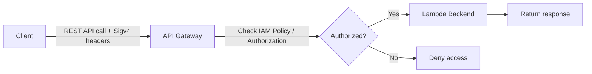
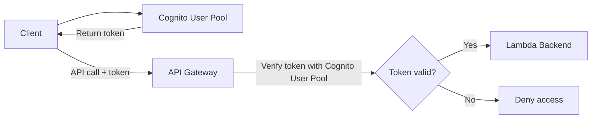
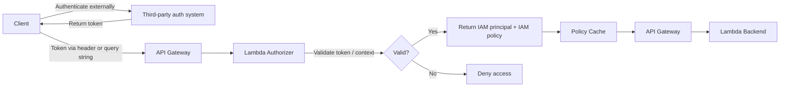

# 350. API Gateway Authentication and Authorization

## 🎯 Giới thiệu
- Bài này tập trung vào các cách bảo vệ `API Gateway` bằng cơ chế `Authentication` và `Authorization`.
- 3 mô hình chính được nhắc đến:
  - `IAM permissions` + `IAM Policy`
  - `Cognito User Pool`
  - `Lambda Authorizer` (formerly `Custom Authorizer`)
- Điểm quan trọng: tùy cách triển khai mà việc xác thực có thể do `IAM`, `Cognito`, hoặc hệ thống bên ngoài đảm nhiệm.

## 1. IAM permissions + Resource Policy
- Đây là cách bảo vệ `API Gateway` rất phù hợp khi người dùng và tài nguyên đều nằm trong cùng `AWS account`.
- `Authentication` được thực hiện bằng `IAM`.
- `Authorization` được thực hiện bằng `IAM Policy`.
- Client sẽ gửi request kèm `Sigv4` headers để truyền `IAM credentials` tới `API Gateway`.
- `API Gateway` kiểm tra chữ ký và đối chiếu với `IAM policy` để xác định có được phép gọi API hay không.
- Nếu hợp lệ, `API Gateway` sẽ gọi backend như `Lambda` và trả kết quả về client.

### Khi kết hợp với `Resource Policy`
- `Resource Policy` giống mục đích của `Lambda resource policy`: xác định ai và cái gì được phép truy cập `API Gateway`.
- Dùng nhiều nhất cho:
  - `Cross account access`
  - Giới hạn theo `IP addresses`
  - Chỉ cho phép qua `VPC Endpoint`
- Đây là lớp bảo vệ bổ sung bên trên `IAM security`.

### Mermaid: luồng `IAM`

## 2. Cognito User Pool
- `Cognito` ở mức cao là một database of users và quản lý đầy đủ `user lifecycle`.
- Token của `Cognito` sẽ hết hạn tự động.
- `API Gateway` sẽ xác minh danh tính người dùng thông qua `Cognito User Pool`.
- Không cần custom code riêng cho phần xác thực này.
- Luồng hoạt động:
  - Client authenticate với `Cognito User Pool`
  - Nhận `connection token`
  - Gửi token đó trong API call tới `API Gateway`
  - `API Gateway` kiểm tra token với `Cognito User Pool`
  - Nếu token hợp lệ, request được phép đi tới backend

### Điểm cần nhớ
- `Authentication` nằm ở `Cognito User Pool`.
- `Authorization` được set ở level `API Gateway methods`.
- Cách này được mô tả là đơn giản hơn so với `Lambda Authorizer`.

### Mermaid: luồng `Cognito`

## 3. Lambda Authorizer
- `Lambda Authorizer` là dạng linh hoạt nhất nhưng cũng cần nhiều công sức nhất.
- Trước đây gọi là `Custom Authorizer`.
- Là một `Token-based authorizer` dùng `bearer token`, có thể giống `JWT` hoặc `OAuth`.
- Client có thể truyền dữ liệu qua:
  - `headers`
  - `query strings`
- `Lambda Authorizer` sẽ:
  - Nhận token và context
  - Tự kiểm tra tính hợp lệ của token
  - Có thể gọi hệ thống xác thực bên thứ ba
  - Trả về `IAM principal` và `IAM policy`
- Policy sau khi tạo sẽ được lưu vào `Policy Cache`.
- Cách này thường dùng khi xác thực đến từ hệ thống bên ngoài.

### Mermaid: luồng `Lambda Authorizer`

## 📊 Bảng tóm tắt
| Tiêu chí | Mô tả |
|----------|------|
| `IAM permissions` | Phù hợp khi user/role đã có sẵn trong account; dùng `Sigv4` và `IAM Policy` |
| `Resource Policy` | Dùng cho `Cross account access`, giới hạn `IP`, hoặc chỉ cho phép qua `VPC Endpoint` |
| `Cognito User Pool` | Xác thực người dùng bằng token từ `Cognito`; không cần custom code |
| `Lambda Authorizer` | Linh hoạt nhất; phù hợp với hệ thống xác thực bên thứ ba; có `Policy Cache` |
| `Authentication` | Có thể do `IAM`, `Cognito`, hoặc hệ thống ngoài đảm nhiệm |
| `Authorization` | Có thể do `IAM Policy`, `API Gateway method`, hoặc `Lambda` trả về policy |

## 💡 Mẹo ghi nhớ cho kỳ thi AWS
- `IAM + Sigv4` = phù hợp nhất khi mọi thứ nằm trong cùng `AWS account`.
- `Resource Policy` = nhớ ngay đến `Cross account access`, `IP filter`, `VPC Endpoint`.
- `Cognito User Pool` = có sẵn user management, token tự hết hạn, ít phải viết code.
- `Lambda Authorizer` = linh hoạt nhất nhưng phức tạp nhất, thường dùng khi có `third-party authentication system`.
- Nếu thấy câu hỏi về `API Gateway security`, hãy tự hỏi:
  - Có phải nội bộ AWS account không? -> nghĩ tới `IAM`
  - Có cần người dùng từ ngoài hệ thống không? -> nghĩ tới `Cognito` hoặc `Lambda Authorizer`
  - Có cần `cross-account` hay lọc `IP/VPC` không? -> nghĩ tới `Resource Policy`

## ✅ Kết luận
- `API Gateway` có 3 hướng bảo vệ chính: `IAM`, `Cognito User Pool`, và `Lambda Authorizer`.
- `IAM` là lựa chọn gọn nhất cho tài nguyên trong cùng account, đặc biệt khi dùng `Sigv4`.
- `Cognito User Pool` phù hợp khi muốn quản lý user mà không cần tự viết logic xác thực.
- `Lambda Authorizer` mạnh nhất về khả năng tùy biến, nhất là khi tích hợp với hệ thống xác thực bên ngoài.
- `Resource Policy` là lớp bổ sung quan trọng để kiểm soát `cross account`, `IP`, và `VPC Endpoint`.
