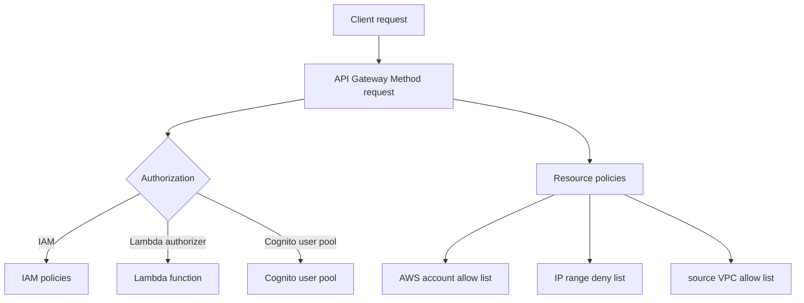

# 351. API Gateway Authentication and Authorization - Hands On

## 🎯 Giới thiệu
Trong bài hands-on này, nội dung tập trung vào các cách **bảo mật API Gateway** bằng cách cấu hình **Authorization** ngay trong **Method request** và thông qua **Resource policies**.  
Mục tiêu là kiểm soát ai có thể gọi API, từ đâu có thể gọi, và bằng cơ chế nào có thể xác thực/ủy quyền request.

## 1. IAM Authorization
- Trong **Method request** của API Gateway, có thể chọn phần **Authorization**.
- Nếu dùng **IAM** làm authorizer, request đi vào API Gateway sẽ được kiểm soát bằng **IAM policies**.
- Đây là một cách để điều khiển quyền truy cập vào API bằng cơ chế IAM.

## 2. Resource Policies
- **Resource policies** dùng để kiểm soát truy cập ở cấp **toàn bộ API**.
- Một số ví dụ được nhắc đến:
  - **AWS account allow list**: cho phép các account khác, user khác, hoặc role khác từ account khác gọi API.
  - Hỗ trợ **cross-account access** vào API Gateway.
  - **IP range deny list**: chặn hoặc cho phép một số IP cụ thể truy cập API.
  - **source VPC allow list**: tạo **private API Gateway**, chỉ cho phép truy cập từ bên trong một **VPC**.
- Transcript cũng nhắc rằng còn có thêm các template/example khác có thể xem trực tiếp trong giao diện.

## 3. Authorizers khác ngoài IAM
Nếu không dùng **IAM** làm authorizer, có thể tạo **authorizer** theo 2 kiểu:

### 3.1 Lambda Authorizer
- Kiểu **Lambda** cho phép kiểm soát linh hoạt nhất cách authorizer hoạt động.
- Cần cung cấp:
  - **Lambda function**
  - Có thể là **role**
  - **event payload**
- Có thể chọn việc **cache** kết quả từ Lambda function hay không.

### 3.2 Cognito User Pool Authorizer
- Có thể dùng **Cognito user pool** để xác thực request vào API.
- Chỉ định pool nào sẽ authenticate request.
- Sau đó user được phép truy cập vào API.

## 4. Luồng bảo mật API Gateway

## 📊 Bảng tóm tắt
| Tiêu chí | Mô tả |
|----------|------|
| IAM Authorization | Dùng **IAM policies** để kiểm soát request vào API Gateway |
| Resource policies | Kiểm soát truy cập ở cấp toàn bộ API |
| Cross-account access | Cho phép account/user/role từ account khác gọi API |
| IP control | Có thể dùng **IP range deny list** để chặn/cho phép IP |
| Private API Gateway | Dùng **source VPC allow list** để chỉ cho phép truy cập từ trong VPC |
| Lambda authorizer | Authorizer linh hoạt nhất, cần **Lambda function**, có thể có **role**, **event payload**, và tùy chọn cache |
| Cognito user pool | Dùng **Cognito** để authenticate request vào API |

## 💡 Mẹo ghi nhớ cho kỳ thi AWS
- Nhớ rằng **IAM** là một cách authorize request vào API Gateway thông qua **IAM policies**.
- **Resource policies** dùng để kiểm soát API ở mức tổng thể, đặc biệt hữu ích cho:
  - **cross-account access**
  - **IP restriction**
  - **private API Gateway** qua **source VPC allow list**
- Khi không dùng IAM, nhớ 2 kiểu **authorizer**:
  - **Lambda authorizer**: linh hoạt nhất
  - **Cognito user pool**: xác thực người dùng qua Cognito
- Nếu đề bài nói đến kiểm soát từ nhiều account khác nhau hoặc giới hạn từ VPC, hãy nghĩ đến **Resource policies**.

## ✅ Kết luận
Bài học này giới thiệu các lựa chọn bảo mật chính của **API Gateway** gồm **IAM Authorization**, **Resource policies**, **Lambda authorizer**, và **Cognito user pool**.  
Điểm cốt lõi là chọn đúng cơ chế để kiểm soát request theo nhu cầu: theo **IAM policy**, theo **account/IP/VPC**, hoặc theo **authorizer** riêng.
