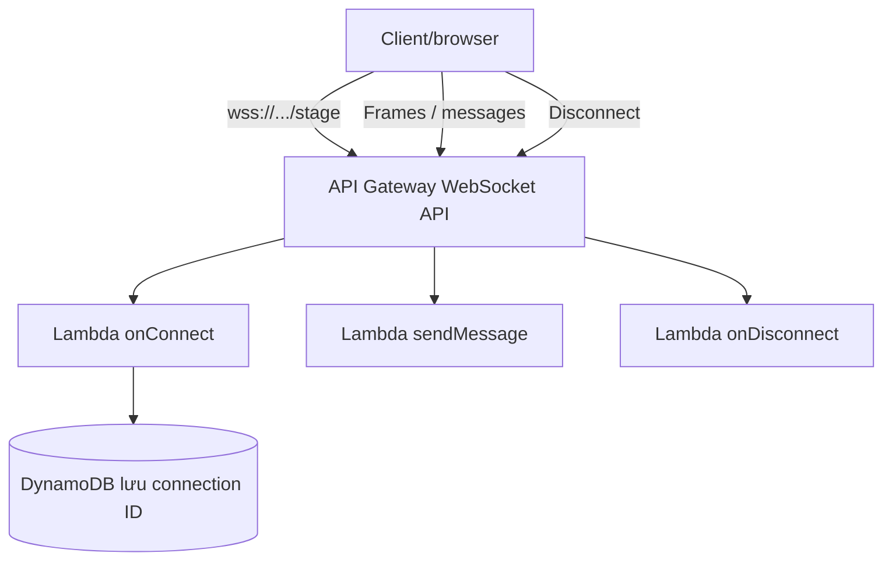
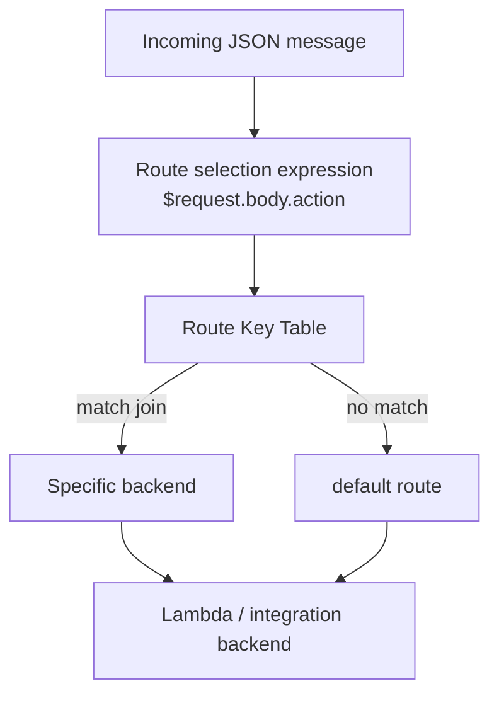

# 353. API Gateway Websocket API

## 🎯 Giới thiệu
- **WebSocket API** trong API Gateway dùng cho **two-way interactive communication** giữa browser/client và server.
- Điểm chính:
  - Server có thể **push dữ liệu ngược về client** mà không cần client gửi request trước.
  - Phù hợp cho các **stateful application use cases**.
- Các use case được nhắc tới:
  - chat application
  - collaboration platform
  - multiplayer games
  - financial trading platform

## 1. Luồng kết nối WebSocket 🔌
- Client kết nối tới **WebSocket URL** bắt đầu bằng `wss://`.
- Khi deploy WebSocket API, URL có dạng:
  - `...execute-api.region.amazonaws.com/<stage>`
- Kết nối là **persistent connection**:
  - không phải nhiều kết nối riêng lẻ
  - connection được giữ mở trong suốt phiên làm việc
- Khi kết nối ban đầu:
  - API Gateway gọi Lambda **`onConnect`**
  - có thể lưu **connection ID** vào **DynamoDB**
- Khi client gửi message:
  - dùng cùng một kết nối
  - message được gửi dưới dạng **frames**
  - có thể invoke Lambda như **`sendMessage`**
- Khi client muốn ngắt kết nối:
  - API Gateway gọi Lambda **`onDisconnect`**

## 2. Gửi dữ liệu từ server về client 📤
- Để server trả dữ liệu về client mà không cần client chủ động request:
  - dùng **connection URL callback**
  - dạng như: `.../connections/{connectionid}`
- Nếu Lambda hoặc backend khác thực hiện một **HTTP POST** tới URL này:
  - request phải được **signed using IAM Sigv4**
  - chỉ định đúng **connection ID**
  - API Gateway sẽ gửi message ngược về client
- Các thao tác với `.../connections/{connectionid}`:
  - **POST**: gửi message từ server về WebSocket client
  - **GET**: lấy trạng thái kết nối mới nhất
  - **DELETE**: ngắt kết nối client khỏi WebSocket

## 3. Routing trong WebSocket API 🧭
- WebSocket có khái niệm **routing** để quyết định message sẽ đi tới backend nào.
- Incoming JSON message sẽ được route theo **route selection expression**.
- Nếu không có route phù hợp:
  - message đi vào **default route**
- Ví dụ trong transcript:
  - payload có các field như:
    - `service = chat`
    - `action = join`
    - `data = room1234`
  - Route selection expression:
    - `$request.body.action`
  - API Gateway lấy giá trị `action`
  - giá trị `join` được so với **Route Key Table**
- **Route Key Table** ở cấp API Gateway gồm:
  - route bắt buộc: `connect`, `disconnect`, `default`
  - custom routes: `join`, `quit`, `delete`, ...
- Nếu route `join` tồn tại:
  - API Gateway biết backend tương ứng để invoke
  - backend có thể là Lambda hoặc integration khác
- Nếu không match:
  - dùng `default`

## 📊 Bảng tóm tắt
| Tiêu chí | Mô tả |
|----------|------|
| Mục đích | Two-way communication giữa client và server |
| Kết nối | Persistent connection qua `wss://` |
| Xử lý kết nối | `onConnect`, `sendMessage`, `onDisconnect` |
| Lưu trạng thái | Có thể lưu `connection ID` trong DynamoDB |
| Gửi ngược về client | Dùng `.../connections/{connectionid}` và HTTP POST signed bằng `IAM Sigv4` |
| Quản lý kết nối | GET để xem trạng thái, DELETE để ngắt kết nối |
| Routing | Dựa trên route selection expression và Route Key Table |
| Route mặc định | `default` nếu không match route nào |
| Use case | Chat, collaboration, multiplayer games, financial trading |

## 💡 Mẹo ghi nhớ cho kỳ thi AWS
- Nhớ 3 ý chính:
  - **WebSocket = two-way communication**
  - **Persistent connection**
  - **Routing theo nội dung message**
- Nhớ bộ từ khóa:
  - `onConnect`
  - `onDisconnect`
  - `connection ID`
  - `wss://`
  - `IAM Sigv4`
  - `Route Key Table`
  - `$request.body.action`
- Nếu đề thi nói về:
  - chat app
  - push message từ server về client
  - routing theo JSON field  
  thì nghĩ ngay tới **API Gateway WebSocket API**.

## ✅ Kết luận
- **API Gateway WebSocket API** dùng cho giao tiếp **hai chiều** với **persistent connection**.
- Client gửi message qua các **frames**, server có thể trả ngược dữ liệu bằng **connection URL callback**.
- **Routing** là phần quan trọng nhất cần nhớ cho kỳ thi:
  - message JSON được ánh xạ vào route
  - nếu không match thì đi vào `default route`
- Các backend tích hợp có thể là **Lambda**, **DynamoDB**, hoặc **HTTP endpoint**.
