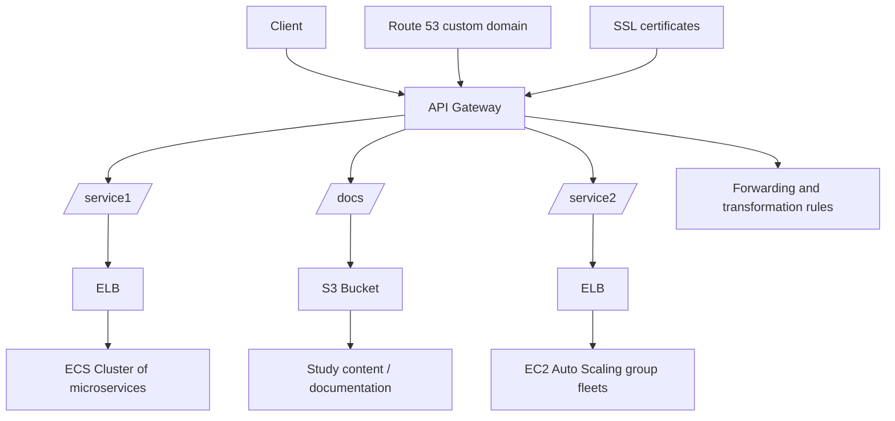

# 354. API Gateway - Architecture

## 🎯 Giới thiệu
API Gateway được dùng để xây dựng **Microservice Architecture** với một **single interface / single URL** cho toàn bộ hệ thống backend. Mục tiêu là:
- Hợp nhất nhiều microservices dưới một điểm truy cập.
- Che giấu độ phức tạp routing từ client.
- Cho phép API Gateway xử lý **routing**, **data transformation**, và **SSL certificates** ở lớp gateway.

## 1. Kiến trúc route trong API Gateway
API Gateway có thể định nghĩa nhiều route khác nhau để trỏ đến các backend khác nhau:
- `/service1` → đi tới **elastic load balancer (ELB)**, phía sau là **ECS cluster** chứa microservices.
- `/docs` → đi tới **S3 bucket** chứa nội dung học tập hoặc documentation.
- `/service2` → đi tới **ELB** kết nối với **Amazon EC2 Auto Scaling group fleets**.

Ý chính:
- Một API Gateway có thể đóng vai trò là **entry point** duy nhất.
- Mỗi route tương ứng với một backend service riêng.

## 2. Custom domain và SSL
Có thể dùng **Route 53** để đăng ký domain thay cho DNS mặc định của API Gateway.
- Hỗ trợ các **custom addresses** theo từng client.
- Ví dụ:
  - `customer1.example.com`
  - `customer2.example.com`
- Có thể áp dụng **SSL certificates** theo từng domain.

## 3. Forwarding và transformation
API Gateway còn hỗ trợ:
- **Forwarding rules**
- **Transformation rules**

Mục đích:
- Chỉnh sửa dữ liệu đầu vào trước khi gửi đến backend.
- Tạo lớp xử lý trung gian ngay tại API Gateway.

## 📊 Bảng tóm tắt
| Tiêu chí | Mô tả |
|----------|------|
| Vai trò chính | Cung cấp **single interface / single URL** cho nhiều microservices |
| Routing | Route như `/service1`, `/docs`, `/service2` trỏ đến backend khác nhau |
| Backend ví dụ | **ELB + ECS**, **S3**, **ELB + EC2 Auto Scaling group** |
| Domain | Dùng **Route 53** để tạo custom domain |
| Bảo mật | Áp dụng **SSL certificates** theo domain |
| Xử lý dữ liệu | Có **forwarding** và **transformation rules** trước khi vào backend |
| Mục tiêu kiến trúc | Hợp nhất microservices và che giấu complexity routing |

## 💡 Mẹo ghi nhớ cho kỳ thi AWS
- Nhớ từ khóa: **API Gateway = unified entry point cho microservices**.
- Khi thấy câu hỏi về:
  - **single URL**
  - **routing nhiều backend**
  - **custom domain**
  - **transformation trước backend**
  
  thì nghĩ ngay đến **API Gateway**.
- Ghi nhớ mô hình:
  - `/service1` → **ELB** → **ECS**
  - `/docs` → **S3**
  - `/service2` → **ELB** → **EC2 Auto Scaling**
- **Route 53 + SSL certificates** thường đi cùng với custom domain cho API Gateway.

## ✅ Kết luận
API Gateway trong bài này được mô tả như một lớp trung tâm để:
- Gom nhiều microservices dưới một **unified URL**,
- Tách routing khỏi client,
- Hỗ trợ **custom domain**, **SSL certificates**,
- Và áp dụng **forwarding/transformation** trước khi request đi vào backend.
