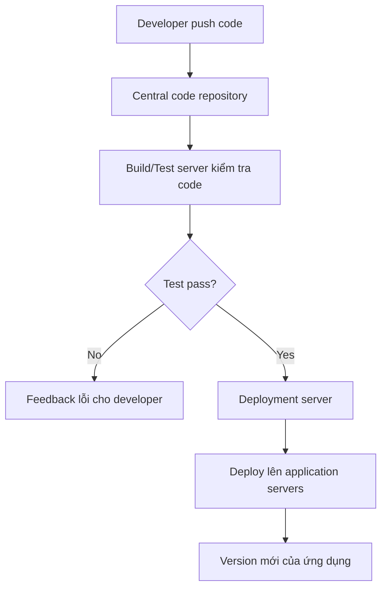

# 356. Introduction to CICD in AWS

## 🎯 Giới thiệu
- Chủ đề này nhấn mạnh **CICD** là phần rất quan trọng với developer và cũng là nội dung key trong kỳ thi AWS.
- Trước đó, việc tạo resource AWS, dùng CLI, và deploy code bằng Beanstalk đều mang tính **manual**.
- Làm thủ công dễ gây lỗi, chậm, và khó mở rộng nhiều môi trường.
- Mục tiêu của **CICD** là:
  - Push code vào một **code repository**.
  - Tự động **test** và **deploy** code lên AWS.
  - Có thể đi qua nhiều stage như **development**, **test**, **staging / pre-prod**, và **prod**.
  - Có thể thêm **manual approval** trước khi deploy production.

## 1. Continuous Integration (CI)
- Developer **push code thường xuyên** vào một **central code repository**.
- Repository có thể là:
  - **GitHub**
  - **CodeCommit**
  - **Bitbucket**
- Sau khi code được push, một **build server** sẽ kiểm tra code có đúng và chạy tốt không.
- Ví dụ:
  - **CodeBuild** nếu dùng dịch vụ AWS
  - **Jenkins** nếu dùng công cụ open source
- Kết quả:
  - Developer nhận được **feedback** về việc test/check **pass hoặc fail**.
  - Giúp **phát hiện bug sớm** và **fix sớm**.
  - Không cần test thủ công trên máy local.
  - Code được deliver **nhanh hơn** và team làm việc hiệu quả hơn.

## 2. Continuous Delivery (CD)
- Sau khi CI pass, code sẽ được **deploy tự động** lên application servers.
- Luồng hoạt động trong transcript:
  - Developer push code lên repo.
  - Code được **build/test**.
  - Nếu đạt, **deployment server** sẽ deploy ứng dụng.
- Khi có version mới của code:
  - Application servers sẽ được cập nhật từ **version 1** sang **version 2**.
- Lợi ích:
  - Deploy **thường xuyên** và **nhanh**.
  - Tránh tư duy release rất lâu, ví dụ “mỗi 3 tháng một lần”.
  - Có thể hướng tới nhiều lần release trong ngày nếu quy trình đã tự động hóa tốt.
- Công cụ deploy được nhắc đến:
  - **CodeDeploy**
  - **Jenkins CD**
  - **Spinnaker**
  - Các tool khác tương tự

## 3. AWS CICD Tech Stack
- **Code repository**:
  - **CodeCommit**
  - **GitHub**
  - **Bitbucket**
  - Các repository bên thứ ba khác
- **Build / Test phase**:
  - **CodeBuild**
  - **Jenkins CI**
  - Các third-party CI server khác
- **Deploy phase**:
  - **CodeDeploy**
  - Deploy tới:
    - **EC2 instances**
    - **on-premises servers**
    - **Lambda functions**
    - **ECS**
- Nếu muốn vừa deploy vừa provision infrastructure:
  - Dùng **Elastic Beanstalk** như một lựa chọn thay thế cho CodeDeploy
- **Orchestration**:
  - Dùng **AWS CodePipeline** để định nghĩa và điều phối toàn bộ CICD process

## 📊 Bảng tóm tắt
| Tiêu chí | Mô tả |
|----------|------|
| Mục tiêu CICD | Tự động hóa việc test và deploy code lên AWS |
| CI | Developer push code thường xuyên, hệ thống tự build/test |
| CD | Tự động deploy code đã pass test lên application servers |
| Code repository | GitHub, CodeCommit, Bitbucket |
| Build/Test tool | CodeBuild, Jenkins |
| Deploy tool | CodeDeploy, Jenkins CD, Spinnaker |
| Tài nguyên deploy | EC2, on-premises servers, Lambda, ECS |
| Orchestration | CodePipeline |
| Điểm quan trọng | Giảm manual work, giảm lỗi, release nhanh hơn |

## 💡 Mẹo ghi nhớ cho kỳ thi AWS
- **CI = Code push thường xuyên + build/test tự động**.
- **CD = code đã test xong thì deploy tự động**.
- Nhớ 3 lớp chính:
  - **Source**: CodeCommit / GitHub / Bitbucket
  - **Build/Test**: CodeBuild / Jenkins
  - **Deploy**: CodeDeploy / Elastic Beanstalk
- **CodePipeline** là dịch vụ để **orchestrate** toàn bộ flow CICD.
- Trong đề thi, nếu thấy nhắc đến:
  - **test code sau khi push**
  - **deploy tự động**
  - **nhiều stage**
  - **manual approval**
  thì đang nói về **CICD**.

## ✅ Kết luận
- Bài học này giới thiệu mục tiêu của **CICD** trong AWS: biến quy trình phát triển từ **manual** sang **automated**.
- **CI** giúp kiểm tra code sớm sau khi push.
- **CD** giúp deploy nhanh, thường xuyên, và có thể đi qua nhiều stage.
- Các dịch vụ AWS trọng tâm là **CodeCommit**, **CodeBuild**, **CodeDeploy**, **CodePipeline**, cùng với **Elastic Beanstalk** như một lựa chọn triển khai và provision hạ tầng.
