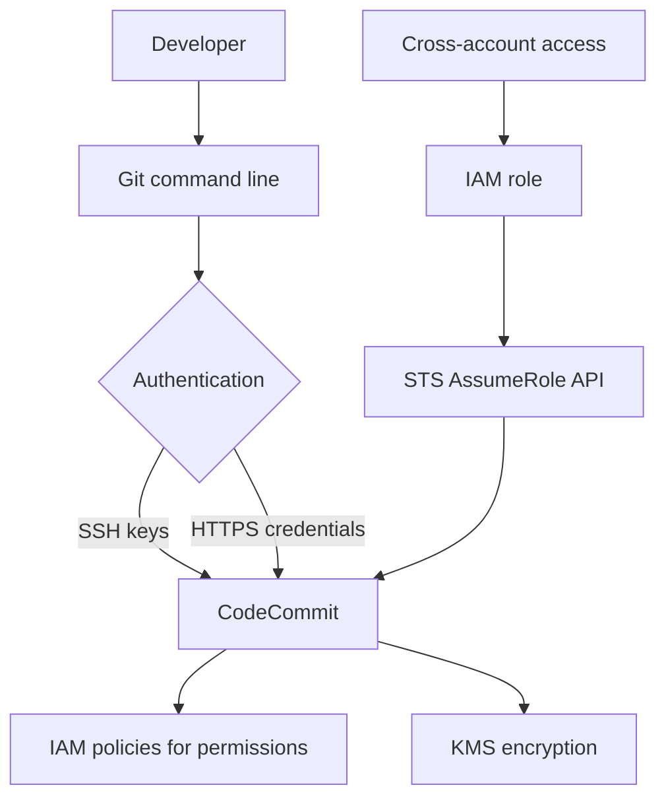

# 357. CodeCommit Overview

## 🎯 Giới thiệu
- **AWS CodeCommit** là dịch vụ **private Git repository** trên AWS để quản lý **version control**.
- Hỗ trợ theo dõi lịch sử thay đổi của code:
  - ai đã commit
  - thay đổi gì
  - thêm/xóa gì
  - có thể **roll back**
- Mục tiêu chính:
  - cho phép nhiều developer cùng làm việc trên cùng một codebase
  - lưu code trong **AWS cloud** thay vì chỉ trên máy cá nhân
  - tăng tính **security** và **compliance**

## 1. Vì sao dùng CodeCommit
- So với các dịch vụ Git bên thứ ba như **GitHub**, **GitLab**, **Bitbucket**:
  - có thể tốn chi phí cao
- CodeCommit mang lại:
  - repository **private**
  - code nằm trong **AWS cloud**
  - repo **không giới hạn size**
  - **fully managed**
  - **highly available**
  - phù hợp khi cần code chỉ tồn tại trong AWS

## 2. Bảo mật và truy cập
- Tương tác với CodeCommit vẫn dùng **Git command line** tiêu chuẩn.
- Xác thực có thể qua:
  - **SSH keys**
  - **HTTPS** với username/password
- Phân quyền dùng:
  - **IAM policies** cho users và roles theo từng repository
- Mã hóa:
  - dữ liệu được mã hóa bằng **KMS**
  - khi truyền lên CodeCommit có **encryption in transit** qua **HTTPS** hoặc **SSH**
- Với **cross-account access**:
  - không chia sẻ SSH keys hay credentials
  - tạo **IAM role**
  - dùng **STS AssumeRole API** để truy cập repository

## 3. So sánh nhanh với GitHub
- Điểm giống:
  - đều hỗ trợ **code reuse / pull requests**
  - đều có tích hợp với **CodeBuild**
  - đều hỗ trợ xác thực qua **SSL/HTTPS**
- Điểm khác:
  - **CodeCommit** tích hợp chặt với **AWS IAM users and roles**
  - **CodeCommit** lưu code hoàn toàn trong **AWS**
  - **GitHub** có thể host trên GitHub hoặc trên server riêng nếu enterprise
  - UI của **CodeCommit** khá tối giản, còn **GitHub** đầy đủ tính năng hơn

## 📊 Bảng tóm tắt
| Tiêu chí | Mô tả |
|----------|------|
| Mục đích | Quản lý **version control** cho code |
| Loại repository | **Private Git repository** trên AWS |
| Cộng tác | Nhiều developer có thể **push/pull** cùng lúc |
| Quy mô | Không giới hạn size repository |
| Quản lý | **Fully managed**, **highly available** |
| Bảo mật | **IAM**, **KMS**, **HTTPS/SSH**, **STS AssumeRole** |
| Tích hợp | **CodeBuild**, **Jenkins**, và các CI tools khác |
| Điểm mạnh | Code nằm trong AWS, tăng security và compliance |
| Điểm hạn chế | UI tối giản hơn GitHub |

## 💡 Mẹo ghi nhớ cho kỳ thi AWS
- **CodeCommit = Git repo + AWS security**.
- Nhớ 4 từ khóa chính:
  - **IAM** để phân quyền
  - **KMS** để mã hóa
  - **HTTPS/SSH** để truyền an toàn
  - **STS AssumeRole** cho cross-account access
- Nếu đề bài nhấn mạnh:
  - **private code repository**
  - **fully managed**
  - **AWS-native access control**
  - **encrypted code storage**
  -> nghĩ ngay đến **CodeCommit**
- Nếu so sánh với GitHub:
  - CodeCommit thiên về **AWS integration** hơn là UI đẹp hay nhiều tính năng quản trị bên ngoài

## ✅ Kết luận
- **AWS CodeCommit** là dịch vụ Git repository riêng tư, fully managed trên AWS.
- Nó phù hợp khi cần lưu trữ code an toàn, kiểm soát bằng **IAM**, mã hóa bằng **KMS**, và hỗ trợ cộng tác qua Git tiêu chuẩn.
- Đây là lựa chọn mạnh khi ưu tiên **security**, **compliance**, và tích hợp sâu với hệ sinh thái AWS.
