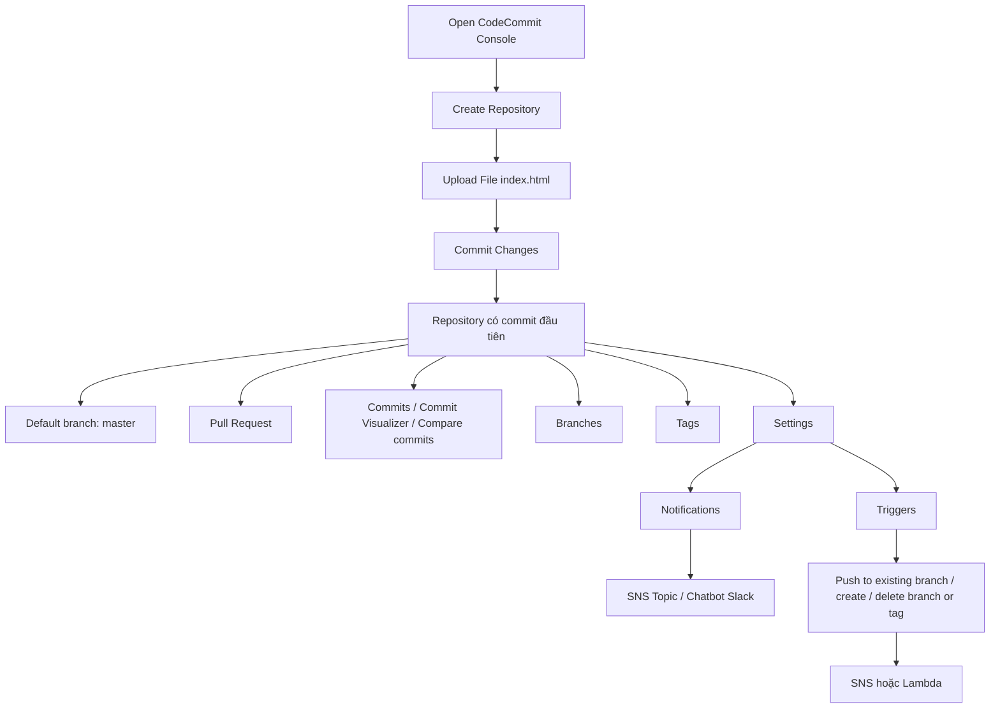

# 358. CodeCommit Hands On Part I

## 🎯 Giới thiệu
- Bài học này thực hành trực tiếp trên **AWS CodeCommit**.
- Mục tiêu là làm quen với:
  - tạo repository
  - upload file và tạo commit
  - xem **commits**, **branches**, **pull request**
  - cấu hình **Notifications** và **Triggers**
- Giao diện CodeCommit trên console còn cho phép truy cập nhanh sang **CodeBuild**, **CodeDeploy**, **CodePipeline** trong cùng một UI.

## 1. Tạo repository và commit đầu tiên
- Tạo repository mới với tên **`my-nodejs.app`**.
- Có thể thêm description và tags, nhưng trong bài thực hành không dùng.
- Sau khi tạo repo, màn hình hiển thị các cách kết nối:
  - **HTTPS**
  - **SSH**
  - **HTTPS GRC**
- Nếu đang dùng **root account** thì sẽ **không thấy SSH**.
- Trong ví dụ này, tài khoản đang dùng là **IAM User**, nên có SSH.
- Upload một file duy nhất tại một thời điểm:
  - chọn file **`index.html`**
  - author: **Stephane**
  - email: **stephane@example.com**
  - commit message: **first commit**
- Sau khi commit:
  - repository có file **`index.html`**
  - commit có **commit ID**
  - commit nằm trên branch **`master`**
- **`master`** là branch mặc định và là branch đầu tiên được tạo.
- Có thể tạo thêm nhiều branches khác để developer cộng tác.

## 2. Các chức năng chính trong CodeCommit
- **Pull request**
  - dùng để merge thay đổi từ branch khác vào branch chính, ví dụ từ branch khác vào **`master`**
  - đây là nội dung quan trọng cần biết cho kỳ thi DevOps/AWS
- **Commits**
  - xem commit vừa tạo
  - browse repository tại thời điểm commit đó
  - có **Commit Visualizer** nếu có nhiều commit
  - có thể **Compare commits** giữa các branch hoặc commit
- **Branches**
  - hiện tại chỉ có **`master`**
  - có thể tạo thêm branch như **`dev`** hoặc **`test`**
  - thường branch mới sẽ được tách từ **`master`**
- **Tags**
  - phần này chưa dùng trong bài
- **Settings**
  - chứa thông tin repository:
    - repository name
    - ID
    - ARN
    - description

## 3. Notifications, Triggers và Repository tags
- **Notifications**
  - dùng để tạo **notification rule** cho repository
  - ví dụ tạo rule tên **`DemoNotificationRule`**
  - mức thông tin có thể là:
    - **full**
    - **basic**
  - các sự kiện có thể kích hoạt thông báo:
    - comments on commits
    - pull request events như created, updated, status changed, merged
    - approval status change
    - branch/tag created, deleted, updated
  - target của notification có thể là:
    - **SNS topic**
    - **Chatbot Slack**
  - trong bài chọn **SNS topic**
  - tạo topic với tên kiểu **`codecommit-lab`**
  - SNS topic có thể dùng để gửi email alert hoặc các thông báo tương tự
- **Triggers**
  - dùng cho các sự kiện code cụ thể hơn
  - ví dụ:
    - push to existing branch
    - create branch or tag
    - delete branch or tag
  - có thể chỉ định branch name, ví dụ **`master`**
  - target có thể là:
    - **SNS**
    - **Lambda function**
  - trong bài tạo **DemoTrigger** để gửi thông báo đến SNS khi repository có thay đổi
- **Repository tags**
  - có thể tag repository, nhưng bài này không thực hiện

## 📊 Bảng tóm tắt
| Tiêu chí | Mô tả |
|----------|------|
| Service chính | **AWS CodeCommit** |
| Repository đã tạo | **my-nodejs.app** |
| File được commit | **index.html** |
| Commit message | **first commit** |
| Branch mặc định | **master** |
| Điều kiện thấy SSH | Không dùng **root account**, phải dùng **IAM User** |
| Pull request | Dùng để merge thay đổi từ branch khác vào branch chính |
| Notifications | Tạo notification rule, target có thể là **SNS topic** hoặc **Chatbot Slack** |
| Triggers | Kích hoạt theo sự kiện cụ thể như push/create/delete branch or tag |
| Target cho trigger | **SNS** hoặc **Lambda** |

## 💡 Mẹo ghi nhớ cho kỳ thi AWS
- **CodeCommit = Git repository trên AWS**.
- Nhớ rằng **`master`** là branch mặc định trong ví dụ này.
- **Pull request** dùng để merge thay đổi giữa các branches.
- **Notifications** và **Triggers** đều liên quan đến sự kiện, nhưng:
  - **Notifications** thiên về thông báo tổng quát
  - **Triggers** thiên về code events cụ thể
- Nếu dùng **root account**, bạn **không thấy SSH** trong connection steps.
- **SNS topic** thường là target để nhận thông báo từ CodeCommit.
- **Lambda** cũng có thể là target của trigger.

## ✅ Kết luận
- Bài thực hành đã tạo một **CodeCommit repository**, upload file **`index.html`**, và tạo **commit đầu tiên** trên branch **`master`**.
- Đồng thời đã xem qua các chức năng quan trọng: **Pull request**, **Commits**, **Branches**, **Settings**, **Notifications**, **Triggers**, và **Repository tags**.
- Đây là nền tảng để bước sang phần cấu hình credentials và thao tác programmatically ở bài tiếp theo.
