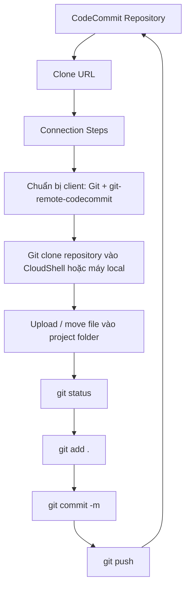

# 359. CodeCommit Hands On Part 2

## 🎯 Giới thiệu
Bài này hướng dẫn cách làm việc với **AWS CodeCommit** theo kiểu thực hành: xem **Connection Steps**, chuẩn bị client Git, clone repository vào **CloudShell**, thêm file mới, rồi dùng **git add / git commit / git push** để đẩy thay đổi lên CodeCommit.

## 1. Kết nối vào CodeCommit bằng Git
- Từ repository, chọn **Clone URL** rồi xem **Connection Steps**.
- Tùy cách kết nối sẽ có các lựa chọn như:
  - **HTTPS**
  - **SSH**
  - **HTTPS GRC** nếu dùng federated account
- Cần chuẩn bị client phù hợp để kết nối với CodeCommit bằng Git.
- Có thể dùng **CloudShell** vì môi trường này đã có sẵn **Git** và **Python**.

## 2. Clone repository và chuẩn bị file
- Cài package Python **git-remote-codecommit** để Git có thể kết nối với CodeCommit.
- Dùng lệnh **Git clone** theo URL được cung cấp để clone repository vào môi trường làm việc.
- Sau khi clone, thư mục project sẽ chứa file giống như trên CodeCommit, ví dụ:
  - `index.html`
- Có thể upload thêm file từ máy local vào CloudShell, ví dụ:
  - `app.js`
  - `cron.yaml`
  - `package.json`
- Sau khi upload, cần di chuyển file vào đúng thư mục project, ở đây là `my-nodejs-app`.

## 3. Commit và push thay đổi lên CodeCommit
- Dùng **git status** để kiểm tra file chưa được track.
- Khi có nhiều file mới, dùng:
  - `git add .` để thêm toàn bộ file vào staging.
- Sau đó commit:
  - `git commit -m "added three files"`
- Trước khi commit, cần cấu hình danh tính Git:
  - `git config` với email
  - `git config` với username
- Nếu chỉ commit trong CloudShell thì repository trên CodeCommit chưa thay đổi ngay.
- Phải chạy **git push** để đẩy commit lên CodeCommit.
- Sau khi push và refresh browser, các file mới sẽ xuất hiện trên repository.

## 📊 Bảng tóm tắt
| Tiêu chí | Mô tả |
|----------|------|
| Mục tiêu | Làm việc với CodeCommit bằng console và Git |
| Client cần có | Git, Python, và package `git-remote-codecommit` |
| Môi trường thực hành | CloudShell hoặc máy local |
| Luồng chính | Clone URL → Connection Steps → clone repo → thêm file → `git add` → `git commit` → `git push` |
| Điểm quan trọng | Commit trong CloudShell chưa đủ, phải `git push` thì CodeCommit mới cập nhật |
| Kỹ năng cần nhớ | Biết cách xem Connection Steps và dùng Git với CodeCommit |

## 💡 Mẹo ghi nhớ cho kỳ thi AWS
- 🔑 **Clone chưa phải là sync**: clone chỉ đưa repo về môi trường làm việc, chưa thay đổi CodeCommit.
- 📌 **Commit chưa đủ**: commit chỉ nằm cục bộ, muốn lên CodeCommit phải **git push**.
- 🧰 **CloudShell là lựa chọn tiện** vì có sẵn **Git** và **Python**.
- 🧪 **git status** là bước kiểm tra nhanh để biết file nào chưa được track.
- 📝 Với CodeCommit, cần nhớ cả hai cách làm việc:
  - thao tác trực tiếp trong console
  - thao tác qua Git command

## ✅ Kết luận
Bài học này minh họa quy trình thực tế để làm việc với **AWS CodeCommit**: xem **Connection Steps**, chuẩn bị Git client, clone repository, thêm file, commit và push. Ý chính cần nhớ là thay đổi chỉ xuất hiện trên CodeCommit sau khi thực hiện **git push**.
