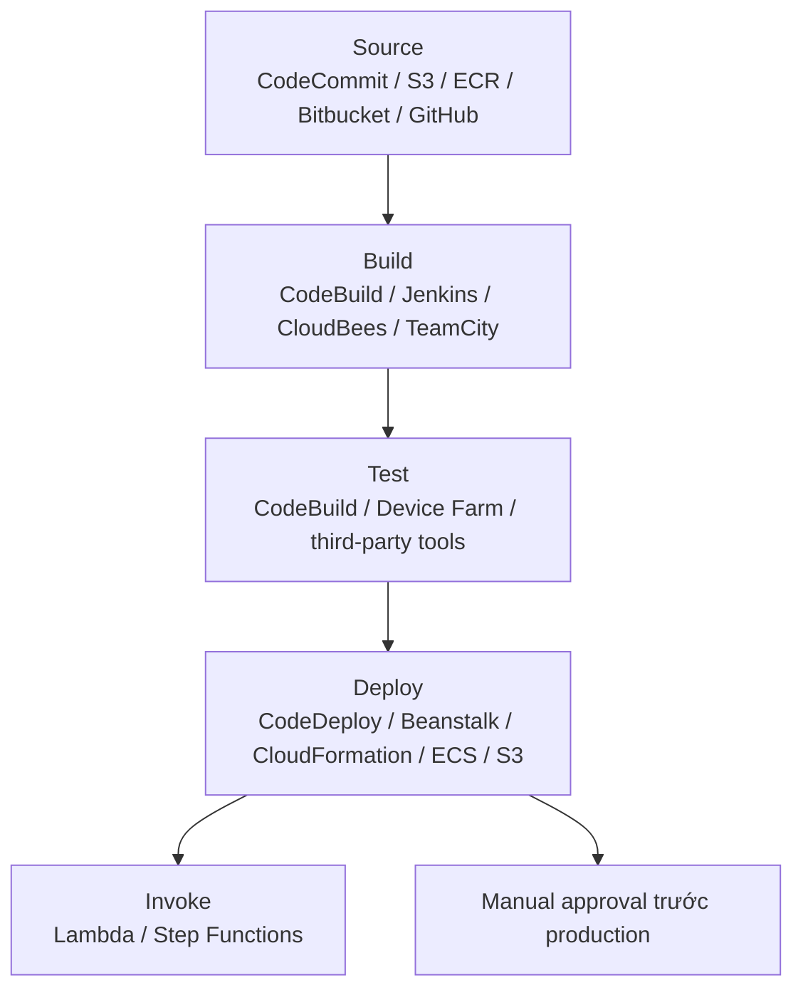

# 360. CodePipeline Overview

## 🎯 Giới thiệu
- **CodePipeline** là công cụ workflow trực quan dùng để **orchestrate CI/CD** trong AWS.
- Pipeline có thể lấy source từ:
  - **CodeCommit**
  - **Amazon S3**
  - **ECR** (Docker image)
  - nguồn ngoài như **Bitbucket** hoặc **GitHub**
- Sau đó pipeline đi qua các giai đoạn như:
  - **Build**
  - **Test**
  - **Deploy**
- Có thể thêm **manual approval** ở bất kỳ stage nào, ví dụ trước khi deploy lên production.

## 1. Cấu trúc pipeline và stages
- Một pipeline gồm nhiều **stages**.
- Mỗi stage có thể có:
  - **sequential actions**
  - **parallel actions**
- Ví dụ flow:
  - Build
  - Test
  - Deploy lên staging
  - Load testing
  - Deploy lên production
- CodePipeline tạo ra nhiều điểm kiểm soát linh hoạt nhờ các building blocks như **Invoke** để gọi **Lambda** hoặc **Step Functions**.

## 2. Cách CodePipeline hoạt động bên trong
- Pipeline có thể tạo ra **artifacts**.
- **Artifacts** là output được tạo ra từ pipeline và được lưu trong **S3 bucket** để chuyển sang stage tiếp theo.
- Luồng chính:
  - Developer push code vào **CodeCommit**
  - **CodePipeline** lấy code và tạo artifact
  - Artifact được lưu vào **S3**
  - **CodeBuild** nhận input từ artifact qua **S3**
  - CodeBuild tạo deployment artifacts
  - CodePipeline lưu tiếp artifacts vào **S3**
  - **CodeDeploy** nhận artifacts và deploy
- Điểm quan trọng:
  - Các stage giao tiếp với nhau thông qua **Amazon S3**
  - **CodeBuild** không cần truy cập trực tiếp vào **CodeCommit**

## 3. Troubleshooting và giám sát
- Để theo dõi:
  - **CodePipeline action execution state changes**
  - **stage execution state changes**
- Có thể dùng:
  - **CloudWatch Events**
  - **EventBridge**
- Ví dụ use case:
  - tạo event khi pipeline failed
  - tạo event khi stage cancelled
  - gửi email notification
- Nếu pipeline không thể thực hiện action nào đó, cần kiểm tra:
  - **IAM service role** của CodePipeline
  - đảm bảo có đúng **IAM permissions**
- Nếu cần audit các API call bị denied trong hạ tầng:
  - dùng **CloudTrail**

## 📊 Bảng tóm tắt
| Tiêu chí | Mô tả |
|----------|------|
| Mục đích | Orchestrate CI/CD trong AWS |
| Source | CodeCommit, S3, ECR, Bitbucket, GitHub |
| Build tools | CodeBuild, Jenkins, CloudBees, TeamCity |
| Test tools | CodeBuild, Device Farm, third-party tools |
| Deploy tools | CodeDeploy, Beanstalk, CloudFormation, ECS, S3 |
| Cơ chế truyền dữ liệu | Artifacts lưu trong S3 |
| Kiểm soát luồng | Sequential actions, parallel actions, manual approval |
| Giám sát | CloudWatch Events, EventBridge |
| Troubleshooting quyền | Kiểm tra IAM service role và IAM permissions |
| Audit API calls | CloudTrail |

## 💡 Mẹo ghi nhớ cho kỳ thi AWS
- **CodePipeline = orchestration layer** cho CI/CD.
- Nhớ rằng **artifacts đi qua S3** giữa các stage.
- **CodeBuild** và **CodeDeploy** có thể là các stage trong pipeline, nhưng **CodePipeline** mới là nơi điều phối.
- Nếu pipeline fail hoặc stage bị cancel, nghĩ ngay đến **CloudWatch Events / EventBridge**.
- Nếu action không chạy được, kiểm tra **IAM service role** trước.
- Nếu cần xem API call bị từ chối, dùng **CloudTrail**.

## ✅ Kết luận
- **CodePipeline** là dịch vụ điều phối CI/CD linh hoạt trong AWS.
- Nó hỗ trợ nhiều source, build, test, deploy tool và cho phép thêm **manual approval**.
- Điểm cốt lõi cần nhớ khi ôn thi: **pipeline stages trao đổi với nhau qua artifacts trong S3**, và các vấn đề vận hành thường liên quan đến **EventBridge**, **CloudWatch Events**, **IAM**, và **CloudTrail**.
