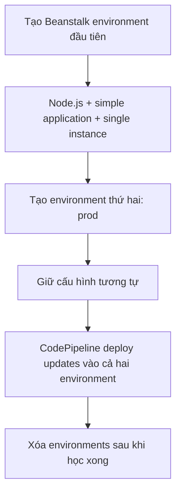

# 361. CodePipeline - Hands On - Prerequisite

## 🎯 Giới thiệu
Trong bài này, mục tiêu là **tạo lại AWS Elastic Beanstalk application** để chuẩn bị cho phần hands-on về **CodePipeline**.

- Sẽ tạo một **web server environment**
- Dùng **Node.js**
- Tạo **2 Beanstalk environments** để CodePipeline có thể deploy update vào cả hai
- Cuối cùng cần **xóa môi trường** để tránh phát sinh chi phí từ **EC2 instances**

## 1. Tạo Beanstalk environment đầu tiên
- Tạo **Web server environment**
- **Application name**: `my first web app, Beanstalk`
- Chọn **managed platform**
- Chọn **nodejs** và dùng **latest**
- Chọn:
  - **simple application**
  - **single instance**
- Bấm **Next**
- Không cần cấu hình **key pair**
- Bấm **Next**
- Có thể **skip to review**
- Cuối cùng bấm **Submit**

✅ Kết quả: tạo xong một **Beanstalk environment** để dùng trong bài học.

## 2. Tạo Beanstalk environment thứ hai
- Vào lại phần **environments**
- Chọn cách nhanh nhất là:
  - vào **application**
  - tạo **new environment**
- Chọn tiếp **Web server environment**
- Đặt **environment name** là `prod`
- Giữ cấu hình giống môi trường đầu:
  - **nodeJS**
  - **simple application**
  - **Next**
  - **skip to review**
  - **Submit**

✅ Kết quả: có **2 Beanstalk environments** để chuẩn bị deploy bằng **CodePipeline**.

## 3. Mục đích của bước chuẩn bị
- Tạo nền tảng để thực hành **CodePipeline**
- Sử dụng **Beanstalk environment** làm đích deploy
- Có **2 environment** để quan sát quá trình deploy vào nhiều môi trường
- Nhớ dọn dẹp sau khi xong để tránh tốn tiền cho **running EC2 instances**

## 📊 Bảng tóm tắt
| Tiêu chí | Mô tả |
|----------|------|
| Mục tiêu | Tạo lại Beanstalk application để chuẩn bị hands-on CodePipeline |
| Môi trường 1 | Web server environment với `my first web app, Beanstalk` |
| Môi trường 2 | Tạo thêm environment tên `prod` |
| Cấu hình chính | `nodejs`, `simple application`, `single instance` |
| Lưu ý quan trọng | Xóa environments sau khi học xong để tránh chi phí EC2 |

## 💡 Mẹo ghi nhớ cho kỳ thi AWS
- Khi thấy **CodePipeline + Elastic Beanstalk**, hãy nghĩ ngay đến việc cần **môi trường đích để deploy**
- Ghi nhớ pattern của bài này:
  - **tạo application**
  - **tạo 2 environments**
  - **deploy updates**
  - **cleanup sau cùng**
- Từ khóa cần nhớ: **Beanstalk, CodePipeline, Node.js, prod, EC2 cost**

## ✅ Kết luận
Bài prerequisite này chỉ nhằm chuẩn bị **2 Elastic Beanstalk environments** cho phần thực hành **CodePipeline**. Điểm cần nhớ nhất là cấu hình đơn giản với **Node.js**, dùng môi trường **prod**, và **xóa môi trường sau khi hoàn thành** để tránh chi phí.
