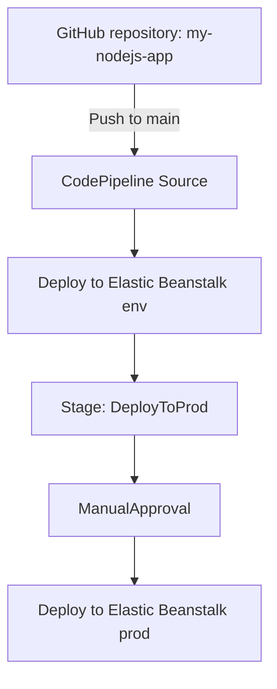

# 362. CodePipeline - Hands On

## 🎯 Giới thiệu
- Bài này hướng dẫn tạo một **CodePipeline** để triển khai code từ **GitHub** sang **AWS Elastic Beanstalk**.
- Pipeline được đặt tên là `MyFirstPipeline`.
- Mục tiêu chính là hiểu flow CI/CD cơ bản trên AWS:
  - Source từ GitHub
  - Deploy vào môi trường **env**
  - Thêm stage **DeployToProd**
  - Chèn **ManualApproval** trước khi deploy lên **prod**

## 1. Tạo CodePipeline cơ bản
- Tạo pipeline mới `MyFirstPipeline`.
- Giữ **execution mode** là `Queued`.
- Tạo **new service role** cho CodePipeline để pipeline có quyền thực thi.
- Giữ nguyên phần **artifact store** và **encryption key** trong Advanced settings.
- Đây là bước nền để CodePipeline có thể hoạt động và truy cập các tài nguyên cần thiết.

## 2. Kết nối Source từ GitHub
- Chọn **source provider** là **GitHub version 2**.
- Tạo connection GitHub với tên `MyGitHubConnection`.
- Cần authorize **AWS Connector for GitHub** và cài **GitHub App**.
- Chọn:
  - Repository: `my-nodejs-app`
  - Branch mặc định: `main`
  - Output artifact format: **CodePipeline default**
- Tạo trigger để pipeline chạy khi có **push** vào branch `main`.

## 3. Deploy sang Elastic Beanstalk và mở rộng pipeline
- Ở bước deploy, chọn **AWS Elastic Beanstalk**.
- Chọn application và environment đã tạo trước đó:
  - Môi trường đầu tiên: `env`
  - Môi trường production: `prod`
- Pipeline sẽ lấy source từ GitHub và deploy trực tiếp vào **Elastic Beanstalk environment**.
- Có thể cần vào **Settings** của pipeline để gắn thêm policy cho **service role**:
  - Thêm `AdministratorAccess Beanstalk` để demo deploy hoạt động trơn tru.

### Thêm stage và action group
- Pipeline có thể được chỉnh sửa để thêm stage mới:
  - `DeployToProd`
- Trong stage có thể có nhiều **action groups** chạy tuần tự.
- Thêm:
  - Action deploy sang `prod`
  - Action `ManualApproval` trước khi deploy production
- Đây là điểm quan trọng: **nhiều action groups có thể nằm trong một stage**.

### Cách pipeline chạy khi có thay đổi
- Khi thay đổi file source, ví dụ đổi màu nền từ **blue** sang **red**:
  - Commit trực tiếp lên `main`
  - CodePipeline tự động trigger
  - Deploy vào `env`
  - Sau đó dừng ở `ManualApproval`
  - Chỉ khi approve mới deploy sang `prod`
- Pipeline history cho phép xem:
  - Các lần chạy
  - Thời gian chạy
  - Run nào success hay failed
  - Commit nào tương ứng

## 📊 Bảng tóm tắt
| Tiêu chí | Mô tả |
|----------|------|
| Mục tiêu | Tạo CI/CD pipeline từ GitHub đến Elastic Beanstalk |
| Source | GitHub version 2, repository `my-nodejs-app`, branch `main` |
| Trigger | Push vào branch `main` |
| Deploy đầu tiên | Deploy vào Elastic Beanstalk environment `env` |
| Mở rộng pipeline | Thêm stage `DeployToProd` |
| Kiểm soát production | Dùng `ManualApproval` trước khi deploy `prod` |
| Lưu ý quyền | Có thể cần thêm `AdministratorAccess Beanstalk` cho service role |
| Theo dõi | Xem pipeline history để kiểm tra run, duration, commit, status |

## 💡 Mẹo ghi nhớ cho kỳ thi AWS
- `Source -> Deploy -> ManualApproval -> Prod` là flow rất dễ gặp trong câu hỏi CI/CD.
- **GitHub version 2** là source provider được nhấn mạnh trong bài.
- **Execution mode: Queued** và **service role** là các chi tiết cấu hình hay bị hỏi.
- **Action group** nằm trong **stage**, và một stage có thể có nhiều action group tuần tự.
- Nếu pipeline deploy sang Beanstalk bị thiếu quyền, hãy nghĩ tới **service role policy**.
- Nhớ rằng thay đổi ở source, nhất là commit vào `main`, có thể tự động kích hoạt pipeline.

## ✅ Kết luận
- Bài học cho thấy cách dựng một **CodePipeline** cơ bản từ **GitHub** sang **Elastic Beanstalk**.
- Sau đó mở rộng pipeline bằng cách thêm **DeployToProd** và **ManualApproval** để kiểm soát production.
- Đây là ví dụ thực hành rất điển hình cho **CI/CD trên AWS** và cách CodePipeline tự động hóa luồng deploy từ source đến môi trường chạy ứng dụng.
