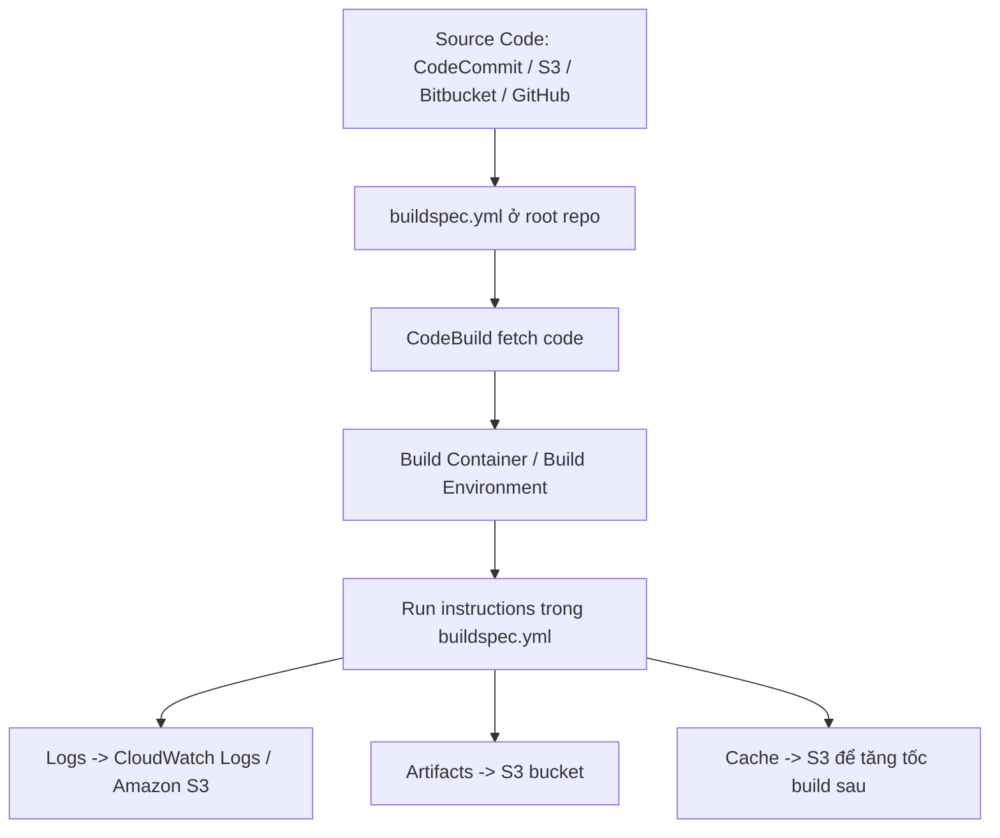

# 363. CodeBuild Overview

## 🎯 Giới thiệu
AWS CodeBuild là dịch vụ dùng để **build** và **test** source code từ các nguồn như **CodeCommit, Amazon S3, Bitbucket, GitHub**.

- CodeBuild đọc hướng dẫn build từ file **`buildspec.yml`**
- File này **phải nằm ở root của source code**
- Có thể nhập build instructions trực tiếp trong console, nhưng **best practice** và cũng là thứ hay xuất hiện trong exam là dùng **`buildspec.yml`**
- Sau khi build xong, output có thể được lưu vào **Amazon S3** và **CloudWatch Logs**

## 1. Nguồn code và `buildspec.yml` 🧾
- CodeBuild nhận source từ:
  - **CodeCommit**
  - **Amazon S3**
  - **Bitbucket**
  - **GitHub**
- File quan trọng nhất là **`buildspec.yml`**
- **`buildspec.yml` phải nằm ở thư mục gốc của code**
- Đây là file chứa các build instructions mà CodeBuild sẽ chạy
- Khi thi, cần nhớ:
  - **`buildspec.yml`**
  - **root of your code**
  - **best practice là dùng file này**

## 2. Build environment và các phase ⚙️
- CodeBuild tạo một **container** để chạy build
- Container sẽ load:
  - source code
  - `buildspec.yml`
- CodeBuild pull một **Docker image** để tạo container build
- Có sẵn image do AWS cung cấp cho nhiều môi trường/language:
  - **Java**
  - **Ruby**
  - **Python**
  - **Go**
  - **Node.js**
  - **Android**
  - **.NET Core**
  - **PHP**
- Nếu cần môi trường khác, có thể dùng **custom Docker image**
- `buildspec.yml` có các phần chính:
  - **environment**: khai báo biến môi trường
  - **phases**: định nghĩa các bước thực thi
  - **artifacts**: chỉ định output cần xuất ra
  - **cache**: chỉ định file cần cache

### Các phase quan trọng
- **install**: cài đặt package cần thiết
- **pre_build**: chạy trước bước build
- **build**: lệnh build chính
- **post_build**: bước hoàn tất, ví dụ tạo zip output

## 3. Logs, artifacts, cache và tích hợp 📦
- Sau khi build/test:
  - **logs** có thể lưu vào **CloudWatch Logs** và **Amazon S3**
  - **artifacts** được trích xuất từ container và đẩy vào **S3 bucket**
- Có thể theo dõi build bằng:
  - **CloudWatch Metrics** để xem build statistics
  - **EventBridge** để phát hiện build failed và trigger notifications
  - **CloudWatch Alarms** khi số lần fail quá nhiều
- CodeBuild hỗ trợ **cache** một số file vào **Amazon S3**
  - thường dùng cho dependencies
  - mục tiêu là **tăng tốc các lần build sau**
- Build Project có thể được:
  - định nghĩa trong **CodeBuild**
  - hoặc định nghĩa trong **CodePipeline**
- **CodePipeline** cũng có thể gọi một **existing CodeBuild Build Project**

## 📊 Bảng tóm tắt
| Tiêu chí | Mô tả |
|----------|------|
| Source input | CodeCommit, S3, Bitbucket, GitHub |
| File quan trọng | `buildspec.yml` |
| Vị trí file | Root của source code |
| Build environment | Container dựa trên Docker image |
| Image hỗ trợ sẵn | Java, Ruby, Python, Go, Node.js, Android, .NET Core, PHP |
| Custom environment | Có thể dùng custom Docker image |
| Output logs | CloudWatch Logs, Amazon S3 |
| Monitoring | CloudWatch Metrics, EventBridge, CloudWatch Alarms |
| Artifacts | Extract từ container và gửi vào S3 |
| Cache | Lưu vào S3 để tăng tốc build sau |
| Tích hợp | Có thể dùng trong CodeBuild hoặc CodePipeline |

## 💡 Mẹo ghi nhớ cho kỳ thi AWS
- Nhớ 3 từ khóa: **`buildspec.yml` - root - Docker container**
- `buildspec.yml` là file **rất quan trọng** và thường được hỏi trong exam
- **Artifacts** đi ra **S3**
- **Logs** đi vào **CloudWatch Logs** hoặc **S3**
- **Cache** dùng **S3** để tối ưu build sau
- **EventBridge** dùng để phát hiện failed builds và trigger notifications
- CodeBuild có thể chạy trong môi trường AWS-managed hoặc **custom Docker image**

## ✅ Kết luận
- CodeBuild là dịch vụ **build/test** code từ nhiều source khác nhau
- Trọng tâm của CodeBuild là file **`buildspec.yml`** ở **root repo**
- Quá trình build diễn ra trong **container** dựa trên **Docker image**
- Kết quả build có thể tạo **artifacts**, lưu **logs**, và dùng **cache** để tăng tốc các lần build tiếp theo
