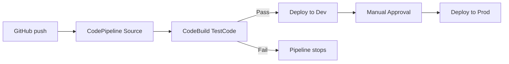

# 365. CodeBuild Hands On Part 2

## 🎯 Giới thiệu
Bài học này tập trung vào cách dùng `buildspec.yaml` để cấu hình `CodeBuild`, đọc `build logs` để kiểm tra từng phase, và tích hợp `CodeBuild` vào `CodePipeline` để tạo luồng `CI/CD` tự động.

## 1. Tạo `buildspec.yaml` để fix lỗi build
- Thêm file `buildspec.yaml` trực tiếp trong GitHub repository.
- File này mô tả các phase của `CodeBuild`:
  - `version: 0.2`
  - `install`
  - `pre_build`
  - `build`
  - `post_build`
- Trong `install`, dùng `nodejs latest` để chạy với runtime Node.js mới nhất.
- Trong `build`, có lệnh test:
  - `grep -Fq "Congratulations" index.html`
- Ý nghĩa của test:
  - Nếu từ `Congratulations` có trong `index.html` thì build pass.
  - Nếu không có thì build fail.
- Mục tiêu của test là xác nhận nội dung trên webpage vẫn đúng.

## 2. Theo dõi `CodeBuild` execution và `CloudWatch logs`
- Sau khi commit `buildspec.yaml`, `CodeBuild` tự động chạy lại.
- Build được trigger bởi `web hook` giữa GitHub và `CodeBuild`.
- Các phase của build có thể quan sát trong UI:
  - `submitted`
  - `queued`
  - `provisioning`
  - `download_source`
  - `install`
  - `pre_build`
  - `build`
  - `post_build`
  - `upload_artifacts`
  - `finalizing`
  - `completed`
- Có thể mở `View entire Log` để xem log trong `CloudWatch`.
- Log cho thấy:
  - Source được download từ GitHub
  - `Node.js version 20` được cài/chạy
  - Các command trong từng phase được thực thi
  - Nếu `grep` thành công thì `build succeeded`

## 3. Tích hợp `CodeBuild` vào `CodePipeline`
- Bỏ `Primary source webhook events` trong `CodeBuild` project.
  - Sau thay đổi này, push lên GitHub không còn trigger `CodeBuild` trực tiếp nữa.
- Trong `CodePipeline`, thêm stage mới tên `TestCode`.
- Cấu hình action:
  - `Action name`: `CodeBuildTest`
  - `Action provider`: `CodeBuild`
  - `Input artifact`: `SourceArtifact`
  - `Project name`: `MyFirstBuild`
  - `Output artifact`: `OutputOfTest`
- Luồng mới của pipeline:
  - Source → `CodeBuild` test → Deploy → DeployToProd
- Khi sửa `index.html`:
  - Đổi `Congratulations` thành `horrible` thì test fail
  - Pipeline dừng lại, không deploy sang bước tiếp theo
  - `Dev` không nhận thay đổi lỗi này
- Khi sửa lại nội dung đúng:
  - `Congratulations, CodeBuild`
  - `CodeBuild` pass
  - Pipeline tiếp tục deploy vào `Elastic Beanstalk`
  - `Dev` được cập nhật
  - `Prod` vẫn cần `manual approval`

## 📊 Bảng tóm tắt
| Tiêu chí | Mô tả |
|----------|------|
| `buildspec.yaml` | File cấu hình các phase của `CodeBuild` như `install`, `pre_build`, `build`, `post_build` |
| Test logic | Dùng `grep -Fq "Congratulations" index.html` để kiểm tra nội dung |
| Trigger build | Có thể được trigger bởi `GitHub webhook` hoặc bởi `CodePipeline` |
| Log kiểm tra | Xem chi tiết trong `CodeBuild` UI hoặc `CloudWatch logs` |
| Tích hợp pipeline | Thêm `CodeBuild` làm stage test trước khi deploy |
| Kết quả fail | Nếu test fail thì pipeline dừng, không deploy tiếp |
| Kết quả pass | Nếu test pass thì tiếp tục deploy sang `Dev` rồi mới đến `Prod` |

## 💡 Mẹo ghi nhớ cho kỳ thi AWS
- `buildspec.yaml` là “trái tim” của `CodeBuild` vì nó định nghĩa toàn bộ flow build.
- `grep` trong `build` phase là ví dụ rõ ràng của test tự động trong `CI/CD`.
- `CodeBuild` có thể được trigger bởi:
  - `GitHub webhook`
  - `CodePipeline`
- Khi đưa `CodeBuild` vào `CodePipeline`, pipeline thường sẽ:
  - `Source` → `Test` → `Deploy`
- Nếu test fail:
  - Pipeline sẽ dừng trước khi deploy
- Nếu test pass:
  - Pipeline mới đi tiếp sang môi trường kế tiếp
- Nhớ xem `CloudWatch logs` khi debug lỗi build.

## ✅ Kết luận
Bài học này cho thấy cách dùng `buildspec.yaml` để cấu hình `CodeBuild`, cách đọc các phase và logs để debug, và cách đưa `CodeBuild` vào `CodePipeline` để tạo quy trình `CI/CD` tự động, trong đó build/test phải pass thì mới được deploy tiếp.
