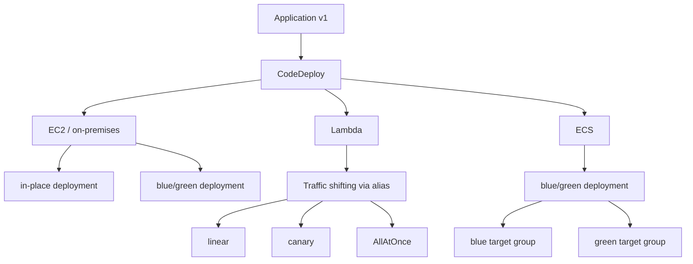

# 366. CodeDeploy Overview

## 🎯 Giới thiệu
- **AWS CodeDeploy** là dịch vụ **deployment** giúp tự động hóa việc triển khai ứng dụng.
- Dùng để nâng cấp application từ **version 1** lên **version 2** một cách an toàn.
- CodeDeploy hỗ trợ triển khai cho:
  - **EC2 instances**
  - **on-premises servers**
  - **Lambda functions**
  - **ECS services**
- Có thể **rollback tự động** nếu deployment lỗi, thất bại, hoặc có **alarm** được kích hoạt.
- Có thể kiểm soát tốc độ triển khai như:
  - `AllAtOnce`
  - `HalfAtATime`
  - `OneAtATime`
  - `blue/green`
- File cấu hình quan trọng: **`appspec.yml`**.

## 1. 🚀 CodeDeploy cho EC2 / on-premises
- Dùng để deploy application và code lên **EC2 instances** hoặc **on-premises servers**.
- Muốn hoạt động cần cài **CodeDeploy agent** trên target instances trước.
- Agent có thể được cài:
  - thủ công bằng lệnh Linux
  - tự động bằng **Systems Manager** nếu EC2 được quản lý qua SSM
- EC2 instance cần đủ **IAM permissions** để truy cập **Amazon S3** vì **application revision** được lưu trong S3.
- CodeDeploy agent sẽ tải revision từ S3 bucket để cập nhật từ **v1** sang **v2**.

### Kiểu triển khai trên EC2/on-premises
- **in-place deployment**
  - Update trực tiếp trên các instance hiện có.
- **blue/green deployment**
  - Tạo môi trường mới, rồi chuyển traffic sang môi trường mới và loại bỏ môi trường cũ.

### Deployment speed
- **AllAtOnce**
  - Update tất cả instance cùng lúc.
  - Downtime lớn nhất.
- **HalfAtATime**
  - Update 50% số instance mỗi lượt.
- **OneAtATime**
  - Update từng instance một.
  - Chậm nhất nhưng ảnh hưởng availability thấp nhất.
- Có thể tự định nghĩa **custom deployment speed**.

### Ví dụ in-place HalfAtATime
- Có **4 EC2 instances** đang chạy **v1**.
- CodeDeploy dừng **2 instance** trước để bảo trì.
- Agent update 2 instance đó lên **v2**.
- Sau đó tiếp tục với 2 instance còn lại.

### Ví dụ blue/green
- Có **Application Load Balancer** đang trỏ tới **v1**.
- CodeDeploy tạo **Auto Scaling group mới** cho **v2**.
- Các instance mới được tạo trong ASG mới.
- Load balancer chuyển sang ASG mới.
- ASG cũ bị loại bỏ.

## 2. 🟡 CodeDeploy cho Lambda
- CodeDeploy giúp **automate traffic shift** cho **Lambda aliases**.
- Triển khai thường gắn với alias như **PROD**.
- CodeDeploy điều chỉnh tỷ lệ traffic từ **v1** sang **v2** theo thời gian.
- Tính năng này được tích hợp trong **SAM framework**.

### Cách hoạt động
- Ban đầu **0%** traffic vào `v2`, toàn bộ đi vào `v1`.
- Sau đó tăng dần cho đến khi **100%** traffic chuyển sang `v2`.

### Các chiến lược traffic shifting
- **linear**
  - Tăng traffic theo từng bước mỗi **N phút** cho đến 100%.
  - Ví dụ: `LambdaLinear10PercentEvery3Minutes`.
- **canary**
  - Đưa một phần nhỏ traffic sang `v2` trước, rồi mới chuyển hẳn 100%.
  - Ví dụ: `LambdaCanary10Percent5Minutes`.
- **AllAtOnce**
  - Chuyển ngay từ `v1` sang `v2`.
  - Không có thời gian test dần.

## 3. 🟢 CodeDeploy cho ECS
- Dùng để tự động deploy **new ECS task definition**.
- Chỉ hỗ trợ **blue/green deployments**.
- Hoạt động cùng:
  - **Application Load Balancer**
  - **target group**
  - **ECS cluster**

### Luồng triển khai
- Có **blue target group** đang chạy version cũ.
- CodeDeploy tạo **green target group** với version mới.
- Version mới chạy từ **new ECS task definition** với cùng capacity như trước.
- Traffic được chuyển từ blue sang green qua load balancer.

### Chiến lược traffic shifting
- **linear**
  - Tăng dần traffic sang target group mới.
- **canary**
  - Cho một phần nhỏ traffic vào target group mới trước.
- **AllAtOnce**
  - Chuyển ngay toàn bộ traffic sang target group mới.

## 📊 Bảng tóm tắt
| Tiêu chí | Mô tả |
|----------|------|
| Mục đích | Tự động hóa application deployment |
| Target hỗ trợ | EC2, on-premises servers, Lambda functions, ECS services |
| Cơ chế an toàn | Hỗ trợ rollback khi deployment lỗi hoặc alarm kích hoạt |
| File cấu hình | `appspec.yml` |
| EC2/on-premises | Cần cài **CodeDeploy agent** |
| EC2 quyền truy cập | Cần **IAM permissions** để đọc **S3** chứa application revision |
| Lambda | Shift traffic theo **alias** như `PROD` |
| ECS | Chỉ hỗ trợ **blue/green** |
| Chiến lược triển khai | `AllAtOnce`, `HalfAtATime`, `OneAtATime`, `linear`, `canary`, `blue/green` |
| Tích hợp đặc biệt | **SAM framework** cho Lambda |

## 💡 Mẹo ghi nhớ cho kỳ thi AWS
- **CodeDeploy = deployment automation + rollback**.
- Nhớ 4 target chính: **EC2**, **on-premises**, **Lambda**, **ECS**.
- Với **EC2/on-premises**:
  - phải có **CodeDeploy agent**
  - revision nằm trong **S3**
  - cần **IAM permissions** để tải revision
- Với **Lambda**:
  - CodeDeploy làm **traffic shifting** cho alias
  - nhớ 3 chiến lược: **linear**, **canary**, **AllAtOnce**
- Với **ECS**:
  - chỉ có **blue/green**
- Nếu gặp câu hỏi về tốc độ rollout:
  - `AllAtOnce` = nhanh nhất, downtime lớn nhất
  - `OneAtATime` = chậm nhất, impact thấp nhất

## ✅ Kết luận
- **AWS CodeDeploy** là dịch vụ triển khai ứng dụng tự động, hỗ trợ nhiều môi trường như **EC2**, **on-premises**, **Lambda**, và **ECS**.
- Điểm mạnh chính là **deploy có kiểm soát**, **traffic shifting**, và **rollback tự động** khi có sự cố.
- Đây là dịch vụ cần nắm chắc khi ôn thi AWS Developer Associate vì xuất hiện nhiều trong các câu hỏi về **deployment strategy** và **safe rollout**.
