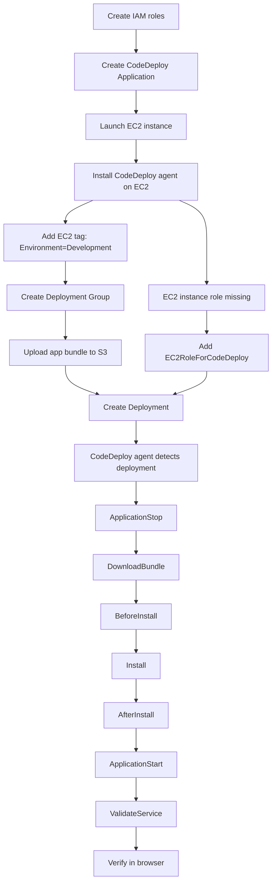

# 367. CodeDeploy Hands On

## 🎯 Giới thiệu
Bài giảng này demo cách triển khai ứng dụng lên EC2 bằng **AWS CodeDeploy** theo luồng thực hành đầy đủ:

- Tạo **IAM roles** cần thiết cho CodeDeploy và EC2
- Tạo **CodeDeploy Application** và **Deployment Group**
- Chuẩn bị **EC2 instance** làm target
- Cài **CodeDeploy agent**
- Upload ứng dụng lên **S3**
- Chạy deployment và kiểm tra các **lifecycle events**
- Sửa lỗi khi thiếu **instance role** để deployment thành công

## 1. IAM Roles cần tạo
### 🛡️ Role cho CodeDeploy
- Tạo role trong **IAM** cho AWS service là **CodeDeploy**
- Chọn use case phù hợp với demo: **CodeDeploy EC2 service role**
- Đặt tên: `CodeDeployServiceRoleForEC2`

### 🖥️ Role cho EC2 instance
- Tạo role cho **EC2 instance** sẽ nhận deployment
- Gắn policy: **AmazonS3ReadOnlyAccess**
- Mục đích: EC2 sẽ **pull code từ S3**
- Policy này cho phép các quyền kiểu:
  - `Get*`
  - `List*`
- Đặt tên: `EC2RoleForCodeDeploy`

### 📌 Điểm quan trọng
- Nếu EC2 **không có instance role**, deployment sẽ fail vì không lấy được bundle từ **S3**

## 2. Tạo Application, EC2 và Deployment Group
### 🏗️ Tạo CodeDeploy Application
- Tạo application tên: `DemoApplication`
- Compute platform có 3 lựa chọn:
  - **EC2**
  - **Lambda**
  - **Amazon ECS**
- Trong demo này chọn: **EC2/on-premises**

### 🚀 Tạo EC2 instance
- Launch EC2 instance tên: `DemoWebServer`
- Dùng:
  - **Amazon Linux**
  - **t2.micro**
- Security group cần cho phép:
  - **SSH**
  - **HTTP**
- Không cần key pair
- Không cần EC2 user data

### 🏷️ Dùng tag để phân nhóm instance
- Thêm tag:
  - Key: `Environment`
  - Value: `Development`
- CodeDeploy sẽ dùng tag này để chọn instance target

### ⚙️ Tạo Deployment Group
- Tạo deployment group tên: `Developmentinstances`
- Chọn:
  - **Service role** đã tạo trước đó
  - **Deployment type**: `In-place`
  - **Environment configuration**: `Amazon EC2 instances`
- Chỉ định tag group:
  - `Environment = Development`
- Kết quả: CodeDeploy nhận diện được đúng **1 unique matched instance**

### 🧩 Các lựa chọn được nhắc đến
- **Deployment type**:
  - `In-place`
  - `Blue/green`
- **Deployment settings**:
  - `CodeDeployDefault.AllAtOnce`
  - `one at a time`
  - `half at a time`
  - custom deployment configuration
- **Systems Manager**:
  - Không dùng trong demo vì agent đã cài thủ công

## 3. Upload Bundle và chạy Deployment
### 📦 Chuẩn bị ứng dụng trên S3
- Tạo S3 bucket cùng region với CodeDeploy
- Upload file zip: `SampleApp_linux.zip`

### 📄 Vai trò của `appspec.yml`
- Đây là file quan trọng nhất trong bundle
- Nó mô tả cho CodeDeploy biết phải làm gì khi deploy
- Trong demo:
  - copy `index.html` vào `/var/www/html`
  - dùng các hooks để điều khiển quá trình deploy

### 🔁 Lifecycle hooks xuất hiện trong deployment
- `ApplicationStop`
- `DownloadBundle`
- `BeforeInstall`
- `Install`
- `AfterInstall`
- `ApplicationStart`
- `ValidateService`

### 🛠️ Nội dung scripts
- `BeforeInstall`: cài dependency, ví dụ `httpd`
- `ApplicationStart`: start `httpd`
- `ApplicationStop`: stop `httpd` nếu đang chạy

### ❌ Lỗi và cách sửa
- Deployment đầu tiên fail vì quên gắn **EC2 instance role**
- Cách sửa:
  - vào EC2
  - chọn **Actions > Security > Modify IAM role**
  - gắn role `EC2RoleForCodeDeploy`
- Sau đó retry deployment thì thành công

### ✅ Kiểm tra kết quả
- Mở public IP của EC2 trên trình duyệt với `http://`
- Trang hiển thị thông báo:
  - ứng dụng đã được deploy bằng **AWS CodeDeploy**

## 📊 Bảng tóm tắt
| Tiêu chí | Mô tả |
|----------|------|
| IAM roles | Cần 2 role: 1 cho **CodeDeploy service**, 1 cho **EC2 instance** |
| Target selection | Dùng **tags** để chọn instance, ví dụ `Environment=Development` |
| Compute platform | Demo dùng **EC2/on-premises** |
| Deployment type | Demo dùng **In-place** |
| Bundle source | Ứng dụng được upload lên **S3** dưới dạng `.zip` |
| Điều khiển deploy | Dùng `appspec.yml` và lifecycle hooks |
| Lỗi thường gặp | Thiếu **instance role** nên EC2 không đọc được từ S3 |
| Kết quả | Sau khi sửa role, deployment chạy qua đủ các hook và web app hoạt động |

## 💡 Mẹo ghi nhớ cho kỳ thi AWS
- **CodeDeploy cần 2 lớp quyền**: một role cho service, một role cho instance
- **EC2 pull bundle từ S3**, nên instance role phải có quyền đọc S3
- **Tagging** là cách CodeDeploy nhận diện instance target
- **`appspec.yml`** là trung tâm của deployment flow
- Nếu thấy câu hỏi về **lifecycle events**, nhớ chuỗi:
  - `ApplicationStop` → `DownloadBundle` → `BeforeInstall` → `Install` → `AfterInstall` → `ApplicationStart` → `ValidateService`
- **In-place** là kiểu deploy trực tiếp lên instance hiện tại
- **Blue/green** cũng là lựa chọn của CodeDeploy, nhưng demo này không dùng
- Có thể áp dụng CodeDeploy cho:
  - **EC2**
  - **Lambda**
  - **ECS**
- Với **on-premises instances**, vẫn cần **CodeDeploy agent** và tagging đúng

## ✅ Kết luận
- Demo này cho thấy quy trình cơ bản của **AWS CodeDeploy** trên **EC2**
- Điểm mấu chốt là:
  - tạo đúng **IAM roles**
  - cài đúng **CodeDeploy agent**
  - gắn đúng **tags**
  - upload đúng **bundle** lên **S3**
  - dùng đúng **appspec.yml**
- Khi thiếu **EC2 instance role**, deployment sẽ không lấy được file từ S3 và sẽ fail
- Sau khi cấu hình đầy đủ, CodeDeploy có thể triển khai application thành công theo các lifecycle events đã định nghĩa
