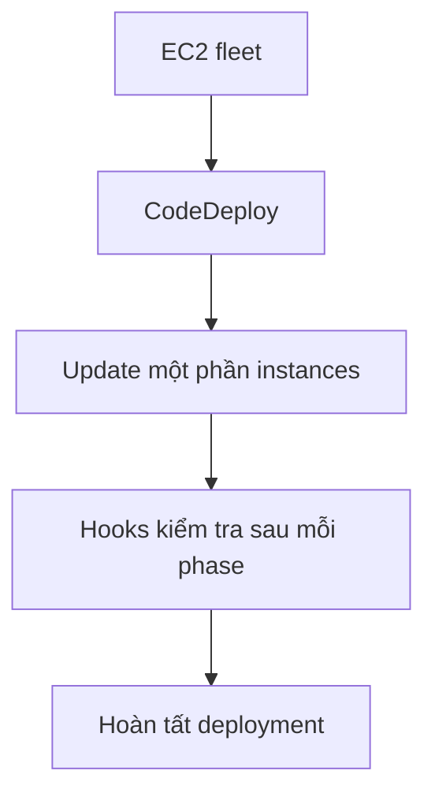
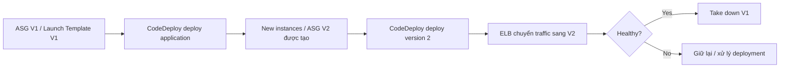
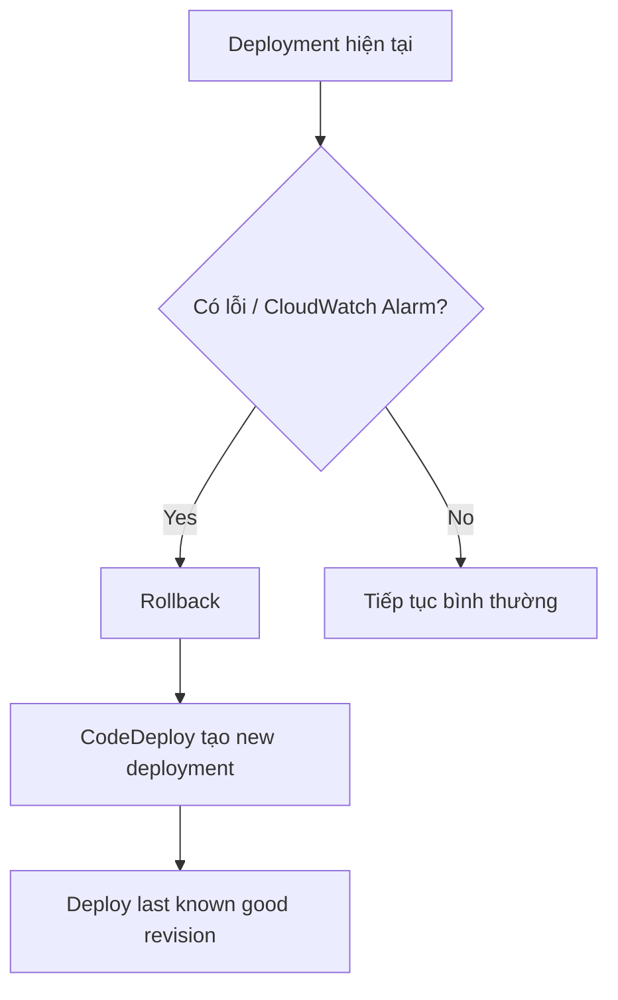

# 368. CodeDeploy for EC2 and ASG

## 🎯 Giới thiệu
- Bài này nói về cách **CodeDeploy** triển khai ứng dụng lên **EC2** và **ASG**.
- Với EC2, code cần có file **`appspec.yml`** ở root.
- CodeDeploy hỗ trợ **in-place deployment**, **blue/green deployment**, và **rollback**.
- Có thể dùng **hooks** để xác minh deployment sau mỗi phase.

## 1. CodeDeploy cho EC2
- Triển khai theo kiểu **in-place** lên fleet EC2 hiện có.
- Có thể update từng phần, ví dụ:
  - một nửa instances bị đưa xuống rồi upgrade lên version mới,
  - sau đó nửa còn lại mới được update.
- **hooks** được dùng để kiểm tra deployment sau từng phase.

## 2. CodeDeploy cho ASG
- Với **ASG**, deployment phức tạp hơn và có 2 kiểu:
  - **in-place deployment**
  - **blue/green deployment**
- Ở **in-place deployment**:
  - CodeDeploy update các EC2 instances đang tồn tại.
  - Nếu ASG tự tạo EC2 instance mới, instance mới đó cũng sẽ nhận deployment từ CodeDeploy.

- Ở **blue/green deployment**:
  - Một **new Auto Scaling group** sẽ được tạo ra.
  - Settings được **copy** sang ASG mới.
  - Có thể chọn giữ **old EC2 instances / old ASG** bao lâu.
  - **ELB** sẽ chuyển traffic từ target group cũ sang target group mới.

## 3. Rollback trong CodeDeploy
- **Rollback** là redeploy lại một **previously deployed revision** của application.
- Có 2 cách rollback:
  - **Automatic**: khi deployment fail hoặc khi **CloudWatch Alarm** được trigger.
  - **Manual**: thực hiện thủ công.
- Nếu **disable rollbacks**, deployment đó sẽ không có rollback.
- Khi rollback xảy ra, CodeDeploy **không quay ngược thời gian**:
  - nó thực sự tạo **một new deployment**
  - và deploy lại **last known good revision**.

## 📊 Bảng tóm tắt
| Tiêu chí | Mô tả |
|----------|------|
| `appspec.yml` | File nằm ở root của code khi deploy lên EC2 |
| EC2 deployment | Chủ yếu là **in-place deployment** |
| Hooks | Dùng để verify deployment sau mỗi phase |
| ASG deployment | Có **in-place** và **blue/green** |
| Blue/green | Tạo **new ASG**, copy settings, chuyển traffic qua **ELB** |
| Rollback | Redeploy lại **last known good revision** như một deployment mới |
| Automatic rollback | Xảy ra khi deployment fail hoặc **CloudWatch Alarm** trigger |
| Manual rollback | Do người dùng thực hiện |
| Disable rollback | Không có rollback cho deployment đó |

## 💡 Mẹo ghi nhớ cho kỳ thi AWS
- **EC2 + CodeDeploy**: nhớ ngay **`appspec.yml`** và **hooks**.
- **ASG in-place**: update instance hiện có, instance mới sinh ra cũng có thể được deploy.
- **ASG blue/green**: có **new ASG**, **copy settings**, rồi **ELB shift traffic**.
- **Rollback**: CodeDeploy **không restore ngược thời gian**; nó tạo **new deployment** bằng **last known good revision**.
- Nếu thấy câu hỏi nhắc đến **CloudWatch Alarm** + failed deployment, nghĩ đến **automatic rollback**.

## ✅ Kết luận
- CodeDeploy trên EC2 thường là **in-place deployment** với **appspec.yml** và **hooks**.
- Với ASG, CodeDeploy hỗ trợ cả **in-place** và **blue/green**, trong đó blue/green tạo ASG mới và chuyển traffic qua **ELB**.
- **Rollback** trong CodeDeploy là một **deployment mới** dùng lại revision tốt gần nhất, không phải quay lại trạng thái cũ theo kiểu restore.
