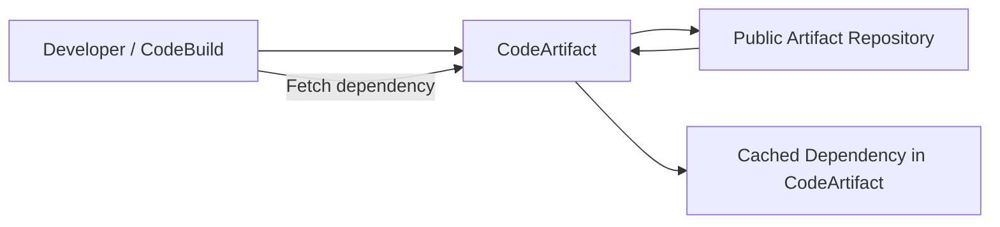
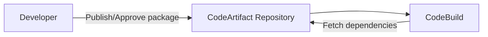
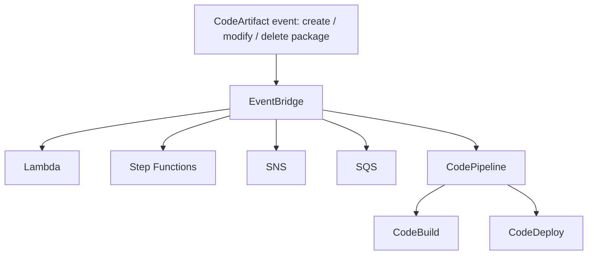

# 369. CodeArtifact - Overview

## 🎯 Giới thiệu
Amazon CodeArtifact là dịch vụ quản lý **artifact/dependency** cho phát triển phần mềm trong AWS.

- Khi build phần mềm, ứng dụng thường phụ thuộc vào các software khác, gọi là **code dependencies**.
- Tập hợp các dependency và artifact này thuộc bài toán **artifact management**.
- CodeArtifact cung cấp một hệ thống artifact management:
  - **secure**
  - **scalable**
  - **cost-effective**
- Dịch vụ này hỗ trợ nhiều hệ sinh thái phổ biến như:
  - **Maven**
  - **Gradle**
  - **npm**
  - **yarn**
  - **twine**
  - **pip**
  - **NuGet**
- Developers và **CodeBuild** có thể lấy dependencies trực tiếp từ CodeArtifact trong AWS.

## 1. Cách CodeArtifact hoạt động
CodeArtifact được dùng như nơi tập trung các artifact trong AWS.

- Các artifact của bạn nằm trong AWS, trong phạm vi VPC theo cách mô tả trong transcript.
- CodeArtifact dùng khái niệm **domain**:
  - Một **domain** là một tập hợp các **repositories**.
- Developers có thể cấu hình tool quen thuộc để kéo dependency từ CodeArtifact:
  - Ví dụ JavaScript developers dùng `npm`
  - Python dùng `pip`
  - Java dùng `Maven`
  - .NET dùng `NuGet`

### 🔁 Proxy và caching
CodeArtifact có thể hoạt động như một **proxy** cho public artifact repositories.

- Developer không cần truy cập trực tiếp public repo.
- Request sẽ đi qua CodeArtifact.
- CodeArtifact sẽ proxy request ra public repository.
- Dependency được **cache** trong CodeArtifact.

Lợi ích:
- **Network security**: developer chỉ tương tác với CodeArtifact.
- Nếu dependency biến mất khỏi public repo, bạn vẫn còn bản copy trong CodeArtifact.
- Giúp đảm bảo code vẫn có thể build về sau.

### Mermaid

## 2. Publish artifacts và tự động hóa build
Ngoài việc lấy dependency từ public repo qua proxy, bạn cũng có thể **push/publish artifacts** của riêng mình vào CodeArtifact.

- IT leader hoặc developers có thể publish và approve packages.
- Tất cả artifacts được quản lý trong một nơi.
- Khi developers lấy được artifacts từ CodeArtifact, thì **CodeBuild** cũng có thể làm tương tự.
- CodeBuild có thể fetch dependency trực tiếp từ CodeArtifact thay vì public repositories.

### Mermaid

## 3. Event flow và kiểm soát truy cập
CodeArtifact có thể phát sinh event khi package thay đổi.

### Event flow
Theo transcript:
- Khi package được **created**
- hoặc **modified**
- hoặc **deleted**

thì CodeArtifact sẽ emit event vào **EventBridge**.

Từ **EventBridge**, có thể trigger nhiều dịch vụ AWS như:
- **Lambda**
- **Step Functions**
- **SNS**
- **SQS**
- **CodePipeline**

Ví dụ trong transcript:
- CodeArtifact cập nhật version của package
- EventBridge nhận event
- Trigger **CodePipeline**
- CodePipeline có thể:
  - dùng **CodeCommit** để biết dependency đã đổi
  - trigger **CodeBuild** để rebuild ứng dụng
  - deploy phiên bản mới bằng **CodeDeploy**

### Mermaid

### Kiểm soát truy cập
Transcript nhấn mạnh 2 kiểu authorization:

- Với users và roles trong **cùng account**:
  - có thể dùng **IAM policy**
- Với **cross-account access**:
  - phải dùng **resource policy**

Lưu ý quan trọng:
- Khi cấp quyền vào CodeArtifact repository, quyền truy cập là:
  - **all packages**
  - hoặc **none**
- Không thể chỉ cấp quyền cho một vài package riêng lẻ.

## 📊 Bảng tóm tắt
| Tiêu chí | Mô tả |
|----------|------|
| Mục đích | Quản lý **artifacts/dependencies** cho software development |
| Điểm mạnh | **Secure**, **scalable**, **cost-effective** |
| Hỗ trợ tool | **Maven, Gradle, npm, yarn, twine, pip, NuGet** |
| Cách hoạt động | Developer/CodeBuild lấy dependency từ CodeArtifact |
| Proxy | Có thể proxy public artifact repositories |
| Caching | Dependency được cache trong CodeArtifact |
| Publish | Có thể publish artifact nội bộ vào repository |
| Event integration | Emit event sang **EventBridge** khi package tạo/sửa/xóa |
| Downstream services | **Lambda, Step Functions, SNS, SQS, CodePipeline** |
| Access control | Cùng account dùng **IAM policy**, cross-account dùng **resource policy** |
| Cross-account rule | Quyền truy cập theo repo: **all packages hoặc none** |

## 💡 Mẹo ghi nhớ cho kỳ thi AWS
- **CodeArtifact = artifact management cho dependencies**
- Nhớ bộ 3 ý chính:
  - **Proxy** public repositories
  - **Cache** dependencies
  - **Publish** artifacts nội bộ
- Với câu hỏi về access:
  - **Same account** -> **IAM policy**
  - **Cross-account** -> **resource policy**
- Với câu hỏi về event-driven automation:
  - CodeArtifact event -> **EventBridge** -> các service như **Lambda**, **CodePipeline**
- Nếu đề bài nói về build ổn định lâu dài:
  - nhớ lợi ích của **caching**: dependency vẫn còn dù public repo biến mất

## ✅ Kết luận
CodeArtifact là dịch vụ giúp quản lý dependency và artifact ngay trong AWS, hỗ trợ proxy public repositories, caching, publish artifact nội bộ, và tích hợp event-driven qua EventBridge. Điểm thi cần nhớ nhất là cách phân quyền: **IAM policy** cho cùng account, **resource policy** cho cross-account, và quyền repo là **all packages or none**.
