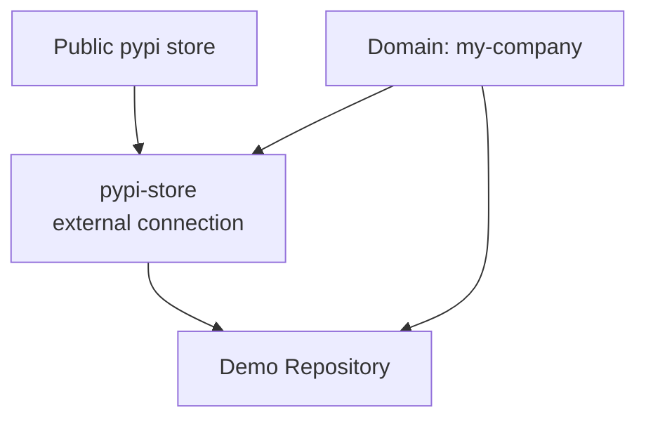
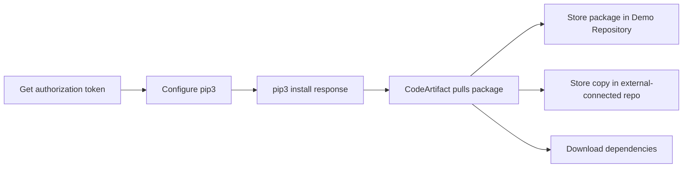

# 370. CodeArtifact - Hands On

## 🎯 Giới thiệu
Bài hands-on này minh họa cách dùng **CodeArtifact** để:
- Tạo **domain** và **repository**
- Cấu hình **upstream repository** và **external connection**
- Kết nối **pip / pip3** để tải package vào CodeArtifact
- Xem cách **package** và **dependency** được lưu trong repository
- Áp dụng **repo policy** và **domain policy**
- Dọn dẹp tài nguyên sau khi thực hành

## 1. Tạo CodeArtifact Domain và Repository
- Tạo repository tên **Demo Repository**
- Chọn upstream là **Python store** để lấy package từ **public pypi store**
- Khi tạo repository, cần tạo **domain** vì tài khoản chưa có domain nào sẵn
- Domain được đặt tên là **my-company**
- Domain là nơi lưu toàn bộ **artifact data** và **package data**
- Khi tạo domain, cần chỉ định **KMS key** để mã hóa
- Trong bài, dùng **AWS managed key**

### Mermaid: Kiến trúc lưu trữ và upstream

## 2. Kết nối pip3 với CodeArtifact và tải package
- Mở **CloudShell** để chạy lệnh
- Xem **connection instruction** trong CodeArtifact
- Có cách cấu hình tự động bằng CLI, nhưng trong bài lệnh đó bị lỗi vì:
  - `pip` không tìm thấy
  - Thực tế chỉ có **pip3**
- Vì vậy thực hiện **manual setup**
- Dùng CodeArtifact để lấy **authorization token**
- Token này:
  - Gắn với **domain**
  - Gắn với **domain owner**
  - Gắn với **region**
  - Có hiệu lực **12 hours**
- Sau đó dùng `pip3 config set` để trỏ pip3 về CodeArtifact repository
- Chạy `pip3 install response`
- Khi cài package:
  - CodeArtifact sẽ pull package từ upstream
  - Các **dependencies** đi kèm cũng được tải theo
- Kết quả:
  - Package được lưu trong **Demo Repository**
  - Repo có **external connection** cũng giữ một bản
- Có thể cài phiên bản khác, ví dụ `== 0.4.0`
- Sau khi refresh, repository sẽ thấy nhiều version như:
  - `0.5.0`
  - `0.4.0`

### Mermaid: Flow cài package

## 3. Policy và Cleanup
- Có thể áp dụng **repo policy** ở cấp repository
- Các mức access được nhắc đến:
  - **read-only access**
  - **read and publish access**
  - **full access**
- Có thể chọn loại governance để chỉnh policy rồi paste policy vào
- Ở cấp **domain**, cũng có thể áp dụng **domain policy**
- Ví dụ policy cho:
  - **contributor domain access**
  - **full domain access**
  - **IAM principal**
  - **organization**
- Cách dùng tổng quát:
  - Tạo nhiều repository
  - Xác định repo nào là **upstream** của repo nào
  - Cấu hình **pip** để pull package từ CodeArtifact
  - Dependencies sẽ được lưu vào repository
- Kết thúc lab:
  - Xóa repository thứ nhất
  - Xóa repository thứ hai
  - Xóa domain

## 📊 Bảng tóm tắt
| Tiêu chí | Mô tả |
|----------|------|
| Mục tiêu | Thực hành CodeArtifact với repository, domain, upstream và package pull |
| Domain | Nơi lưu toàn bộ artifact/package data, ví dụ `my-company` |
| Repository | Ví dụ `Demo Repository`, nhận package từ upstream |
| Upstream | `pypi-store` lấy từ `public pypi store` qua external connection |
| Mã hóa | Domain cần **KMS key**, trong bài dùng **AWS managed key** |
| Kết nối client | Dùng **authorization token** và cấu hình `pip3` |
| Token | Có hiệu lực **12 hours** |
| Kết quả pull | Package và dependencies được lưu trong repository |
| Quản trị | Có thể áp dụng **repo policy** và **domain policy** |
| Dọn dẹp | Xóa repository và domain sau khi thực hành |

## 💡 Mẹo ghi nhớ cho kỳ thi AWS
- **Domain** = nơi chứa toàn bộ package data của công ty
- **Repository** = nơi client như `pip3` pull package về
- **Upstream repository** = nguồn lấy package từ repo khác hoặc public store
- **External connection** = kết nối tới **public pypi store**
- **Authorization token** chỉ có hiệu lực **12 hours**
- Khi cài một package, **dependencies** cũng có thể được lưu cùng
- Nhớ phân biệt:
  - **repo policy**: kiểm soát ở mức repository
  - **domain policy**: kiểm soát ở mức domain

## ✅ Kết luận
Bài học này cho thấy cách dùng **CodeArtifact** để tạo **domain**, xây dựng chuỗi **upstream repository**, cấu hình **pip3** bằng **authorization token**, và lưu package cùng dependencies vào repository. Ngoài ra, bài còn minh họa cách quản lý truy cập bằng **repo policy** và **domain policy**, rồi dọn dẹp tài nguyên sau khi thực hành.
