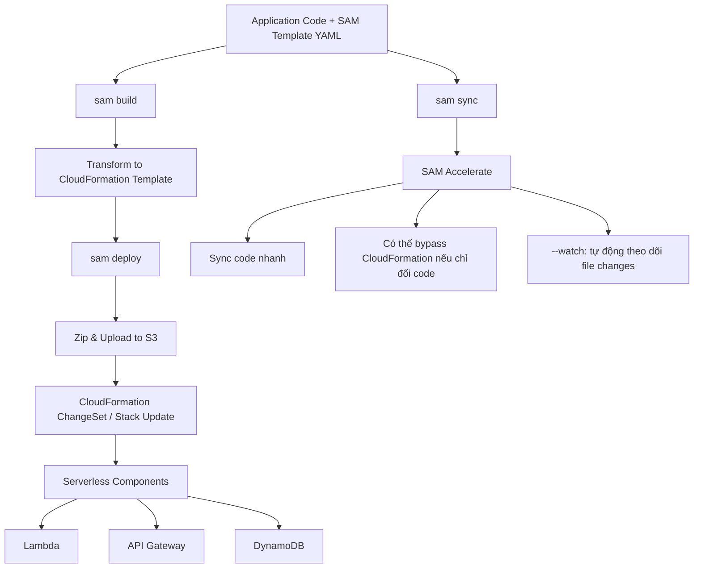

# 372. SAM Overview

## 🎯 Giới thiệu
AWS SAM (Serverless Application Model) là một framework dùng để **develop** và **deploy serverless applications**. Ý chính của SAM là giúp bạn viết cấu hình bằng **YAML** đơn giản hơn, sau đó SAM sẽ tự động chuyển đổi thành các **CloudFormation** template phức tạp hơn.

SAM tập trung vào serverless workflow, hỗ trợ:
- Deploy nhanh lên AWS bằng **CloudFormation**
- Debug và test **locally**
- Làm việc với các dịch vụ serverless như **Lambda**, **API Gateway**, **DynamoDB**

## 1. SAM là gì?
- SAM là viết tắt của **Serverless Application Model**
- SAM là một **framework** thực sự để xây dựng serverless applications
- Bạn vẫn có thể dùng các thành phần của CloudFormation như:
  - `Outputs`
  - `Mappings`
  - `Parameters`
  - `Resources`
- Trong template SAM, bạn thêm `Transform` ở đầu file để báo cho CloudFormation biết đây là SAM template
- CloudFormation sẽ transform SAM template thành CloudFormation template

## 2. SAM Constructs và cách viết template
Thay vì dùng trực tiếp CloudFormation constructs, bạn dùng các **SAM constructs** để đơn giản hóa việc viết serverless app:

- `serverless function` → **Lambda**
- `serverless API` → **API Gateway**
- `serverless SimpleTable` → **DynamoDB**

Điểm nhấn:
- Cấu hình vẫn ở dạng **YAML**
- Code + SAM template đi cùng nhau
- SAM giúp viết template ngắn gọn, dễ đọc, dễ quản lý hơn

## 3. Deployment Flow và SAM Accelerate
Quy trình deploy SAM được mô tả như sau:
- Viết **application code** và **SAM template**
- Chạy `sam build`
- SAM transform thành CloudFormation template và build application
- Chạy `sam deploy`
- Code sẽ được zip và upload lên **S3**
- Sau đó SAM thực thi **ChangeSet** hoặc deploy lên **CloudFormation**
- CloudFormation stack có thể gồm:
  - Lambda
  - API Gateway
  - DynamoDB

### SAM Accelerate
SAM Accelerate là tập hợp các feature giúp giảm độ trễ khi deploy lên AWS.

Các điểm quan trọng:
- `sam sync` dùng để đồng bộ project lên AWS nhanh hơn
- Có thể **bypass CloudFormation** khi chỉ thay đổi code, không đổi infrastructure
- Có thể:
  - sync cả **code + infrastructure**
  - hoặc chỉ sync **code**
- Có thể chỉ định **resource ID** để update một Lambda cụ thể
- `sam sync --watch` sẽ theo dõi file changes và tự động sync khi phát hiện thay đổi

## 📊 Bảng tóm tắt
| Tiêu chí | Mô tả |
|----------|------|
| Mục tiêu | Build và deploy serverless applications nhanh hơn |
| Cấu hình | Dùng YAML theo SAM framework |
| Chuyển đổi | SAM template được transform thành CloudFormation template |
| Constructs chính | `serverless function`, `serverless API`, `serverless SimpleTable` |
| Dịch vụ liên quan | Lambda, API Gateway, DynamoDB, S3, CloudFormation |
| Lệnh deploy | `sam build`, `sam deploy` |
| Đồng bộ nhanh | `sam sync`, `sam sync --watch` |
| Điểm mạnh | Debug local, deploy nhanh, giảm độ trễ cập nhật |

## 💡 Mẹo ghi nhớ cho kỳ thi AWS
- SAM = **Serverless Application Model**
- Nhớ 3 constructs chính:
  - `serverless function` = **Lambda**
  - `serverless API` = **API Gateway**
  - `serverless SimpleTable` = **DynamoDB**
- `Transform` ở đầu template dùng để báo đây là **SAM template**
- `sam build` rồi `sam deploy` là flow deploy cơ bản
- `sam sync --watch` là cách đồng bộ nhanh khi chỉ thay đổi code
- SAM có thể giúp deploy nhanh và local debug cho serverless app

## ✅ Kết luận
AWS SAM là framework giúp đơn giản hóa việc phát triển và triển khai **serverless applications**. SAM dùng **YAML**, chuyển đổi sang **CloudFormation**, hỗ trợ các dịch vụ như **Lambda**, **API Gateway**, **DynamoDB**, và có **SAM Accelerate** để đồng bộ thay đổi nhanh hơn, đặc biệt hữu ích khi cần cập nhật code liên tục.
