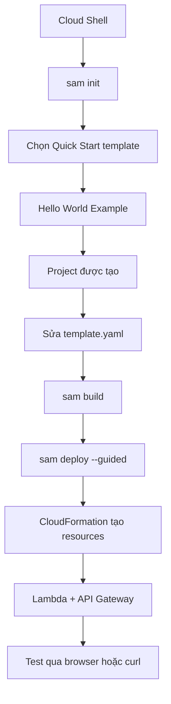

# 373. SAM - Hands On

## 🎯 Giới thiệu
Bài học này hướng dẫn thực hành với **AWS SAM (Serverless Application Model)** bằng **SAM CLI** trong **Cloud Shell** để tạo, build và deploy một ứng dụng serverless đơn giản.

Mục tiêu chính:
- Khởi tạo project bằng `sam init`
- Hiểu các file quan trọng trong SAM project
- Sửa `template.yaml` để phù hợp runtime
- Build bằng `sam build`
- Deploy bằng `sam deploy --guided`
- Kiểm tra ứng dụng qua **API Gateway** và **Lambda**

## 1. Khởi tạo SAM Application
- Mở **Cloud Shell** để dùng **SAM CLI** đã được cài sẵn.
- Kiểm tra phiên bản bằng `sam --version`.
- Chạy `sam init` để khởi tạo ứng dụng.
- Chọn:
  - **Quick Start template**
  - **Hello World Example**
  - **Python**
  - **zip**
- Các lựa chọn như:
  - `X-ray tracing`
  - `CloudWatch Insights`
  - `JSON log format`
  được tắt trong demo này.
- Kết quả:
  - Project `SAM app` được tạo tự động.

## 2. Cấu trúc Project và File Quan Trọng
Sau khi vào thư mục project, có thể thấy các file/thư mục chính:

- `Hello World/app.py`
  - Chứa code Python của Lambda function
  - Có `lambda handler`
  - Trả về `"Hello world"`

- `requirements.txt`
  - Khai báo các Python packages cần thiết
  - Trong transcript có package `requests`

- `samconfig.toml`
  - File cấu hình cho SAM application
  - Lưu các thông tin như:
    - version
    - stack name
    - build parameters

- `template.yaml`
  - Đây là file rất quan trọng
  - Là **serverless application template**
  - Có `Transform AWS::Serverless`
  - Khai báo:
    - `Function timeout`
    - `Resources`
    - `Type: AWS::Serverless::Function`
    - `CodeUri`
    - `Handler`
    - `Runtime`

### Chỉnh sửa runtime
- Khi chạy `sam build`, transcript gặp lỗi vì version Python được chọn ban đầu không có sẵn.
- Cách xử lý:
  - mở `template.yaml`
  - đổi `Runtime` sang **Python 3.9**
- Sau đó build lại sẽ thành công.

## 3. Build, Deploy và Kiểm Tra
### Build
- Chạy `sam build`
- Sau khi build thành công:
  - SAM tạo thư mục build artifacts
  - Trong đó có:
    - code function
    - dependencies
    - file template đã được xử lý

### Deploy
- Chạy `sam deploy --guided`
- Nhập các lựa chọn:
  - `Stack name`: `SAM app`
  - `Region`: default
  - xác nhận resources sẽ tạo
  - cho phép tạo **SAM CLI IAM role**
  - không disable rollback
  - lưu tham số vào config file
- SAM sẽ triển khai qua **CloudFormation**

### Resources được tạo
Transcript cho thấy deploy sẽ tạo các thành phần như:
- **S3 bucket**
- **IAM role**
- **Lambda function**
- **API Gateway**
- các resource liên quan khác của stack

### Kiểm tra kết quả
- Vào **Lambda** để thấy function `Hello World`
- Vào **API Gateway** để thấy endpoint `SAM app API`
- GET request sẽ invoke Lambda function
- Test bằng:
  - browser
  - `curl`
- Kết quả trả về:
  - `message: "Hello world"`

## 📊 Bảng tóm tắt
| Tiêu chí | Mô tả |
|----------|------|
| Công cụ | `SAM CLI` trong `Cloud Shell` |
| Mục đích | Tạo và deploy serverless application |
| Template | `Quick Start` -> `Hello World Example` |
| File quan trọng | `app.py`, `requirements.txt`, `samconfig.toml`, `template.yaml` |
| Build | `sam build` |
| Deploy | `sam deploy --guided` |
| Runtime xử lý lỗi | Đổi sang `Python 3.9` trong `template.yaml` |
| Kết quả cuối | `Lambda` + `API Gateway` hoạt động thành công |

## 💡 Mẹo ghi nhớ cho kỳ thi AWS
- `sam init` dùng để khởi tạo serverless project nhanh.
- `template.yaml` là file trung tâm mô tả tài nguyên SAM.
- Nếu build lỗi do runtime, kiểm tra lại version `Python` trong `template.yaml`.
- `sam build` tạo build artifacts trước khi deploy.
- `sam deploy --guided` rất hữu ích để deploy lần đầu và lưu cấu hình.
- SAM triển khai qua **CloudFormation**, nên các resource như `Lambda`, `API Gateway`, `IAM role` sẽ được tạo cùng stack.
- Endpoint của `API Gateway` có thể được test trực tiếp bằng browser hoặc `curl`.

## ✅ Kết luận
Bài hands-on này cho thấy quy trình cơ bản của **AWS SAM**: khởi tạo project, hiểu các file cấu hình, build ứng dụng, deploy lên AWS và test qua endpoint. Đây là workflow quan trọng để ôn thi AWS khi học về **serverless application deployment** với `Lambda` và `API Gateway`.
