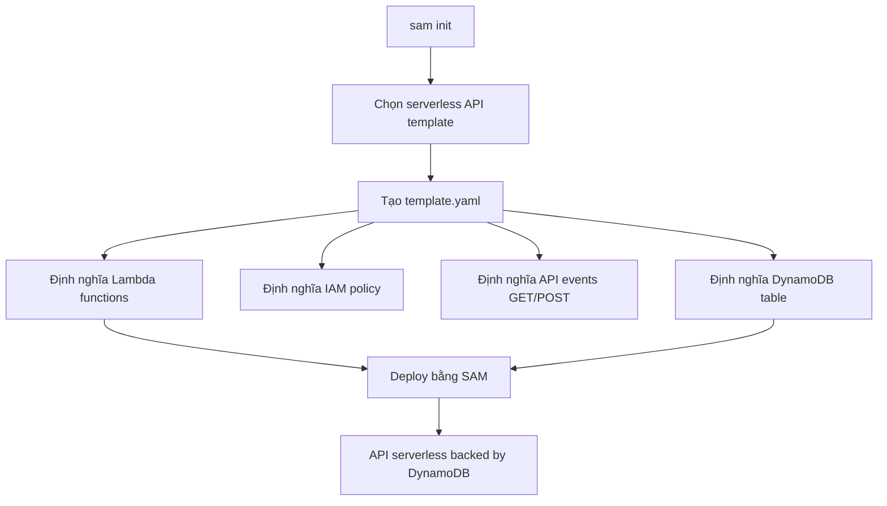

# 374. SAM with DynamoDB - Hands On

## 🎯 Giới thiệu
Bài giảng này minh họa cách dùng **AWS SAM** để tạo một **serverless API** có gắn với **DynamoDB table**. Mục tiêu chính là cho thấy cách SAM giúp mô tả nhanh **Lambda functions**, **API events**, **IAM policy**, và **DynamoDB** chỉ trong một `template.yaml`.

## 1. Khởi tạo project với SAM
- Dùng `sam init`
- Chọn **quick start templates**
- Chọn mẫu **serverless API** (number 7 trong ví dụ)
- Chọn runtime **nodejs22**
- Không bật **X-Ray**
- Đặt tên project là `sam-app-dynamodb`

Sau khi khởi tạo:
- Cấu trúc thư mục tương tự các ví dụ trước
- Có các file source JavaScript
- File quan trọng nhất vẫn là `template.yaml`

## 2. Cấu trúc `template.yaml` và các resource chính
- `Transform: AWS::Serverless-...` là phần rất quan trọng trong SAM
- Trong `Resources`, template có nhiều **serverless function**
- Mỗi function đều có:
  - `source`
  - `runtime`
  - `memory`
  - `policy`
  - `events`

### Các function trong ví dụ
- `getAllItemsFunction`
  - Có **DynamoDB CRUD policy**
  - Policy được tham chiếu theo **table name**
  - Event là **GET** ở root path `/`
- Một function khác
  - Có handler và policy riêng
  - Gắn với một API path khác
- Function thứ ba
  - Dùng method **POST**
  - Đại diện cho thao tác **put**

### DynamoDB table
- `sample table` được khai báo trực tiếp trong SAM
- Bên dưới sẽ được chuyển thành **DynamoDB table**
- Có:
  - **primary key**
  - **provisioned throughput**
  - read capacity unit = 2
  - write capacity unit = 2

## 3. Chạy và kiểm thử local với SAM
- SAM có khả năng chạy local
- Có thể dùng:
  - `sam local invoke`
  - `sam local start-api`
- Trong ví dụ, các event mẫu có sẵn để copy và dùng khi test local
- Tài liệu `readme.md` sẽ hướng dẫn các event cần dùng cho:
  - function **put item**
  - function **getAllItemsFunction**
- Có thể khởi động **local API Gateway** ngay trên máy cá nhân bằng `sam local start-api`
- Mục tiêu là:
  - iterate nhanh trên máy local
  - sau khi xong thì upload/deploy lên AWS
- Nếu deploy thật, cần nhớ dọn tài nguyên bằng `sam delete`

## 📊 Bảng tóm tắt
| Tiêu chí | Mô tả |
|----------|------|
| Mục tiêu | Tạo serverless API bằng SAM có backend là DynamoDB |
| Khởi tạo | `sam init` với quick start template serverless API |
| Runtime | `nodejs22` |
| Thành phần chính | `template.yaml`, Lambda functions, API events, DynamoDB table |
| IAM | Dùng `policy` trong SAM để tạo IAM policy dễ hơn CloudFormation raw |
| API methods | `GET` và `POST` |
| DynamoDB | Table được khai báo trong SAM và chuyển thành DynamoDB thật |
| Local test | `sam local invoke`, `sam local start-api` |
| Cleanup | Dùng `sam delete` sau khi deploy thử |

## 💡 Mẹo ghi nhớ cho kỳ thi AWS
- **SAM** giúp mô tả nhanh cả **Lambda + API Gateway + DynamoDB** trong một template.
- `policy` trong SAM có thể tạo **IAM policy** rất gọn, đặc biệt với **DynamoDB CRUD policy**.
- `events` trong SAM dùng để map API như **GET root path** hoặc **POST**.
- DynamoDB table trong template SAM sẽ được **convert** sang resource thật khi deploy.
- Nếu muốn test nhanh, nhớ 2 lệnh quan trọng:
  - `sam local invoke`
  - `sam local start-api`
- Đừng quên `sam delete` nếu đã deploy thử.

## ✅ Kết luận
Ví dụ này cho thấy sức mạnh của **SAM CLI** khi xây dựng một **serverless API** backed by **DynamoDB**. Chỉ với `template.yaml`, ta có thể định nghĩa **function**, **policy**, **API route**, và **table** rất nhanh, đồng thời vẫn có thể test local trước khi deploy lên AWS.
