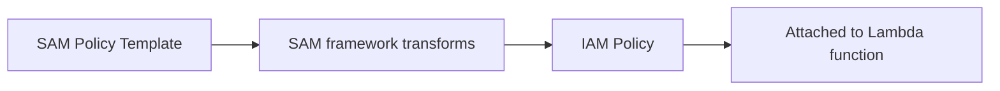

# 375. SAM Policy Templates

## 🎯 Giới thiệu
- SAM policy templates là các **serverless model policy templates** có thể xuất hiện trong exam.
- Đây là **danh sách template** dùng để gán quyền cho **Lambda functions**.
- Mục tiêu chính:
  - Giúp đọc nhanh function được phép làm gì
  - Gom nhóm các permission theo mục đích sử dụng
  - Đỡ phải tự lo quá nhiều về việc provision **IAM roles**

## 1. SAM policy templates là gì? 🧩
- Là các template quyền sẵn có trong SAM.
- Dùng để áp permissions cho Lambda function.
- Khi nhìn tên template, thường có thể đoán được chức năng của nó khá rõ ràng.
- Transcript nhấn mạnh: chỉ cần nhìn một lần là có thể hiểu cách chúng hoạt động.

## 2. Ba ví dụ quan trọng 📌
### `S3ReadPolicy`
- Cấp **read-only permissions** cho objects trong **S3**.

### `SQSPollerPolicy`
- Cho phép Lambda function **poll** một **SQS queue**.

### `DynamoDBCrudPolicy`
- **CRUD** = `create`, `read`, `update`, `delete`.
- Cho phép Lambda function thực hiện các thao tác CRUD trên **DynamoDB table**.

## 3. Cách SAM policy templates hoạt động trong thực tế 🔄
- Thay vì attach trực tiếp một **IAM role**, bạn khai báo policy template trong SAM.
- Ví dụ transcript nêu:
  - Function chạy **Python 2.7**
  - Muốn đọc từ **SQS**
  - Ta dùng `SQSPollerPolicy` và chỉ định queue name
- Sau đó, khi **SAM policy template** được **SAM framework** transform:
  - Nó sẽ trở thành **IAM policy**
  - Policy này được attach vào **Lambda function**
- Lợi ích chính:
  - Viết dễ hơn
  - Rõ function cần làm gì
  - Không phải quá bận tâm đến cách provision IAM roles

## 📊 Bảng tóm tắt
| Tiêu chí | Mô tả |
|----------|------|
| Khái niệm | Template quyền trong **SAM** dùng cho **Lambda functions** |
| Mục đích | Gom nhóm permission và đơn giản hóa việc cấp quyền |
| Ví dụ 1 | `S3ReadPolicy` = đọc object trong **S3** |
| Ví dụ 2 | `SQSPollerPolicy` = poll **SQS queue** |
| Ví dụ 3 | `DynamoDBCrudPolicy` = CRUD trên **DynamoDB table** |
| Cơ chế | SAM transform template thành **IAM policy** |
| Lợi ích | Dễ viết, dễ hiểu, giảm gánh nặng quản lý **IAM roles** |

## 💡 Mẹo ghi nhớ cho kỳ thi AWS
- Nhìn tên là đoán được chức năng: `S3ReadPolicy`, `SQSPollerPolicy`, `DynamoDBCrudPolicy`.
- Nhớ từ khóa:
  - `Read` = chỉ đọc
  - `Poller` = lấy message từ queue
  - `CRUD` = create, read, update, delete
- Câu hỏi exam thường xoay quanh việc:
  - Cấp quyền cho Lambda nhanh hơn
  - SAM template được convert thành **IAM policy**
  - Không cần tự viết toàn bộ permission thủ công

## ✅ Kết luận
- **SAM policy templates** là cách đơn giản để gán quyền cho **Lambda**.
- Chúng giúp bạn mô tả quyền cần dùng một cách rõ ràng, rồi SAM sẽ chuyển thành **IAM policy**.
- Ba ví dụ quan trọng cần nhớ là `S3ReadPolicy`, `SQSPollerPolicy`, và `DynamoDBCrudPolicy`.
