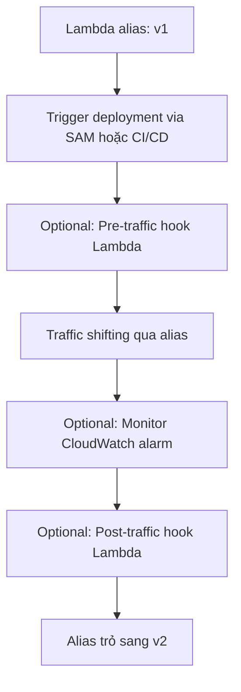

# 376. SAM with CodeDeploy

## 🎯 Giới thiệu
- Bài này nói về cách `CodeDeploy` tích hợp với `SAM` để deploy `Lambda`.
- Mục tiêu chính là dùng `alias` để thực hiện `traffic shifting` giữa version cũ và version mới.
- Có thể thêm:
  - `pre-traffic hooks`
  - `post-traffic hooks`
  - `CloudWatch alarms` để tự động rollback

## 1. Luồng triển khai với CodeDeploy
- `SAM` dùng `CodeDeploy` để cập nhật `Lambda function`.
- Quy trình triển khai dựa trên `alias`:
  - ban đầu `alias` trỏ tới `v1`
  - deploy tạo `v2`
  - `CodeDeploy` chuyển traffic dần từ `v1` sang `v2`
- Các bước có thể xuất hiện trong flow:
  - `pre-traffic hook` để kiểm tra trước khi shift traffic
  - `traffic shifting` theo strategy
  - theo dõi `CloudWatch alarm`
  - `post-traffic hook` để kiểm tra sau khi shift xong
- Nếu mọi thứ ổn, `alias` sẽ trỏ hoàn toàn sang `v2`.

## 2. Các cấu hình chính trong SAM
- `AutoPublishAlias`
  - giúp `SAM` phát hiện khi có code mới
  - tự động publish version mới
  - cập nhật `alias` sang version mới
- `DeploymentPreference`
  - điều khiển tốc độ và kiểu triển khai
  - các kiểu được nhắc đến:
    - `Canary`
    - `Linear`
    - `AllAtOnce`
- Ví dụ trong bài:
  - `Canary10Percent10Minutes`
  - nghĩa là:
    - 10% traffic đi vào version mới trong 10 phút
    - nếu ổn thì chuyển lên 100%
- `Alarms`
  - danh sách `CloudWatch alarms`
  - dùng để trigger rollback nếu version mới có lỗi quá nhiều
- `Hooks`
  - là `Lambda functions`
  - chạy trước hoặc sau khi shift traffic
  - dùng để test hoặc chạy logic tùy chỉnh

## 3. Thực hành triển khai
- Tạo ứng dụng `SAM` mới bằng template `Hello World Example`.
- Chạy:
  - `sam build`
  - `sam deploy --guided`
- Ứng dụng ban đầu:
  - có `HelloWorldFunction`
  - `app.py` trả về `"hello world"`
  - `alias live` ở `version 1`
- Sau đó sửa code thành `"hello world v2"`.
- Build và deploy lại:
  - `SAM` tạo `version 2`
  - `CodeDeploy` thực hiện `blue/green deployment`
  - alias hiển thị traffic chia `90% / 10%`
- Trong `CodeDeploy`:
  - `pre-deployment validation` có thể không tồn tại và vẫn pass
  - quá trình `traffic shift` diễn ra theo cấu hình `Canary10Percent10Minutes`
  - sau khi hoàn tất, alias chỉ còn trỏ tới `version 2`
- Kết quả:
  - triển khai thành công `Lambda` bằng `SAM` + `CodeDeploy`
  - traffic được chuyển an toàn từ `v1` sang `v2`

## 📊 Bảng tóm tắt
| Tiêu chí | Mô tả |
|----------|------|
| Mục tiêu | Deploy `Lambda` an toàn bằng `SAM` và `CodeDeploy` |
| Cơ chế chính | Dùng `alias` để `traffic shifting` giữa các version |
| Cấu hình quan trọng | `AutoPublishAlias`, `DeploymentPreference`, `Alarms`, `Hooks` |
| Chiến lược triển khai | `Canary`, `Linear`, `AllAtOnce` |
| Ví dụ trong bài | `Canary10Percent10Minutes` |
| Kiểm tra triển khai | `pre-traffic hook`, `post-traffic hook`, `CloudWatch alarm` |
| Kết quả cuối | `alias` trỏ hoàn toàn sang `v2` nếu deploy thành công |

## 💡 Mẹo ghi nhớ cho kỳ thi AWS
- Nhớ công thức: `SAM` + `CodeDeploy` + `Lambda alias` = triển khai có `traffic shifting`.
- `AutoPublishAlias` dùng để tự động publish version mới và cập nhật alias.
- `DeploymentPreference` quyết định cách traffic được chia.
- `Canary10Percent10Minutes` nghĩa là 10% trước, 100% sau nếu ổn.
- `Alarms` có vai trò bảo vệ, giúp rollback khi version mới có lỗi.
- `Hooks` là các `Lambda` test trước và sau khi shift traffic.

## ✅ Kết luận
- `SAM` có thể tích hợp với `CodeDeploy` để triển khai `Lambda` theo kiểu an toàn hơn so với đổi thẳng sang version mới.
- Trọng tâm là dùng `alias` để kiểm soát `traffic shifting`, kết hợp `DeploymentPreference`, `Alarms`, và `Hooks`.
- Bài lab minh họa rõ quy trình từ `v1` sang `v2` và cách `CodeDeploy` xử lý deployment trong nền.
