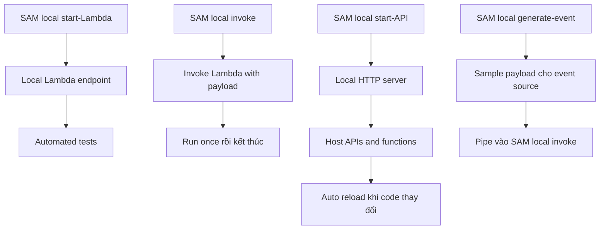

# 377. SAM - Local Capabilities

## 🎯 Giới thiệu
- SAM framework cho phép mô phỏng và chạy thử **AWS Lambda** ngay trên máy local.
- Mục tiêu chính là hỗ trợ:
  - test tự động trên endpoint local
  - invoke Lambda với payload mẫu
  - dựng local API Gateway
  - tạo event mẫu cho nhiều nguồn sự kiện khác nhau

## 1. Local Lambda với `SAM local start-Lambda`
- Lệnh `SAM local start-Lambda` sẽ tạo ra một **local endpoint** cho Lambda trên máy tính.
- Endpoint này mô phỏng **Lambda framework**.
- Rất hữu ích để chạy **automated tests** trực tiếp trên Lambda local.

## 2. Invoke Lambda và chạy local API với `SAM local invoke` / `SAM local start-API`
- `SAM local invoke` dùng để **invoke Lambda function** với một **payload**.
- Cách dùng này phù hợp khi bạn muốn chạy một lần rồi kết thúc sau khi invocation hoàn tất.
- Nếu Lambda có gọi sang AWS service, ví dụ **DynamoDB**, thì cần chạy local function với đúng `--profile` để xác định môi trường chạy.
- `SAM local start-API` sẽ tạo một **local HTTP server** để host toàn bộ APIs và functions.
- Khi code Lambda thay đổi, function sẽ được **reload tự động** và API cũng được cập nhật.

## 3. Tạo event mẫu với `SAM local generate-event`
- `SAM local generate-event` dùng để tạo **sample payloads** cho các **event sources** của Lambda.
- Có thể kết hợp với `SAM local invoke` bằng cách pipe event đã tạo vào lệnh invoke.
- Ví dụ nêu trong transcript: tạo event cho **Amazon S3** khi put object vào bucket tại một key cụ thể.
- Các nguồn event được nhắc đến gồm:
  - **Amazon S3**
  - **API Gateway**
  - **SNS**
  - **Kinesis**
  - **DynamoDB**
  - và hầu như các nguồn khác của Lambda

## 📊 Bảng tóm tắt
| Tiêu chí | Mô tả |
|----------|------|
| `SAM local start-Lambda` | Tạo local endpoint cho Lambda để test trên máy |
| `SAM local invoke` | Invoke Lambda bằng payload và chạy một lần |
| `--profile` | Cần dùng khi Lambda local tương tác với AWS service, ví dụ DynamoDB |
| `SAM local start-API` | Tạo local HTTP server cho APIs và functions |
| Auto reload | Code Lambda thay đổi thì function và API được cập nhật |
| `SAM local generate-event` | Sinh event mẫu cho Lambda từ nhiều nguồn sự kiện |

## 💡 Mẹo ghi nhớ cho kỳ thi AWS
- Nhớ bộ 3 lệnh chính:
  - `start-Lambda` = dựng Lambda local
  - `invoke` = chạy thử một payload
  - `start-API` = dựng API Gateway local
- Nếu Lambda gọi AWS service, hãy nhớ chi tiết `--profile`.
- `generate-event` rất hay đi với `invoke` để tạo payload test nhanh.
- Các event source được nhắc trong transcript cần nhớ: **S3, API Gateway, SNS, Kinesis, DynamoDB**.

## ✅ Kết luận
- SAM local giúp bạn mô phỏng **Lambda** và **API Gateway** ngay trên máy local.
- Bạn có thể test, invoke, reload code tự động, và tạo event mẫu cho nhiều nguồn khác nhau.
- Đây là bộ công cụ rất quan trọng để luyện tập và kiểm thử workflow Lambda trước khi deploy.
