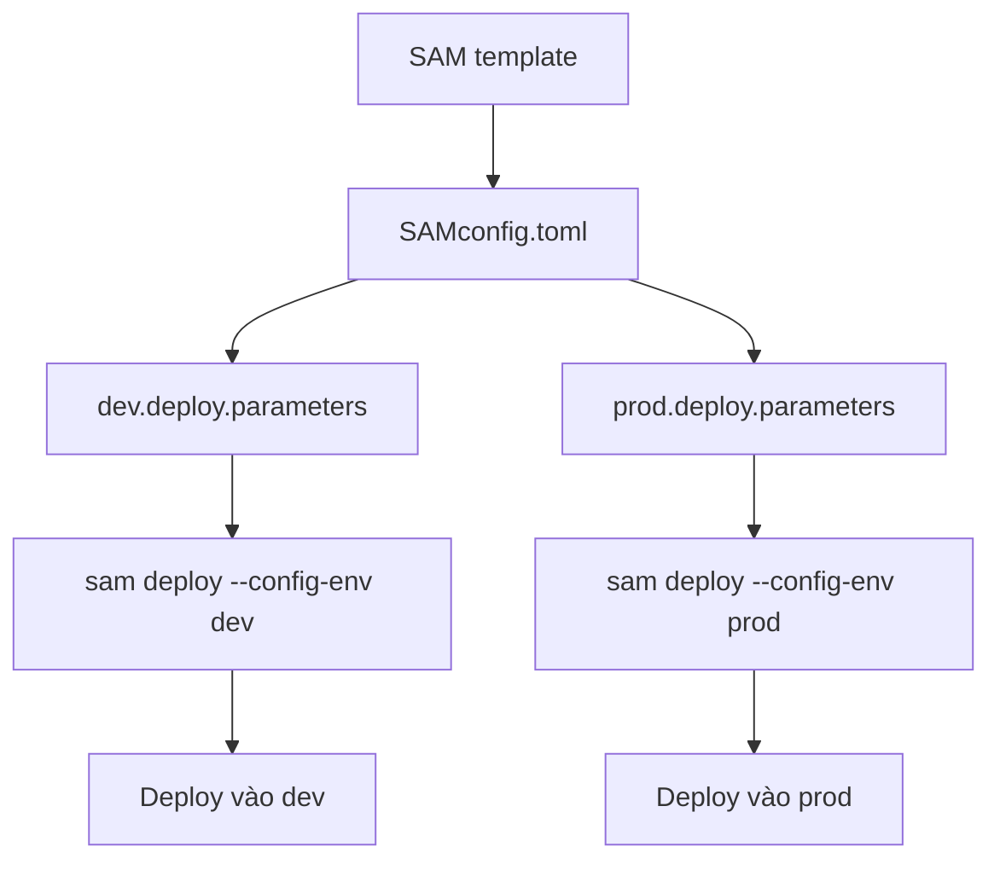

# 378. SAM - Multiple Environments

## 🎯 Giới thiệu
SAM cho phép quản lý nhiều môi trường khác nhau trong cùng một development stack một cách dễ dàng.

- Bạn có thể deploy cùng một SAM template vào nhiều môi trường như `dev` và `prod`.
- Thay vì tách nhiều bộ lệnh riêng, bạn tạo thêm file `SAMconfig.toml`.
- File này dùng định dạng `TOML` để lưu các cấu hình khác nhau cho từng environment.

## 1. `SAMconfig.toml` và cấu hình theo môi trường
- `SAMconfig.toml` chứa các parameter riêng cho từng stack/environment.
- Với `dev`:
  - khai báo `deploy.parameters`
  - đặt `stack name`
  - đặt `S3 bucket`
  - đặt `region`
  - đặt `capabilities`
  - dùng `parameter overrides` để chỉ định environment là `development`
  - có thể cấu hình thêm `sync parameters`
- Với `prod`:
  - khai báo `prod.deploy.parameters`
  - cấu hình tương tự như `dev`
  - `parameter overrides` chỉ định environment là `production`
  - cũng có thể cấu hình `sync parameters`

## 2. Cách SAM CLI chọn đúng môi trường
- Sau khi cấu hình xong trong `SAMconfig.toml`, bạn chỉ cần chạy:
  - `sam deploy --config-env dev`
  - hoặc `sam deploy --config-env prod`
- SAM CLI sẽ:
  - đọc `SAMconfig.toml`
  - lấy đúng parameters tương ứng với environment được chọn
  - deploy resources vào đúng môi trường và đúng vị trí

## 3. Ý nghĩa khi học và thi AWS
- Cách này giúp quản lý nhiều environment trong cùng một workflow.
- Bạn có thể mở rộng thêm nhiều environment khác nếu cần.
- Đây là một chủ đề có thể xuất hiện trong exam.

## 📊 Bảng tóm tắt
| Tiêu chí | Mô tả |
|----------|------|
| Mục đích | Quản lý nhiều environment trong SAM |
| File chính | `SAMconfig.toml` |
| Cách phân tách | Dùng các block như `dev.deploy.parameters` và `prod.deploy.parameters` |
| Lệnh triển khai | `sam deploy --config-env dev` hoặc `sam deploy --config-env prod` |
| Kết quả | SAM CLI tự chọn đúng parameters cho environment tương ứng |

## 💡 Mẹo ghi nhớ cho kỳ thi AWS
- Nhớ cặp đôi: `SAMconfig.toml` + `--config-env`
- `dev` và `prod` được tách bằng các block parameter riêng
- `parameter overrides` dùng để chỉ định environment
- `sam deploy` không cần đổi template, chỉ đổi `config-env`

## ✅ Kết luận
SAM hỗ trợ nhiều môi trường bằng cách lưu cấu hình trong `SAMconfig.toml` và chọn environment phù hợp bằng `--config-env`. Đây là cách deploy gọn hơn, rõ ràng hơn và rất dễ gặp trong bài thi AWS.
