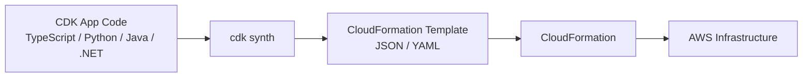
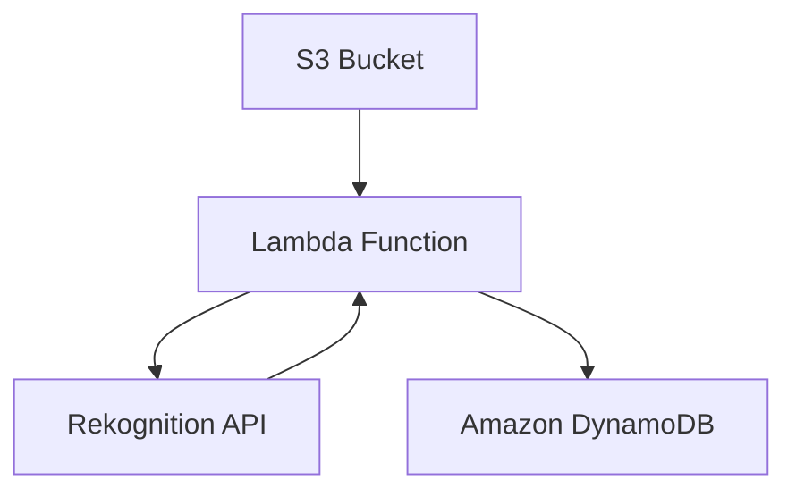

# 379. CDK Overview

## 🎯 Giới thiệu
AWS Cloud Development Kit (CDK) cho phép bạn định nghĩa **cloud infrastructure** bằng ngôn ngữ lập trình quen thuộc như **JavaScript/TypeScript, Python, Java, .NET**.

Điểm chính:
- CDK là một bước cao hơn so với **CloudFormation**
- Bạn viết code để tạo **constructs** thay vì viết YAML/JSON trực tiếp
- Nếu code hợp lệ và compile được, CDK sẽ **synthesize** thành **CloudFormation template** để triển khai

## 1. CDK hoạt động như thế nào
CDK dùng các **constructs** để mô tả hạ tầng ở mức cao.

Ví dụ trong transcript:
- Tạo **VPC** với tên và số **AZs**
- Tạo **ECS Cluster** và gắn vào VPC
- Tạo **application load-balanced Fargate service**
  - gắn với cluster
  - cấu hình CPU, number of tasks, memory limits
  - public **ALB**

Ý nghĩa quan trọng:
- CDK giúp bạn mô tả hạ tầng bằng code
- Code có thể được kiểm tra lỗi compile/type safety sớm
- Nếu code không compile, template sẽ không được tạo

## 2. CDK và CloudFormation
CDK không thay thế hoàn toàn CloudFormation theo nghĩa tách rời, mà hoạt động như một lớp cao hơn:

- Bạn viết infrastructure bằng programming language
- CDK **compile/synthesize** thành **CloudFormation template**
- CloudFormation là nơi thực thi triển khai cuối cùng

Điểm nổi bật:
- CloudFormation template có thể là **JSON** hoặc **YAML**
- CDK mang lại sự linh hoạt cao hơn và dễ làm việc hơn
- CDK cho phép triển khai **infrastructure** và **application runtime code** cùng nhau

Phù hợp đặc biệt với:
- **Lambda functions**
- **Docker containers** trên **ECS** hoặc **EKS**

## 3. CDK, SAM và workflow kết hợp
Transcript so sánh CDK với **SAM** như sau:

- **SAM**:
  - thiên về **serverless**
  - dùng template **declarative** bằng **JSON/YAML**
  - phù hợp để bắt đầu nhanh với **Lambda**
  - cũng dựa trên **CloudFormation** ở backend

- **CDK**:
  - là **superset of CloudFormation**
  - hỗ trợ mọi AWS services
  - dùng programming language quen thuộc
  - cũng tạo ra CloudFormation ở backend

Kết hợp CDK với SAM:
- chạy `cdk synth` để sinh CloudFormation template
- dùng **SAM CLI** để test local, ví dụ `sam local invoke`
- SAM có thể tham chiếu template sinh ra từ CDK

Ví dụ kiến trúc hands-on trong transcript:
- Người dùng upload image vào **S3 bucket**
- **S3** trigger **Lambda**
- **Lambda** gọi **Rekognition** để phân tích ảnh
- Kết quả được lưu vào **Amazon DynamoDB**
- Tất cả được định nghĩa trong **CDK script**

## 📊 Bảng tóm tắt
| Tiêu chí | Mô tả |
|----------|------|
| Mục đích | Định nghĩa infrastructure bằng programming language |
| Đầu vào | TypeScript, Python, Java, .NET, JavaScript |
| Đầu ra | CloudFormation template (JSON/YAML) |
| Tính chất | Type-safe, compile trước khi deploy |
| Mối quan hệ với CloudFormation | CDK là lớp cao hơn, synth ra CloudFormation |
| So với SAM | CDK rộng hơn, SAM thiên về serverless |
| Tình huống phù hợp | Lambda, ECS/EKS, infrastructure + runtime code |

## 💡 Mẹo ghi nhớ cho kỳ thi AWS
- **CDK = code để tạo CloudFormation**
- **CloudFormation** vẫn là lớp backend thực thi cuối cùng
- **CDK** phù hợp khi muốn viết infrastructure bằng ngôn ngữ lập trình và giảm lỗi YAML/JSON thủ công
- **SAM** nhớ là thiên về **serverless** và **Lambda**
- `cdk synth` là bước quan trọng để sinh template trước khi deploy hoặc test local với SAM

## ✅ Kết luận
CDK giúp bạn mô tả AWS infrastructure bằng code thay vì viết template thủ công. Nó mang lại **type safety**, dễ bảo trì hơn, và vẫn dựa trên **CloudFormation** ở phía sau. Trong transcript, CDK được minh họa qua một luồng kiến trúc gồm **S3 -> Lambda -> Rekognition -> DynamoDB**, cho thấy khả năng kết hợp cả infrastructure lẫn application logic trong cùng một workflow.
