# 380. CDK - Hands On

## 🎯 Giới thiệu
- Bài lab này dùng **AWS CDK** để tạo một hệ thống gồm:
  - **S3 bucket**
  - **Lambda function**
  - **Amazon Recognition**
  - **DynamoDB table**
- Mục tiêu là:
  - Upload file vào **S3**
  - **Lambda** được trigger
  - Lambda gọi **Recognition**
  - Kết quả được lưu vào **DynamoDB**
- Trong quá trình làm, dùng **CloudTrail** và **CloudShell** để chạy lệnh trên AWS environment.

## 1. Khởi tạo CDK application
- Cài đặt CDK library bằng `npm install` với `aws-cdk-lib`.
- Tạo thư mục `cdk-app`, sau đó chạy `cdk init app` với **JavaScript**.
- Dùng `cdk ls` để kiểm tra stack được tạo ra, kết quả mong đợi là **CdkAppStack**.
- Trong thư mục `lib`, thay nội dung `cdk-app-stack` bằng file mới và kiểm tra lại bằng `cat`.

## 2. Định nghĩa infrastructure bằng CDK
- File CDK là phần cốt lõi của bài lab:
  - `require` các construct như **S3**, **IAM**, **Lambda**, **DynamoDB**
  - Tạo **S3 bucket** với `removal policy` là `destroy`
  - Tạo output bằng **CfnOutput** cho `bucket name`
- Tạo **role** cho Lambda:
  - Dùng `addToPolicy` để thêm **policy statement**
- Tạo **DynamoDB table**:
  - Định nghĩa **partition key**
  - Thiết lập `removal policy`
  - Xuất output
- Tạo **Lambda function**:
  - Khai báo `runtime`, `role`, `environment variables`
  - Biến môi trường được nối trực tiếp với **table** và **bucket**
  - Thêm **event source** để Lambda được trigger từ **S3**
- CDK cho phép:
  - Viết infrastructure bằng code
  - Tự động chuyển sang **CloudFormation**
  - Dùng shorthand như `grant read-write access` cho Lambda lên bucket và table thay vì tự viết IAM policy thủ công

## 3. Viết Lambda và triển khai stack
- Tạo thư mục `Lambda`, tạo file `index.py`.
- File `index.py` nhận vai trò:
  - Detect labels trong ảnh bằng **Amazon Recognition**
  - Đọc image từ **S3**
  - Ghi dữ liệu vào **DynamoDB**
- Bootstrap CDK:
  - Chạy một lần cho mỗi **account** và **region**
  - Tạo các tài nguyên cần thiết cho CDK hoạt động
  - Trong **CloudFormation**, stack **CDK Toolkit** sẽ được tạo ra
- Dùng `cdk synth`:
  - Sinh ra **CloudFormation template**
  - Template chứa **S3 bucket**, **S3 notifications**, **Lambda**, **IAM role**, **SSM parameters**
- Dùng `cdk deploy`:
  - Deploy template vào **CloudFormation**
  - Sau khi deploy xong, stack có các resource như **IAM role**, **S3 bucket**, **DynamoDB table**
- Kiểm tra luồng hoạt động:
  - Upload ảnh vào **S3**
  - **S3** gửi notification đến **Lambda**
  - Lambda gọi **Recognition**
  - Kết quả xuất hiện trong **DynamoDB**
- Ví dụ trong transcript:
  - Upload `penguins.jpeg` -> table có một item với các labels như `penguin`, `mobile phone`, `animal`, `bird`, `person`, `man`, `adult`, `male`, `glove`, `shoe`
  - Upload thêm `kid_and_pigeons` và `swans` -> DynamoDB có thêm item mới
- Dọn dẹp:
  - Xóa toàn bộ file trong **S3 bucket**
  - Chạy `cdk destroy` để xóa stack

```mermaid
flowchart LR
    A[cdk init app] --> B[Define S3 / Lambda / DynamoDB / IAM]
    B --> C[cdk bootstrap]
    C --> D[cdk synth]
    D --> E[cdk deploy]
    E --> F[Upload image to S3]
    F --> G[S3 notification triggers Lambda]
    G --> H[Lambda invokes Amazon Recognition]
    H --> I[Write results to DynamoDB]
    I --> J[Check table items]
    J --> K[Cleanup: empty S3 + cdk destroy]
```

## 📊 Bảng tóm tắt
| Tiêu chí | Mô tả |
|----------|------|
| Mục tiêu | Dùng **CDK** để triển khai full stack gồm **S3**, **Lambda**, **Recognition**, **DynamoDB** |
| Ngôn ngữ | **JavaScript** cho CDK app, **Python** cho Lambda `index.py` |
| Quy trình chính | `cdk init` -> sửa stack -> `cdk bootstrap` -> `cdk synth` -> `cdk deploy` |
| Trigger flow | Upload file vào **S3** -> trigger **Lambda** -> gọi **Recognition** -> ghi vào **DynamoDB** |
| Điểm nổi bật | Viết infrastructure bằng code, rồi CDK chuyển sang **CloudFormation** |
| Dọn dẹp | Xóa object trong **S3** và chạy `cdk destroy` |

## 💡 Mẹo ghi nhớ cho kỳ thi AWS
- Nhớ chuỗi chính: **S3 -> Lambda -> Recognition -> DynamoDB**
- **cdk bootstrap** là bước cần làm **một lần per account per region**
- **cdk synth** dùng để xem **CloudFormation template** trước khi deploy
- **cdk deploy** là bước đưa stack thật sự vào **CloudFormation**
- CDK giúp giảm việc viết **IAM policy** thủ công nhờ các hàm như `grant read-write access`
- Khi dọn dẹp lab, phải:
  - **Empty S3 bucket**
  - Sau đó mới `cdk destroy`

## ✅ Kết luận
- Bài hands-on này cho thấy cách dùng **AWS CDK** để dựng một hệ thống hoàn chỉnh bằng code.
- CDK tạo và triển khai được **S3**, **Lambda**, **DynamoDB**, và các quyền liên quan trong **CloudFormation**.
- Luồng xử lý quan trọng của bài là upload ảnh vào **S3**, Lambda xử lý ảnh bằng **Amazon Recognition**, rồi lưu kết quả vào **DynamoDB**.
