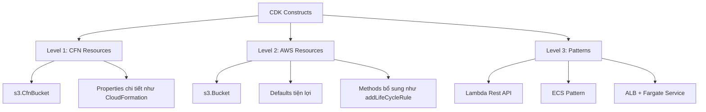

# 381. CDK - Constructs

## 🎯 Giới thiệu
- **Construct** trong CDK là thành phần rất quan trọng, dùng để **đóng gói toàn bộ những gì CDK cần để tạo ra final CloudFormation stack**.
- Một Construct có thể là:
  - **1 AWS resource đơn lẻ** như `S3 bucket`
  - Hoặc **một nhóm nhiều resources liên quan** như `SQS worker queue` kèm compute
- CDK cung cấp:
  - **Construct Library**: tập hợp các Constructs có sẵn cho từng AWS resource
  - **Construct Hub**: nơi có Constructs từ AWS, bên thứ ba và cộng đồng open-source để xây dựng stack nhanh hơn

## 1. Construct Library và Construct Hub
- **Construct Library** là bộ sưu tập Constructs được tích hợp trong CDK.
- Nó chứa Constructs cho **mọi AWS resource**.
- **Construct Hub** mở rộng thêm các Constructs từ:
  - AWS
  - Third parties
  - Open-source CDK community
- Mục tiêu là giúp tạo CDK stack **nhanh hơn và tốt hơn**.

## 2. Ba cấp độ Constructs trong CDK
### Level 1 - `CFN Resources`
- Là các resource-level Constructs, đại diện cho những gì có trong **CloudFormation**.
- Tên thường bắt đầu bằng **`Cfn`**, ví dụ:
  - `s3.CfnBucket`
- Bạn phải khai báo **các properties chi tiết** giống CloudFormation Resource Specifications.
- Phù hợp khi:
  - Muốn migrate từ CloudFormation sang CDK **từng resource một**
  - Cần kiểm soát rất sát từng thuộc tính
- Đây là level cơ bản nhất.

### Level 2 - AWS Resources
- Level 2 là Constructs ở mức cao hơn, tập trung vào **intent** thay vì cấu hình từng chi tiết.
- Ví dụ:
  - `s3.Bucket`
- Không bắt đầu bằng `Cfn`.
- Có **convenient defaults** và **boilerplate được giảm bớt**.
- Có thêm các **methods tiện ích**, ví dụ:
  - `bucket.addLifeCycleRule`
- CDK sẽ tự xử lý phần phức tạp phía sau.
- Vẫn có chức năng tương tự Level 1, nhưng dễ dùng hơn nhiều.

### Level 3 - Patterns
- Level 3 được gọi là **Patterns** vì nó đại diện cho **nhiều resources liên quan**.
- Mục tiêu là hỗ trợ các tác vụ phổ biến trong AWS.
- Ví dụ:
  - **Lambda Rest API**
  - **ECS pattern** với `Application Load Balancer` và `Fargate Service`
- Lợi ích:
  - Không cần cấu hình từng resource nhỏ bên dưới
  - Chỉ cần khai báo mục tiêu chính, CDK sẽ ghép đúng các thành phần
- Với ECS pattern, CDK có thể tự nối:
  - `ALB`
  - `Fargate Service`
  - đúng ports
  - đúng `security groups`
  - đúng `listeners`

## 3. Ý nghĩa thực tiễn khi dùng Constructs
- Nếu dùng **Level 1**, bạn đang làm việc gần với CloudFormation nhất.
- Nếu dùng **Level 2**, bạn có nhiều tiện ích hơn và ít phải cấu hình thủ công.
- Nếu dùng **Level 3**, bạn giải quyết nhanh các kiến trúc phổ biến bằng một API đơn giản hơn.
- Tóm lại, CDK cho phép đi từ:
  - **resource-level**
  - đến **higher-level abstraction**
  - đến **pattern-level**
- Đây chính là sức mạnh của CDK.

## 📊 Bảng tóm tắt
| Tiêu chí | Mô tả |
|----------|------|
| Khái niệm Construct | Thành phần đóng gói mọi thứ CDK cần để tạo CloudFormation stack |
| Construct Library | Bộ Constructs có sẵn trong CDK cho mọi AWS resource |
| Construct Hub | Nguồn Constructs từ AWS, bên thứ ba và cộng đồng |
| Level 1 | `Cfn` resources, bám sát CloudFormation, khai báo chi tiết |
| Level 2 | AWS resources mức cao hơn, có defaults và methods tiện lợi |
| Level 3 | Patterns, đại diện cho nhiều resources liên quan |
| Mục tiêu chính | Giảm boilerplate, tăng tốc xây dựng stack, đơn giản hóa cấu hình |

## 💡 Mẹo ghi nhớ cho kỳ thi AWS
- **Level 1 = `Cfn` = CloudFormation-level**
- **Level 2 = AWS resource-level** với defaults và helper methods
- **Level 3 = Patterns** cho các kiến trúc phổ biến nhiều resources
- Câu hỏi thi thường xoay quanh:
  - `Cfn*` là gì
  - Khác nhau giữa `s3.CfnBucket` và `s3.Bucket`
  - Patterns dùng khi muốn dựng nhanh một kiến trúc phức tạp
- Nhớ rằng:
  - **Level 1** = chi tiết nhất
  - **Level 2** = cân bằng giữa kiểm soát và tiện lợi
  - **Level 3** = nhanh nhất cho use case phổ biến

## ✅ Kết luận
- CDK Constructs là nền tảng để tạo infrastructure theo hướng trừu tượng hóa dần.
- Ba cấp độ chính là:
  - **Level 1**: `CFN Resources`
  - **Level 2**: `AWS Resources`
  - **Level 3**: `Patterns`
- Hiểu rõ 3 level này giúp bạn chọn đúng mức abstraction khi học và làm bài thi AWS.
