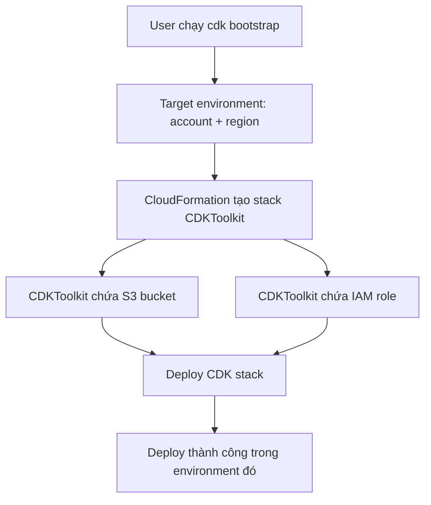

# 382. CDK - Commands & Bootstraping

## 🎯 Giới thiệu
- Bài này tập trung vào các **CDK commands** quan trọng và khái niệm **bootstrapping** trong CDK.
- Mục tiêu chính: hiểu cách CDK đi từ **code stack** sang **CloudFormation template**, rồi triển khai vào AWS environment.
- Trong CDK, **environment** là tổ hợp của **account + region**.

## 1. Các lệnh CDK quan trọng
- `cdk init`:
  - Khởi tạo CDK app từ template được chọn.
  - Có thể chọn ngôn ngữ như **Python**, **JavaScript**, v.v.
- `cdk synth`:
  - **Synthesize** và in ra **CloudFormation template**.
  - Đây là bước chuyển từ **CDK stack as code** sang **CloudFormation template**.
- `cdk deploy`:
  - Triển khai stack lên AWS.
- `cdk diff`:
  - So sánh khác biệt giữa **local CDK** và tài nguyên đã được deploy trên **CloudFormation**.
- `cdk destroy`:
  - Xóa các stack đã tạo.
- Trước khi dùng CDK deploy trong một môi trường mới, cần `cdk bootstrap`.

## 2. Bootstrapping trong CDK
- **Bootstrapping** là quá trình provision các tài nguyên cần thiết cho CDK trước khi deploy app vào một AWS environment.
- Với CDK, muốn deploy vào một **account + region** cụ thể thì phải tạo sẵn stack **CDKToolkit**.
- Stack **CDKToolkit** chứa:
  - một **S3 bucket**
  - một **IAM role**
- Đây là các prerequisite để deploy bất kỳ CDK stack nào trong environment đó.

### Mermaid: Flow bootstrapping và deploy

## 3. Điều gì xảy ra nếu chưa bootstrap?
- Khi deploy CDK vào một environment mới mà **chưa bootstrap**, việc deploy sẽ lỗi.
- Lỗi được nhắc đến trong transcript là:
  - `policy contains a statement with one or more invalid principle`
- Nguyên nhân được giải thích trong bài:
  - do thiếu **IAM role** cần thiết từ bước bootstrap.

## 📊 Bảng tóm tắt
| Tiêu chí | Mô tả |
|----------|------|
| `cdk init` | Khởi tạo CDK app từ template |
| `cdk synth` | Sinh và in ra CloudFormation template |
| `cdk deploy` | Deploy stack lên AWS |
| `cdk diff` | So sánh local CDK với stack đã deploy |
| `cdk destroy` | Xóa stack |
| `cdk bootstrap` | Provision tài nguyên cần thiết trước khi deploy |
| CDKToolkit | CloudFormation stack được tạo khi bootstrap |
| Thành phần của bootstrap | `S3 bucket` và `IAM role` |
| Environment trong CDK | Kết hợp của `account + region` |

## 💡 Mẹo ghi nhớ cho kỳ thi AWS
- **`synth` = sinh template**, **`deploy` = triển khai**, **`diff` = so sánh**, **`destroy` = xóa**.
- Nhớ rằng **CDK bootstrap** là bước bắt buộc trước khi deploy vào **environment mới**.
- Nếu thấy lỗi deploy liên quan đến **invalid principle**, hãy nghĩ ngay đến việc **chưa bootstrap** và thiếu **IAM role**.
- Trong CDK, hãy luôn gắn `bootstrap` với **CDKToolkit + S3 bucket + IAM role**.

## ✅ Kết luận
- CDK có một bộ lệnh cốt lõi để làm việc với stack: **init, synth, deploy, diff, destroy**.
- Trước khi deploy vào một **account + region** mới, phải chạy **`cdk bootstrap`** để tạo **CDKToolkit** cùng các tài nguyên phụ trợ cần thiết.
- Hiểu rõ flow này giúp tránh lỗi khi deploy và nắm chắc phần kiến thức CDK quan trọng cho kỳ thi AWS.
