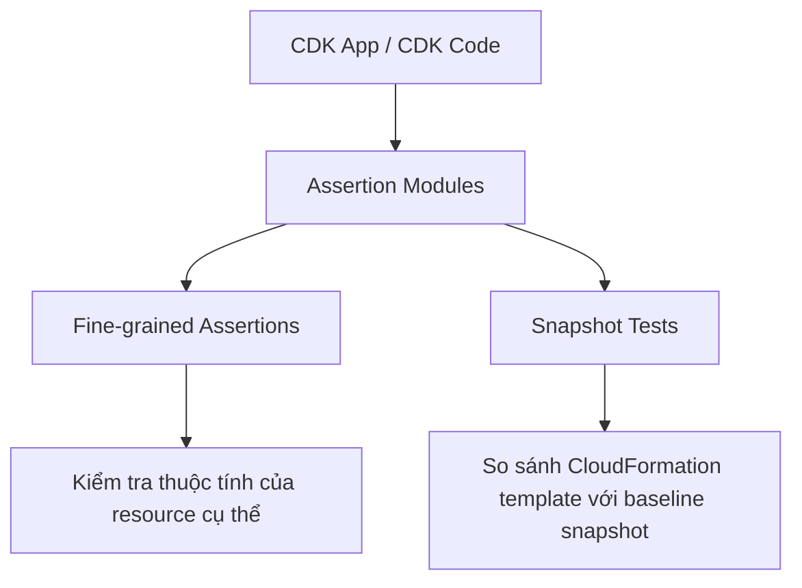

# 383. CDK - Unit Testing

## 🎯 Giới thiệu
- Trong CDK, vì viết infrastructure bằng code nên có thể test giống như test Python/JavaScript thông thường.
- CDK dùng **assertion modules** để kiểm tra:
  - resource cụ thể
  - rules / conditions / parameters
  - CloudFormation template sau khi synthesize
- Ý chính của bài: kiểm tra xem output template sinh ra có đúng thứ mình cần hay không.

## 1. Các loại test trong CDK
- Có **2 loại test** chính trong CDK:

### a. Fine-grained assertions
- Là loại phổ biến nhất.
- Dùng để kiểm tra các resource cụ thể có đúng thuộc tính hay không.
- Ví dụ trong transcript:
  - `Lambda` có đúng `handler`
  - `Lambda` có `runtime` là `nodejs14.x`
  - `SNS topic subscription` chỉ có một subscription
- Mục tiêu: xác minh từng chi tiết nhỏ của resource.

### b. Snapshot tests
- Kiểm tra CloudFormation template hiện tại với một **baseline template** đã lưu trước đó.
- Dùng để đảm bảo template không bị thay đổi ngoài ý muốn.
- Ví dụ transcript nhắc đến việc xác nhận một `DynamoDB table` vẫn còn đó với các thuộc tính quen thuộc.

## 2. Cách test template trong CDK
- Có **2 cách** chính để test template:

### a. `template.fromStack`
- Dùng khi stack đã được định nghĩa trong CDK.
- Import stack đó vào test rồi kiểm tra template sinh ra.
- Đây là cách transcript nói là đang dùng trong ví dụ.

### b. `template.fromString`
- Dùng khi template **chưa nằm trong CDK**.
- CloudFormation template được đưa vào từ một chuỗi / file bên ngoài CDK.
- Vẫn có thể chạy test trên template CloudFormation external.

## 3. Điểm cần nhớ cho kỳ thi
- CDK có thể test như code bình thường.
- `assertion modules` là phần quan trọng trong CDK testing.
- Hai loại test cần nhớ:
  - **fine-grained assertions**
  - **snapshot tests**
- Hai method cần nhớ rất kỹ:
  - `fromStack`
  - `fromString`

## 📊 Bảng tóm tắt
| Tiêu chí | Mô tả |
|----------|------|
| Mục đích test | Kiểm tra CDK code và CloudFormation template sinh ra |
| Công cụ | CDK assertion modules |
| Framework ví dụ | `Jest`, `Pytest` |
| Fine-grained assertions | Kiểm tra thuộc tính cụ thể của resource |
| Snapshot tests | So sánh template với baseline đã lưu |
| `fromStack` | Test stack đã định nghĩa trong CDK |
| `fromString` | Test CloudFormation template bên ngoài CDK |
| Trọng tâm exam | Nhớ rõ 2 loại test và 2 cách load template |

## 💡 Mẹo ghi nhớ cho kỳ thi AWS
- Nhớ theo cặp:
  - **Fine-grained** = kiểm tra **chi tiết resource**
  - **Snapshot** = kiểm tra **toàn bộ template** so với bản mẫu
- Nhớ 2 hàm quan trọng:
  - `fromStack` = template từ stack trong CDK
  - `fromString` = template từ chuỗi / file ngoài CDK
- Nếu câu hỏi nhắc đến việc kiểm tra `Lambda`, `SNS`, `DynamoDB` trong CDK test, nghĩ ngay đến **assertions** và **template validation**.

## ✅ Kết luận
- CDK cho phép test infrastructure như test code bình thường.
- Có 2 kiểu test chính: **fine-grained assertions** và **snapshot tests**.
- Khi test template, cần nhớ hai cách chính: **`fromStack`** và **`fromString`**.
- Đây là phần rất dễ xuất hiện trong câu hỏi thi vì tập trung vào cách CDK xác minh CloudFormation output.
