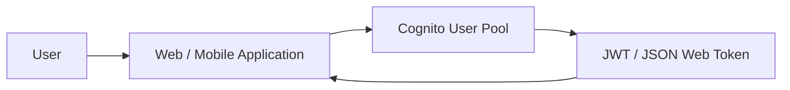
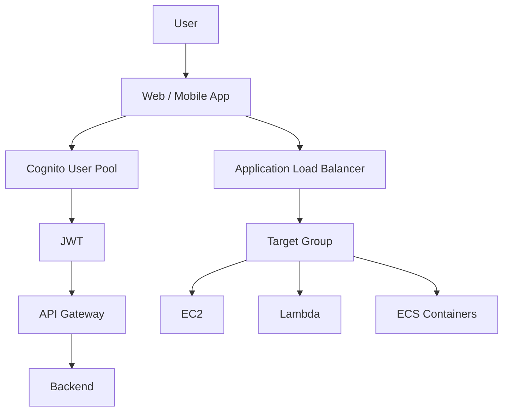

# 385. Cognito User Pools

## 🎯 Giới thiệu
Cognito User Pools, hay **CUP**, là cách tạo một **serverless database** cho user của ứng dụng web và mobile.  
Mục tiêu chính là hỗ trợ **authentication** cho người dùng bằng nhiều cách khác nhau, sau đó trả về **JWT (JSON Web Token)** sau khi đăng nhập thành công.

## 1. Cognito User Pools là gì?
- Là một **user database** nội bộ cho ứng dụng.
- Ứng dụng web/mobile có thể đăng nhập vào **Cognito User Pool**.
- Khi user đăng nhập thành công, CUP trả về **JWT**.
- Có thể dùng username/password hoặc email/password để đăng nhập.
- User có thể **reset password**.

## 2. Các tính năng xác thực chính
- **Password reset**
- **Email verification** và **phone number verification**
- **Multi-Factor Authentication (MFA)**
- Hỗ trợ đăng nhập qua:
  - **Google**
  - **Facebook**
  - **SAML**
  - **OpenID Connect**
- Đăng nhập qua bên thứ ba được gọi là **Federated Identities**
- Có tính năng chặn user nếu credential của họ bị lộ ở nơi khác
- AWS sẽ quét web để phát hiện **compromised credentials** và cảnh báo user trong **Cognito User Pools**

## 3. Tích hợp với AWS
### API Gateway
- User đăng nhập qua **Cognito User Pool** để lấy **JWT**
- Sau đó gửi **JWT** tới **API Gateway**
- **API Gateway** sẽ kiểm tra token có hợp lệ hay không
- Nếu hợp lệ thì cho phép truy cập backend

### Application Load Balancer
- **Application Load Balancer** có thể xác thực user bằng **Cognito User Pools** qua **Listeners** và **Rules**
- Sau khi xác thực xong, traffic được chuyển đến **Target Group**
- Backend trong Target Group có thể là:
  - **EC2 instances**
  - **Lambda functions**
  - **ECS containers**

## 📊 Bảng tóm tắt
| Tiêu chí | Mô tả |
|----------|------|
| Mục đích | Tạo **serverless database** cho user của ứng dụng |
| Kết quả sau login | Trả về **JWT** |
| Hỗ trợ đăng nhập | Username/password, email/password, Google, Facebook, SAML, OpenID Connect |
| Tính năng bảo mật | Reset password, email/phone verification, **MFA**, cảnh báo credential bị lộ |
| Tích hợp AWS | **API Gateway** và **Application Load Balancer** |
| Backend sau ALB | **EC2**, **Lambda**, **ECS containers** |

## 💡 Mẹo ghi nhớ cho kỳ thi AWS
- Nhớ câu: **Cognito User Pools = user authentication + JWT**
- Gặp câu hỏi về:
  - **đăng nhập người dùng**
  - **xác thực**
  - **MFA**
  - **social login**
  - **JWT**
  
  thì nghĩ ngay đến **Cognito User Pools**
- Nếu thấy **API Gateway** cần kiểm tra token từ user, hãy liên hệ với luồng:
  - User login qua **Cognito User Pool**
  - Nhận **JWT**
  - Gửi JWT tới **API Gateway**
- Nếu thấy **ALB** xác thực user trước khi vào backend, cũng là trường hợp tích hợp với **Cognito User Pools**

## ✅ Kết luận
**Cognito User Pools** là giải pháp để quản lý và xác thực user cho ứng dụng web/mobile theo kiểu **serverless**.  
Nó hỗ trợ login bằng nhiều phương thức, trả về **JWT**, và tích hợp native với **API Gateway** và **Application Load Balancer** để bảo vệ backend.
