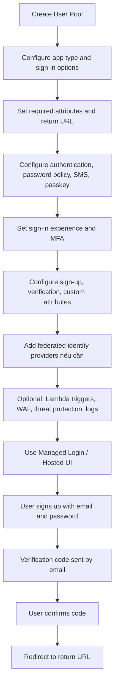

# 386. Cognito User Pools Hands On

## 🎯 Giới thiệu
- Bài học thực hành cách tạo và cấu hình **Amazon Cognito User Pools**.
- Trọng tâm là:
  - tạo **user pool**
  - cấu hình **authentication**, **security**, **branding**
  - dùng **Managed Login** để kiểm tra luồng đăng ký và đăng nhập
- Mục tiêu học thi AWS:
  - hiểu user pool dùng để quản lý người dùng
  - nắm các thiết lập quan trọng như sign-in, verification, MFA, federation, và login page

## 1. Tạo User Pool và ứng dụng 📱
- Chọn **User Pools** trong Cognito và tạo **Create user pool**.
- Chọn loại ứng dụng:
  - traditional web application
  - single page application
  - mobile app
  - machine-to-machine application
- Trong ví dụ:
  - chọn **traditional web application**
  - đặt tên app là `my web app`
- Cấu hình ban đầu:
  - **sign-in options**: dùng **email** để đăng nhập
  - có thể dùng phone number hoặc username, nhưng transcript chọn email
  - nếu muốn social sign-in thì cần **federated users**
  - chọn các **required attributes** cho sign-in như first name, email, birth date, v.v.
  - đặt **return URL** sau khi đăng nhập thành công, ví dụ `example.com`
- Sau khi tạo xong:
  - có **application**
  - có **user pool**
  - cần tiếp tục cấu hình user pool ở các mục bên trái

## 2. Các cấu hình quan trọng của User Pool 🔐
- **Client**: ứng dụng kết nối tới user pool, ở đây là web application.
- **Users**:
  - nơi xem danh sách user
  - có thể tạo user bằng email và temporary password
- **Groups**:
  - dùng để nhóm user
- **Authentication methods**:
  - gửi email để verify email bằng Cognito
  - trong production nên dùng **Amazon SES**
  - Cognito chỉ dùng cho testing và giới hạn **50 emails/day**
  - có thể cấu hình **from** và **reply-to address**
- **SMS**:
  - dùng để validate user bằng SMS
- **Password policy**:
  - đặt minimum length, ví dụ 8 ký tự
  - cấu hình password expiry, ví dụ 7 ngày
  - đặt các yêu cầu khác cho password
- **Passkey**:
  - cho phép sign in bằng biometrics
  - bỏ qua password

## 3. Security, Sign-up và Federation 🛡️
- **Sign-in experience**:
  - email là setting đã chọn trước đó
  - không chỉnh lại được ở đây
  - có thể bật **MFA**:
    - require MFA
    - optional MFA
  - cấu hình cách user dùng MFA và cách user recovery
- **Sign-up**:
  - cấu hình **user verification**
  - có thể dùng **SMS verification**
  - chọn các attributes cho việc đăng ký
  - các attribute này không modifiable sau khi đã thiết lập ban đầu
  - có thể thêm **custom attributes** dạng string hoặc number
- **Federated identity provider**:
  - cho phép đăng nhập bằng:
    - Facebook
    - Google
    - Amazon
    - Apple
    - SAML
    - OpenID Connect
  - dùng khi website có kiểu “login with Google”
- **Lambda triggers / extensions**:
  - có thể gắn **Lambda** vào Cognito User Pools
  - chạy sau:
    - signup
    - authentication
    - custom authentication
    - messaging
  - mục đích là tùy biến luồng hoạt động của Cognito

## 4. Branding, Managed Login và kiểm thử đăng nhập 🎨
- **Security**:
  - có **WAF** để monitor requests tới user pool
  - có **threat protection**
  - có thể **stream logs** để phát hiện log đáng ngờ
- **Branding**:
  - có **domain** được tạo tự động
  - có thể dùng **custom domain** nếu có domain riêng, ví dụ trong Route 53
- **Manage login**:
  - cách quản lý login trực tiếp từ Cognito
  - có **Hosted UI** kiểu cổ điển
  - hiện tại dùng **Managed Login**
  - có thể customize giao diện:
    - email
    - password
    - sign-in button
    - sign-in pages
    - continue as
    - reset password page
- **Kiểm thử login**:
  - vào **overview** rồi chọn **view login page**
  - người dùng mới sẽ tạo account
  - dùng **Mailinator** để lấy email tạm
  - nhập email, password, rồi sign up
  - hệ thống gửi verification code qua email
  - user xuất hiện trong danh sách với:
    - email `unverified`
    - confirmation status `unconfirmed`
  - nhập code để confirm account
  - sau khi xác nhận:
    - được redirect về `example.com`
    - email thành `verified`
    - confirmation status thành `confirmed`
- **Message templates**:
  - có thể chỉnh sửa verification message
  - thay nội dung mặc định bằng message mang thương hiệu riêng

## 📊 Bảng tóm tắt
| Tiêu chí | Mô tả |
|----------|------|
| Mục tiêu | Tạo và cấu hình **Amazon Cognito User Pools** |
| Loại app | **Traditional web application** trong ví dụ |
| Sign-in | Dùng **email**; có thể là phone number hoặc username |
| Xác minh | Email verification, có thể dùng **SMS verification** |
| Bảo mật | **MFA**, **password policy**, **WAF**, **threat protection**, log streaming |
| Federation | Đăng nhập qua Google, Facebook, Amazon, Apple, SAML, OpenID Connect |
| Tùy biến | **Lambda triggers**, custom attributes, message templates, branding |
| UI đăng nhập | **Managed Login**; trước đây gọi là **Hosted UI** |
| Kiểm thử | Dùng email tạm, nhận verification code, confirm account, redirect theo return URL |

## 💡 Mẹo ghi nhớ cho kỳ thi AWS
- **User Pools** = nơi quản lý user, sign-up/sign-in, verification, groups.
- **Managed Login** là giao diện đăng nhập tùy biến mới, còn **Hosted UI** là tên cũ được nhắc trong transcript.
- **Email verification** trong transcript dùng Cognito để test, nhưng production nên dùng **Amazon SES**.
- Nếu cần social login, nhớ từ khóa **federated identity provider**.
- **Lambda triggers** là điểm rất hay xuất hiện trong đề thi vì giúp custom flow của Cognito.
- **MFA + password policy + WAF + threat protection** là các lớp bảo vệ được nhấn mạnh trong bài.
- Nếu user đăng ký xong rồi confirm code, hệ thống sẽ redirect về **return URL** đã cấu hình.

## ✅ Kết luận
- Bài thực hành cho thấy quy trình đầy đủ của **Cognito User Pools**:
  - tạo pool
  - cấu hình sign-in, verification, security, federation
  - tùy biến login page bằng **Managed Login**
  - test flow đăng ký, xác minh và đăng nhập thành công
- Đây là nền tảng quan trọng để ôn thi AWS vì hội tụ nhiều khái niệm: **authentication**, **security**, **branding**, và **user management** trong một dịch vụ duy nhất.
