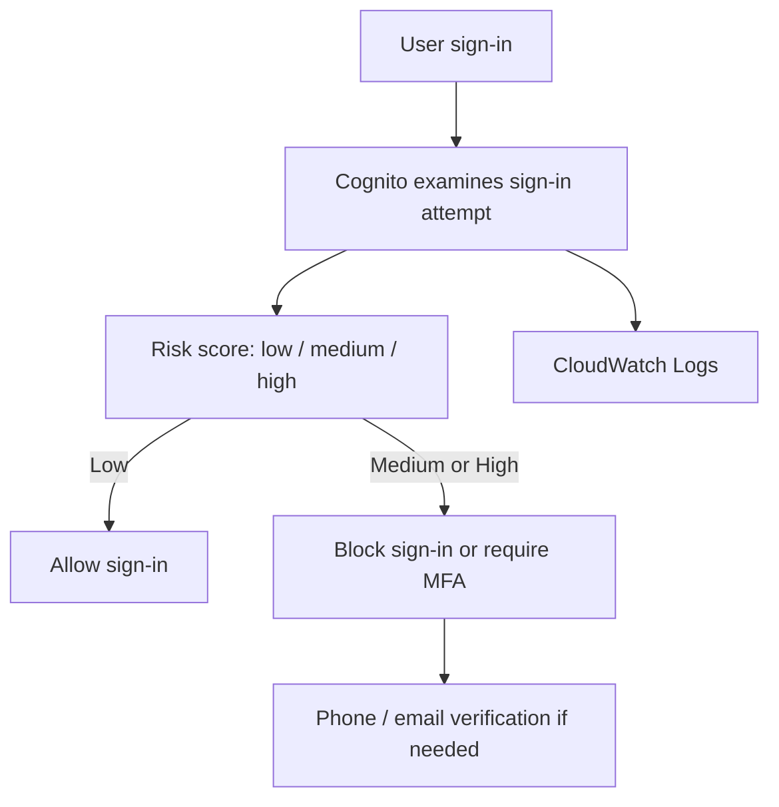
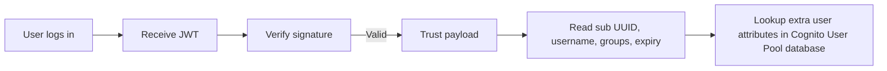

# 387. Cognito User Pools - Others

## 🎯 Giới thiệu
- Bài này tổng hợp các điểm còn lại về **Cognito User Pools**.
- Các chủ đề chính:
  - **Lambda Triggers** cho các sự kiện đăng nhập/đăng ký.
  - **Hosted Authentication UI** và **custom domain**.
  - **Adaptive Authentication**, **JWT Token** và cách đọc/kiểm tra token.

## 1. Lambda Triggers trong Cognito User Pools
- **Cognito User Pools** có thể gọi **Lambda function** một cách đồng bộ theo các trigger khác nhau.
- Các trigger quan trọng liên quan đến **authentication events**:
  - `pre-authentication`
  - `post-authentication`
  - `pre-token generation`
- Ứng dụng:
  - **Accept/Deny sign-in request**.
  - Ghi log sau khi đăng nhập thành công để phục vụ **custom analytics**.
  - **Augment/suppress token claims**.

- Các trigger liên quan đến **sign-up**:
  - `pre sign-up`
  - `post confirmation`
  - `migrate user`
- Ứng dụng:
  - Gửi **custom welcome message**.
  - Ghi log sự kiện đăng ký cho **custom analytics**.

- Ngoài ra có thể:
  - Tùy chỉnh message gửi cho user bằng **Lambda function**.
  - Thay đổi quá trình tạo token bằng cách **add/remove attributes** trong **ID token**.

## 2. Hosted Authentication UI và custom domain
- **Hosted authentication UI** cho phép dùng giao diện đăng nhập/đăng ký do Cognito tạo sẵn, không cần tự code UI trong application.
- UI này hỗ trợ sẵn:
  - **social logins**
  - **OIDC**
  - **SAML**
- Có thể tùy chỉnh để phù hợp website của mình:
  - đổi **logo**
  - sửa **CSS**

- Nếu muốn host UI trên domain riêng:
  - phải dùng **custom domain**.
  - cần có **ACM certificate** để dùng **HTTPS**.
  - certificate phải nằm ở **us-east-1**.
- Custom domain được cấu hình trong phần **app integration** của Cognito User Pools vì đây là cấu hình chung cho app claims.

## 3. Adaptive Authentication và JWT Token
- **Adaptive authentication** cho phép user đăng nhập bình thường bằng username/password, nhưng sẽ tăng bảo vệ khi phát hiện login đáng ngờ.
- Cognito sẽ đánh giá mỗi lần sign-in và gán **risk score**:
  - `low`
  - `medium`
  - `high`
- Dựa trên risk score:
  - có thể **block sign-in**
  - hoặc yêu cầu **MFA**
- Risk score có thể dựa trên:
  - device đang dùng
  - location
  - IP address
  - và các yếu tố khác
- Nếu có **compromised credentials**, sẽ có **account takeover protection** và xác minh qua **phone** và **email**.
- Tất cả hoạt động của adaptive authentication được thấy trong **CloudWatch logs**:
  - sign-in attempts
  - risk score
  - fail challenges

### Mermaid: luồng đăng nhập và kiểm tra bảo mật

- Khi đăng nhập với **Cognito User Pool**, kết quả trả về là **JWT Token** (`JSON Web Token`).
- JWT được **Base64 encoded** và gồm:
  - `header`
  - `payload`
  - `signature`
- Trước khi tin vào dữ liệu trong `payload`, cần **verify signature**.
- Sau khi verify:
  - có thể đọc thông tin user từ `payload`
  - trường `sub UUID` là **user ID** trong Cognito User Pool database
  - dùng `sub UUID` để tra thêm thông tin user như:
    - email
    - given name
    - phone number
    - các attributes khác
  - các trường khác có thể có:
    - `username`
    - `Cognito groups`
    - expiry của JWT

### Mermaid: luồng JWT verification

## 📊 Bảng tóm tắt
| Tiêu chí | Mô tả |
|----------|------|
| Lambda Triggers | Cognito User Pools có thể invoke Lambda synchronously ở các trigger như `pre-authentication`, `post-authentication`, `pre-token generation`, `pre sign-up`, `post confirmation`, `migrate user`. |
| Hosted UI | Cung cấp sẵn giao diện sign-up/sign-in, hỗ trợ social logins, OIDC, SAML, và có thể tùy chỉnh logo/CSS. |
| Custom domain | Dùng với Hosted UI; cần ACM certificate ở **us-east-1** và cấu hình trong **app integration**. |
| Adaptive Authentication | Đánh giá mỗi sign-in bằng risk score để block login hoặc yêu cầu MFA khi có dấu hiệu bất thường. |
| JWT Token | Trả về sau khi đăng nhập; cần verify signature trước khi tin vào payload. |
| Payload | Có thể chứa `sub UUID`, `username`, `Cognito groups`, expiry và các thông tin user khác. |
| CloudWatch Logs | Ghi lại sign-in attempts, risk score, fail challenges của adaptive authentication. |

## 💡 Mẹo ghi nhớ cho kỳ thi AWS
- **Lambda Triggers**: nhớ theo 3 nhóm chính trong transcript:
  - authentication
  - sign-up
  - token generation/message customization
- **Hosted UI + custom domain**:
  - custom domain đi với **ACM**
  - certificate phải ở **us-east-1**
- **Adaptive Authentication**:
  - user bình thường thì login như thường
  - login đáng ngờ thì Cognito có thể ép **MFA**
- **JWT**:
  - luôn nhớ 3 phần: `header`, `payload`, `signature`
  - phải **verify signature** trước khi tin payload
- **sub UUID**:
  - là key để tra thêm thông tin user trong Cognito database

## ✅ Kết luận
- **Cognito User Pools** không chỉ làm authentication mà còn hỗ trợ:
  - **Lambda Triggers**
  - **Hosted UI**
  - **custom domain**
  - **Adaptive Authentication**
  - **JWT Token handling**
- Với kỳ thi AWS, các điểm dễ hỏi nhất là:
  - trigger nào dùng cho tình huống nào
  - custom domain cần **ACM in us-east-1**
  - adaptive auth dùng **risk score**
  - JWT phải verify signature trước khi trust payload
