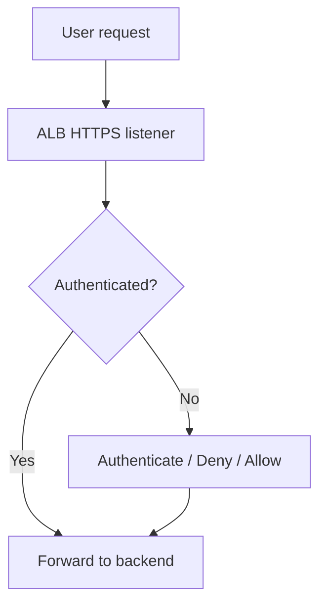
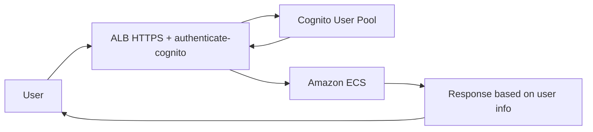
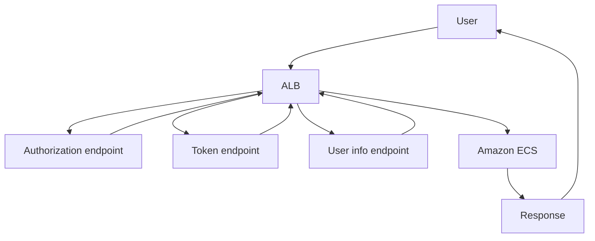

# 388. Application Load Balancer - User Authentication

## 🎯 Giới thiệu
- `Application Load Balancer (ALB)` có thể dùng để **authenticate user** giống như cách tích hợp `Cognito` với `API Gateway`.
- Mục tiêu chính là **đẩy trách nhiệm xác thực ra khỏi application**, để ứng dụng chỉ tập trung vào **business logic**.
- ALB hỗ trợ 2 cách xác thực:
  - `authenticate-oidc` với `OIDC-compliant identity provider`
  - `authenticate-cognito` với `Cognito user pools`
- Để hoạt động, ALB cần:
  - `HTTPS listener`
  - cấu hình rule `authenticate-oidc` hoặc `authenticate-cognito`

## 1. Cách ALB xử lý authentication
- Khi cấu hình ALB, default action thường là:
  - `authenticate` trước
  - rồi mới `forward` request đến backend
- Nếu user **unauthenticated**, có 3 lựa chọn:
  - `authenticate` lại: lựa chọn mặc định
  - `deny` request
  - `allow` request
- `allow` rất hữu ích cho các trang như `login page`, nơi user chưa cần đăng nhập vẫn phải truy cập được.

## 2. Authentication với Cognito user pools
- Đây là cách dùng `ALB + Cognito` để xác thực user.
- Phù hợp với:
  - social identity providers như `Amazon login`, `Facebook login`, `Google login`
  - corporate identities tương thích với `SAML`, `LDAP`, `Microsoft AD`
- Luồng triển khai được mô tả trong transcript:
  - tạo `Cognito user pool`
  - tạo `client` và `domain`
  - đảm bảo `ID token / JWT token` được trả về
  - kết nối user pool với social hoặc corporate `IdP`
  - cấu hình `URL redirections` và `callback URLs`
  - liên kết `Cognito user pool` vào ALB với app client tương ứng
- Khi user gọi request như `GET /api/data`:
  - ALB dùng `authenticate-cognito`
  - `Cognito` authenticate user
  - request/payload được chuyển tiếp tới backend như `Amazon ECS`
  - backend nhận thêm thông tin user từ `Cognito`
- Lợi ích:
  - application có thêm user information để xử lý response theo từng user

## 3. Authentication với OIDC
- `OIDC` cho phép ALB tích hợp trực tiếp với bất kỳ `OIDC-compliant identity provider`.
- Cách này **không dùng Cognito integration**, nên cần cấu hình nhiều hơn.
- Luồng request trong transcript:
  - user gửi HTTP request
  - ALB redirect user đến `authentication endpoint` của identity provider
  - identity provider trả về `authorization code`
  - ALB gửi code tới `token endpoint`
  - code được exchange thành:
    - `ID token`
    - `access token`
  - ALB gọi tiếp `user info endpoint`
  - `access token` được đổi lấy `user claims`
  - request gốc + `user claims` được gửi tới backend như `Amazon ECS`
- Các cấu hình cần có:
  - `authorization endpoint`
  - `token endpoint`
  - `user info endpoint`
  - `client ID`
  - `client secret`
  - cấu hình `redirection` phù hợp
- So với Cognito, OIDC có **nhiều request hơn** giữa ALB và identity provider.

## 📊 Bảng tóm tắt
| Tiêu chí | Mô tả |
|----------|------|
| Mục đích | Authenticate user ngay trên `ALB`, giảm xử lý ở application |
| Điều kiện | Cần `HTTPS listener` |
| Cách 1 | `authenticate-cognito` với `Cognito user pools` |
| Cách 2 | `authenticate-oidc` với `OIDC-compliant identity provider` |
| Khi unauthenticated | `authenticate` mặc định, hoặc `deny`, hoặc `allow` |
| Dữ liệu chuyển xuống backend | Request gốc + thông tin user / `user claims` |
| Lợi ích | Application tập trung vào `business logic` |

## 💡 Mẹo ghi nhớ cho kỳ thi AWS
- Nhớ câu: **ALB authenticate ở lớp load balancer, không phải trong application**.
- `authenticate-cognito`:
  - dễ hơn
  - gắn với `Cognito user pools`
  - hợp với social/corporate identity integration
- `authenticate-oidc`:
  - linh hoạt hơn với mọi `OIDC-compliant IdP`
  - nhưng cần cấu hình nhiều endpoint hơn
- Nếu thấy câu hỏi có `HTTPS listener`, `authenticate-oidc`, `authenticate-cognito`, hoặc `user claims`, rất có thể đang nói về **ALB User Authentication**.
- `allow` khi unauthenticated thường gợi ý các trang công khai như `login page`.

## ✅ Kết luận
- `Application Load Balancer` có thể làm authentication cho user bằng `Cognito` hoặc `OIDC`.
- Điều này giúp giảm tải logic xác thực khỏi application và chuyển trách nhiệm đó sang ALB.
- Điểm cần nhớ nhất:
  - phải dùng `HTTPS listener`
  - có 2 rule chính: `authenticate-cognito` và `authenticate-oidc`
  - backend nhận thêm thông tin user để xử lý linh hoạt hơn
