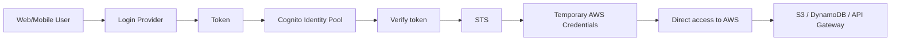

# 389. Cognito Identity Pools

## 🎯 Giới thiệu
Cognito Identity Pools, còn gọi là **Federated Identities**, dùng để cấp **temporary AWS credentials** cho người dùng bên ngoài AWS như web users và mobile users.

Mục tiêu chính:
- Cho phép người dùng đăng nhập qua một **trusted third-party**
- Đổi token đăng nhập lấy **AWS credentials**
- Truy cập trực tiếp vào AWS services như **S3** và **DynamoDB**
- Tránh phải tạo **IAM users** cho từng người dùng bên ngoài

## 1. Cognito Identity Pools là gì
Cognito Identity Pools được dùng khi người dùng cần truy cập vào tài nguyên AWS nhưng không nên được tạo IAM user riêng.

Các nguồn đăng nhập có thể dùng:
- **Amazon, Facebook, Google, Apple**
- **Cognito User Pools**
- **OpenID Connect providers**
- **SAML providers**
- **Developer authenticated identities** qua custom login server

Ngoài ra, có thể cho phép:
- **Unauthenticated guest users**
- Gán **guest policy** để cấp credentials cho guest users

## 2. Luồng hoạt động và tích hợp với Cognito User Pools
Luồng cơ bản:
1. Người dùng đăng nhập qua provider đã cấu hình
2. Nhận **token**
3. Gửi token đến **Cognito Identity Pool**
4. Identity Pool xác thực token
5. Identity Pool gọi **STS**
6. STS trả về **temporary credentials**
7. Ứng dụng dùng credentials để gọi AWS services trực tiếp

Khi kết hợp với **Cognito User Pools**:
- Người dùng đăng nhập vào **Cognito User Pools**
- Nhận **JSON Web Token**
- Token được đưa sang **Cognito Identity Pool**
- Identity Pool xác thực token rồi gọi **STS**
- Credentials được trả về cho web/mobile app

Lý do dùng cách này:
- Muốn tập trung user trong **Cognito User Pools**
- Có thể dùng cả internal users và social/federated identity providers
- Vẫn lấy được AWS credentials để truy cập AWS

## 3. Role, Policy và fine-grained access
Cognito Identity Pools quyết định role nào được gán cho user nào bằng cách:
- Đặt **default IAM role** cho:
  - **authenticated users**
  - **guest users**
- Dùng **rules** theo **user ID**
- Dùng **policy variables** để tùy biến IAM policy

### Flow cấp quyền
- Credentials được lấy thông qua **STS**
- API call được nhắc đến: **AssumeRoleForWebIdentity**
- Role phải có **trust policy** cho **Cognito Identity Pools**

### Ví dụ quyền truy cập
- **Guest users**: có thể được cấp IAM policy rất giới hạn, ví dụ chỉ cho **GetObject** một file cụ thể trong S3
- **Authenticated users**:
  - Truy cập S3 theo prefix gắn với **user ID**
  - Truy cập DynamoDB theo **leading key** khớp với **user ID**

Ý nghĩa:
- Tạo **fine-grained control**
- Có thể đạt kiểu **row-based security** trong DynamoDB
- Chỉ cho user truy cập đúng phần dữ liệu của họ

## 📊 Bảng tóm tắt
| Tiêu chí | Mô tả |
|----------|------|
| Mục đích | Cấp **temporary AWS credentials** cho web/mobile users ngoài AWS |
| Tên khác | **Federated Identities** |
| Đầu vào | Token từ provider đăng nhập như Google, Facebook, SAML, OIDC, Cognito User Pools |
| Dịch vụ trung gian | **STS** |
| API liên quan | **AssumeRoleForWebIdentity** |
| Kết quả | Người dùng có thể gọi trực tiếp AWS services bằng credentials tạm thời |
| Phân quyền | Dựa trên **IAM role**, **rules**, và **policy variables** |
| Hỗ trợ guest | Có, thông qua **unauthenticated guest users** |
| Ví dụ dịch vụ | **S3**, **DynamoDB**, có thể qua **API Gateway** |

## 💡 Mẹo ghi nhớ cho kỳ thi AWS
- **Identity Pool = lấy AWS credentials**
- **User Pool = quản lý user và login**
- Identity Pool thường là nơi **đổi token lấy credentials**
- Nhớ luồng: **Login provider -> token -> Identity Pool -> STS -> temporary credentials**
- Nhớ API quan trọng: **AssumeRoleForWebIdentity**
- Nhớ cơ chế phân quyền:
  - **guest role**
  - **authenticated role**
  - **policy variables** theo **user ID**
- Nếu thấy câu hỏi về truy cập S3/DynamoDB trực tiếp từ web/mobile app mà không tạo IAM users, nghĩ đến **Cognito Identity Pools**

## ✅ Kết luận
Cognito Identity Pools dùng để trao đổi token đăng nhập lấy **temporary AWS credentials** qua **STS**, giúp web/mobile users truy cập trực tiếp vào AWS mà không cần tạo IAM users. Dịch vụ này hỗ trợ cả provider ngoài, **Cognito User Pools**, và cả **guest users**, đồng thời cho phép kiểm soát truy cập chi tiết bằng **IAM role**, **rules**, và **policy variables**.
