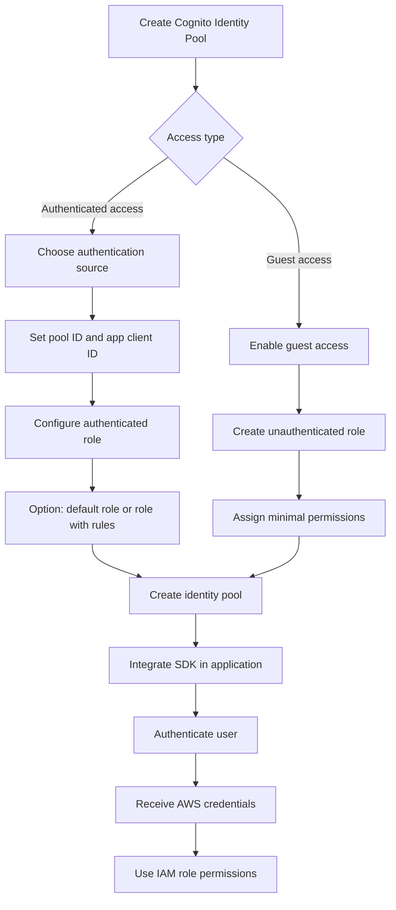

# 390. Cognito Identity Pools Hands On

## 🎯 Giới thiệu
- Bài thực hành này hướng dẫn cách tạo và dùng **Cognito Identity Pool** để cấp **AWS credentials** cho người dùng.
- Identity Pool có thể hỗ trợ:
  - **Authenticated access**
  - **Guest access**
- Điểm cốt lõi: người dùng đăng nhập qua Identity Pool sẽ nhận **IAM credentials**, sau đó quyền truy cập được điều khiển bởi **IAM role** và **IAM policy**.

## 1. Tạo Cognito Identity Pool
- Vào **Cognito Identity** và tạo **identity pool** mới.
- Chọn loại truy cập:
  - **Authenticated access**
  - **Guest access**
- Nếu bật **authenticated access**, cần chọn **source of authentication**:
  - **Amazon Cognito user pool**
  - Facebook, Google, Apple, Amazon, Twitter
  - **OIDC**
  - **SAML**
  - custom developer provider
- Trong bài này, chọn **Amazon Cognito user pool** vì đã tạo sẵn trước đó.
- Có thể bật thêm **guest access** để bất kỳ ai cũng có thể truy cập pool và nhận **IAM credentials**.

## 2. Cấu hình Permissions và Role
- Sau khi chọn access type, cần cấu hình **permissions**.
- Tạo **authenticated role**:
  - Là role được **assume** bởi user đã xác thực vào identity pool.
  - Role này chứa quyền mà user có sau khi nhận quyền truy cập AWS.
- Tạo **unauthenticated role** cho guest access:
  - Cũng là một **IAM role**
  - Chỉ nên có **minimal permissions**
- Ở phần **role settings**:
  - Có thể dùng **default authenticated role**
  - Hoặc dùng **role with rules**
- Có thể map các **claims** trong token hoặc các thuộc tính như **username** và **client** vào **IAM policies** để kiểm soát quyền chi tiết hơn.
- Trong bài, chọn cách đơn giản là dùng **default authenticated role**.

## 3. Hoàn tất và dùng trong ứng dụng
- Vì chọn **Amazon Cognito user pool** làm source login, cần cung cấp:
  - **pool ID**
  - **app client ID**
- Có thể đặt tên pool, ví dụ: **Demo Identity Pool**.
- Tùy chọn **classic authentication** được để mặc định.
- Sau khi tạo xong:
  - Kết nối **SDK**
  - Tích hợp vào code
  - Xác thực user qua SDK
  - Nhận **AWS credentials**
- Trong **IAM**, có thể tìm các role liên quan đến **Cognito** để chỉnh:
  - **authenticated role**
  - **unauthenticated role**
- Có thể thêm **inline policy** hoặc các policy khác để cấp quyền, ví dụ quyền **read** cho **Amazon S3**.

## 📊 Bảng tóm tắt
| Tiêu chí | Mô tả |
|----------|------|
| Mục tiêu | Dùng **Cognito Identity Pool** để cấp **AWS credentials** |
| Loại truy cập | **Authenticated access** và/hoặc **Guest access** |
| Nguồn xác thực | **Cognito user pool**, Facebook, Google, Apple, Amazon, Twitter, **OIDC**, **SAML**, custom provider |
| Role chính | **Authenticated role** và **unauthenticated role** |
| Cách kiểm soát quyền | Qua **IAM role**, **IAM policy**, có thể dùng claims trong token |
| Sau khi tạo xong | Tích hợp **SDK** để authenticate user và lấy credentials |

## 💡 Mẹo ghi nhớ cho kỳ thi AWS
- **Identity Pool** gắn với việc cấp **AWS credentials**, không chỉ là đăng nhập.
- Nếu có **authenticated access**, phải xác định **source of authentication**.
- **Guest access** nghĩa là user chưa đăng nhập vẫn có thể nhận credentials, nhưng chỉ theo **unauthenticated role**.
- Quyền thực tế của user sau khi đăng nhập được quyết định bởi **IAM role** gán cho Identity Pool.
- Khi cần phân quyền chi tiết, nhớ đến khả năng map **token claims** vào **IAM policies**.
- Trong exam, nếu câu hỏi nói về “user gets AWS credentials after login”, rất dễ là **Cognito Identity Pool**.

## ✅ Kết luận
- **Cognito Identity Pool** dùng để tạo cầu nối giữa xác thực người dùng và **AWS credentials**.
- Quy trình chính là: chọn nguồn xác thực, cấu hình **authenticated/unauthenticated role**, tạo pool, rồi tích hợp **SDK** vào ứng dụng.
- Điểm cần nhớ nhất là quyền truy cập cuối cùng được kiểm soát bởi **IAM role** và **IAM policy**.
