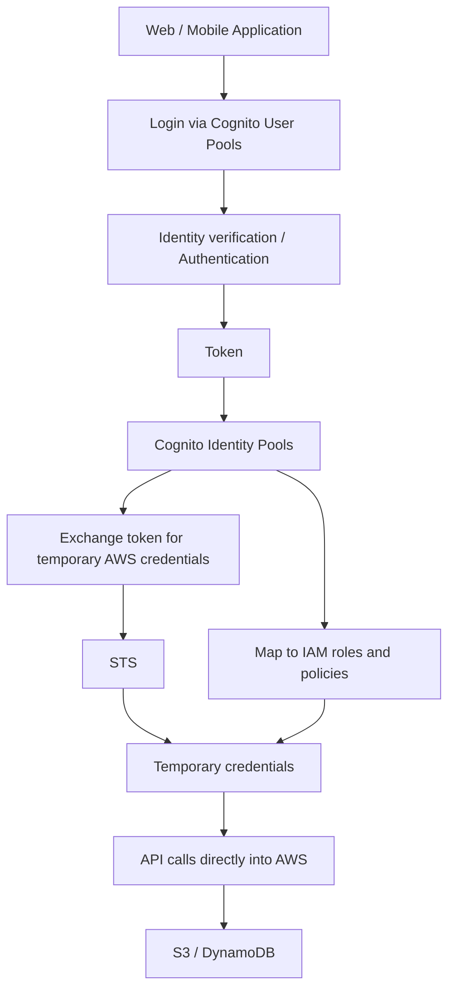

# 391. Cognito User Pools vs Cognito Identity Pools

## 🎯 Giới thiệu
- Bài này phân biệt rõ 2 khái niệm:
  - `Cognito User Pools` dùng cho **authentication** (xác thực danh tính).
  - `Cognito Identity Pools` dùng cho **authorization / access control** (ủy quyền và kiểm soát truy cập).
- Ý chính để nhớ:
  - `User Pools` = lưu user, xác thực user.
  - `Identity Pools` = cấp quyền truy cập vào tài nguyên AWS bằng temporary credentials.

## 1. Cognito User Pools
- Là **database of users** cho web và mobile applications.
- Dùng cho **authentication** = identity verification.
- Hỗ trợ federation login:
  - Google
  - Facebook
  - Amazon
  - `OIDC`
  - corporate login qua `SAML`
- Có thể:
  - customize hosted UI cho authentication
  - thêm logo
  - tích hợp `Lambda` trong authentication flow cho `pre-` và `post-` processing
  - dùng `adaptive authentication` để điều chỉnh trải nghiệm sign-in theo risk level
  - `MFA` sẽ được dùng khi phù hợp

## 2. Cognito Identity Pools
- Dùng cho **authorization** hoặc **access control** từ bên trong AWS.
- Phù hợp khi user cần truy cập tài nguyên AWS như:
  - `DynamoDB`
  - `S3 bucket`
- Cung cấp **temporary credentials** cho user.
- Có thể nhận token qua:
  - social login
  - `OIDC`
  - `SAML`
  - hoặc từ `Cognito User Pools`
- User có thể là:
  - authenticated
  - unauthenticated / guest
- Sau khi thiết lập, user sẽ được map vào:
  - specific `IAM roles`
  - `IAM policies`
- Có thể dùng `policy variables` để cấp quyền theo từng user/type.

## 3. User Pools + Identity Pools trong một luồng
- Cách dùng phổ biến:
  - User đăng nhập qua `Cognito User Pools`
  - Nhận `token`
  - Dùng token đó để exchange lấy `temporary AWS credentials` qua `Cognito Identity Pools`
  - Credentials này được cấp thông qua `STS`
- Sau đó web/mobile application có thể gọi API trực tiếp vào AWS.
- `IAM policy` gắn với temporary credentials sẽ giới hạn đúng action mà user được phép làm.
- Mô hình này cho phép:
  - **authentication trước**
  - **authorization sau**

## 📊 Bảng tóm tắt
| Tiêu chí | Mô tả |
|----------|------|
| Mục đích của `User Pools` | Authentication, identity verification |
| Mục đích của `Identity Pools` | Authorization, access control trong AWS |
| Vai trò chính của `User Pools` | Database of users |
| Vai trò chính của `Identity Pools` | Cấp temporary credentials |
| Tài nguyên AWS liên quan | `S3`, `DynamoDB` |
| Federation support | `Google`, `Facebook`, `Amazon`, `OIDC`, `SAML` |
| Tích hợp đặc biệt | `Lambda` trong auth flow, `STS` cho credentials |
| User type | `Identity Pools` hỗ trợ cả authenticated và unauthenticated users |
| Mapping quyền | User được map vào `IAM roles` và `IAM policies` |

## 💡 Mẹo ghi nhớ cho kỳ thi AWS
- `User Pools` = **User login**
- `Identity Pools` = **AWS access**
- Nhớ công thức:
  - **Authentication = User Pools**
  - **Authorization = Identity Pools**
- Nếu câu hỏi nói về:
  - lưu user
  - đăng nhập
  - federation login
  - custom hosted UI
  - `Lambda` trong auth flow  
  => nghĩ tới `Cognito User Pools`
- Nếu câu hỏi nói về:
  - truy cập `S3`, `DynamoDB`
  - temporary credentials
  - `IAM roles`
  - guest/unauthenticated users
  - `STS`  
  => nghĩ tới `Cognito Identity Pools`

## ✅ Kết luận
- `Cognito User Pools` dùng để **xác thực người dùng** và quản lý database user.
- `Cognito Identity Pools` dùng để **ủy quyền truy cập AWS** bằng temporary credentials.
- Khi kết hợp cả hai:
  - `User Pools` lo authentication
  - `Identity Pools` lo authorization
- Đây là mô hình chuẩn để web/mobile app truy cập an toàn vào tài nguyên AWS như `S3` và `DynamoDB`.
