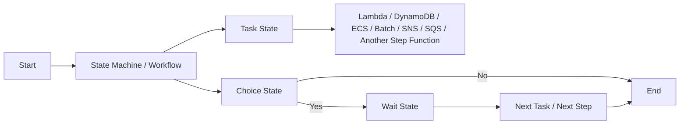
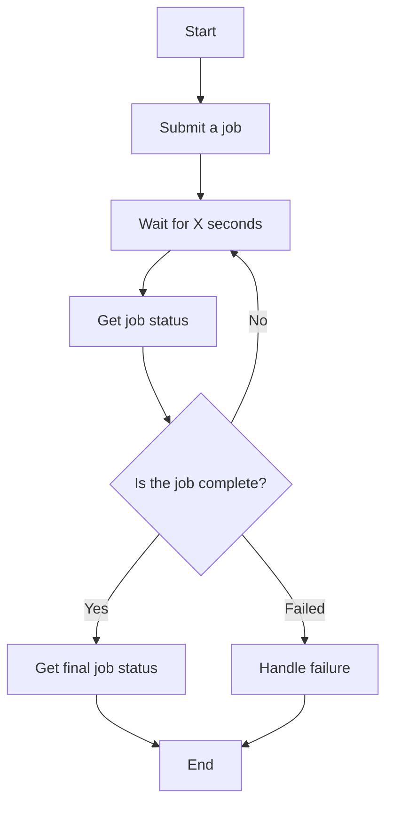

# 392. Step Functions Overview

## 🎯 Giới thiệu
AWS Step Functions dùng để **model workflow dưới dạng state machine**, với **one state machine per workflow**.

- Phù hợp cho nhiều workflow như:
  - `order fulfillment`
  - `data processing`
  - `web application`
  - bất kỳ workflow nào cần điều phối nhiều bước
- Ý tưởng chính:
  - định nghĩa **what happens**
  - định nghĩa **what happens next**
  - xử lý nhánh theo điều kiện `if/else`
- Workflow được mô tả bằng **JSON**
  - JSON này tạo ra **visualization** của workflow
  - đồng thời cho phép xem **execution history**

## 1. Vai trò của Step Functions
Step Functions là lớp **orchestrator** cho workflow.

- Mỗi step có thể là:
  - `Lambda function`
  - ghi dữ liệu vào `DynamoDB`
  - một `ECS task`
  - `Batch job`
  - gửi message vào `SNS` hoặc `SQS`
  - launch một `step function` khác
- Step Functions không trực tiếp làm toàn bộ công việc, mà điều phối các bước trong luồng xử lý

### Mermaid: workflow orchestration

## 2. Các cách khởi chạy workflow
Transcript nêu các cách start một workflow:

- `SDK API call`
- `API Gateway`
- `CloudWatch Events` hoặc `Amazon EventBridge`
- chạy thủ công từ `console`

## 3. Các state quan trọng trong Step Functions
### `Task State`
Dùng để thực hiện công việc trong state machine.

- Có thể:
  - invoke `Lambda function`
  - invoke `Batch job`
  - chạy `ECS task` và chờ hoàn tất
  - insert trực tiếp vào `DynamoDB`
  - publish message vào `SNS` / `SQS`
  - launch workflow khác
- Cũng có thể dùng cho `activity`
  - activity có thể là `EC2`, `Amazon ECS task`, hoặc `on-premises server`
  - các worker này **polling** Step Functions để lấy work rồi gửi kết quả trả về

### Các state khác
- `Choice State`: rẽ nhánh theo điều kiện, đi vào branch phù hợp hoặc default branch
- `Fail State`: kết thúc workflow với lỗi
- `Succeed State`: kết thúc workflow thành công
- `Pass State`: chuyển input sang output hoặc inject fixed data, không làm xử lý
- `Wait State`: tạo độ trễ theo thời gian hoặc đến một mốc ngày giờ xác định
- `Map State`: lặp động qua nhiều bước
- `Parallel State`: chạy nhiều nhánh song song

## 4. Ví dụ luồng thực thi
Transcript mô tả một workflow kiểu job processing:

- `Submit a job`
- `Wait for X seconds`
- `Get the job status`
- kiểm tra `Is the job complete?`
  - nếu `No` thì quay lại `Wait`
  - nếu `Yes` thì lấy `final job status`
- nếu job thất bại thì đi vào nhánh xử lý failure
- tất cả đi đến `End`

### Mermaid: job status loop

## 📊 Bảng tóm tắt
| Tiêu chí | Mô tả |
|----------|------|
| Mục đích | Orchestrate workflow dưới dạng `state machine` |
| Cấu trúc | `One state machine per workflow` |
| Mô tả workflow | Định nghĩa bằng `JSON` |
| Quan sát | Có `visualization` và `execution history` |
| Task phổ biến | `Lambda`, `DynamoDB`, `ECS task`, `Batch`, `SNS`, `SQS` |
| State cần nhớ | `Task`, `Choice`, `Fail`, `Succeed`, `Pass`, `Wait`, `Map`, `Parallel` |
| Điểm thi quan trọng | `Parallel State` và `Task State` được nhấn mạnh là cần nhớ |
| Cách start | `SDK API call`, `API Gateway`, `CloudWatch Events` / `EventBridge`, console |

## 💡 Mẹo ghi nhớ cho kỳ thi AWS
- `Step Functions = orchestration`, không phải nơi viết toàn bộ business logic
- Nhớ rằng workflow được mô tả bằng `JSON` và hiển thị trực quan
- `Task State` là state làm việc thực tế, thường gặp nhất
- `Choice State` dùng cho rẽ nhánh, `Wait State` dùng để chờ, `Parallel State` dùng cho chạy song song
- Nếu gặp câu hỏi về nhiều bước xử lý có loop, retry kiểu chờ rồi kiểm tra lại status, hãy nghĩ tới `Step Functions`

## ✅ Kết luận
AWS Step Functions cho phép xây dựng workflow dưới dạng `state machine`, điều phối nhiều bước như `Lambda`, `DynamoDB`, `ECS`, `SNS`, `SQS` hoặc các `activity` khác. Điểm cốt lõi cần nhớ là khả năng **orchestrate workflow**, hỗ trợ **visual execution**, và có nhiều loại state như `Task`, `Choice`, `Wait`, `Map`, `Parallel` để mô hình hóa luồng xử lý rõ ràng.
