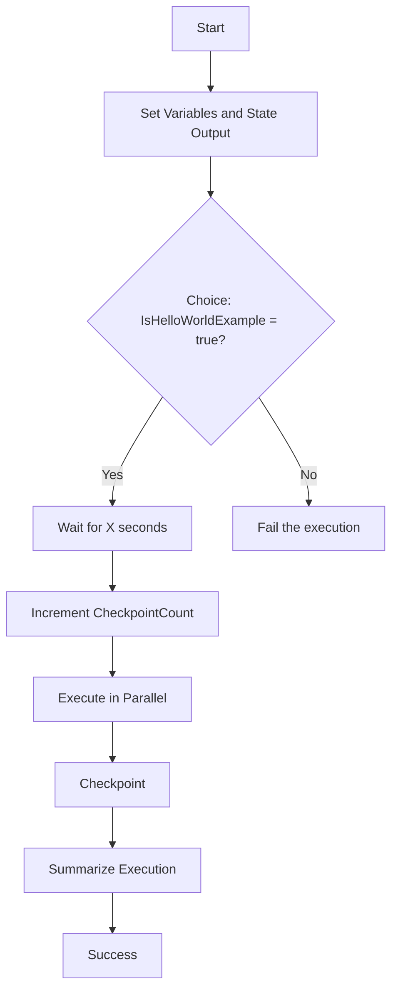

# 393. Step Functions - Hands On

## 🎯 Giới thiệu
- Bài học này demo **Step Functions** qua ví dụ **Hello World** trong console.
- Mục tiêu là làm quen với **Workflow Studio**, cách tạo workflow, chạy execution, và quan sát **input/output**, **variables**, **Event History**.
- Workflow trong Step Functions được biểu diễn bằng **Amazon State Language (ASL)**, tức là một **big JSON document** mô tả cách state machine hoạt động.

## 1. Workflow Studio và ASL
- Ở bên trái của **Workflow Studio** có các component có thể kéo-thả vào workflow.
- Có thể thêm nhiều service và API, ví dụ:
  - **Lambda**
  - **Flow**
  - **Choice**
  - **Parallel**
  - **Map**
- Ngoài ra còn có các **patterns** để làm nhanh, ví dụ xử lý **JSON file in S3**.
- Khi hoàn tất flow, Step Functions có thể **generate code** dưới dạng **ASL**.
- Phần cấu hình chạy workflow bao gồm:
  - **state machine name**
  - chọn **standard workflow** hoặc **express workflow**
  - thông tin về **duration** và **cost**
  - **permissions of the role**
  - **logging**
  - các cấu hình bổ sung nếu cần

## 2. Luồng thực thi của Hello World
- Workflow bắt đầu ở **Start** và đi vào bước khởi tạo:
  - set output của state
  - gán `IsHelloWorldExample = true`
  - gán `execution wait time in seconds = 3`
  - tạo biến `CheckpointCount = 0`
- Sau đó đi vào **Choice state**:
  - nếu `IsHelloWorldExample = true` thì đi tiếp sang nhánh **wait for X seconds**
  - nếu không đúng thì đi vào state mặc định **fail the execution**
- Ở nhánh đúng:
  - workflow **wait** trong số giây lấy từ biến `execution wait time in seconds`
  - tăng `CheckpointCount`
  - đi sang **execute in parallel**
  - tiếp tục qua các bước checkpoint khác
  - cuối cùng **summarize the execution** và báo thành công
- Ý chính cần nhớ:
  - Step Functions hỗ trợ kiểu **if statements** qua **Choice**
  - hỗ trợ **parallel executions**
  - có thể theo dõi **variables** trong suốt workflow

## 3. Chạy thử và quan sát execution
- Khi bấm **Create** rồi **Start Execution**, graph sẽ được populate theo thời gian.
- Khi chạy thành công:
  - có thể xem **input** và **output** của từng state
  - xem **variables** đã được gán
  - xem lý do từng bước xảy ra trong graph view
  - xem toàn bộ sự kiện trong **Event History**
- Với ví dụ thành công:
  - output có `IsHelloWorldExample = true`
  - `execution wait time in seconds = 3`
  - `CheckpointCount` được khởi tạo và sau đó tăng dần
  - kết quả cuối cùng cho biết workflow chạy trong **3 seconds** và đi qua **2 checkpoints**
- Nếu đổi điều kiện thành `false` rồi chạy lại:
  - workflow đi sang nhánh **failed state**
  - điều này minh họa rõ hành vi của **Choice** và nhánh mặc định

## 📊 Bảng tóm tắt
| Tiêu chí | Mô tả |
|----------|------|
| Công cụ | **Step Functions** trong console, dùng **Workflow Studio** |
| Mô hình | Workflow được mô tả bằng **ASL** dưới dạng JSON |
| Thành phần nổi bật | **Lambda**, **Choice**, **Parallel**, **Map**, patterns |
| Logic chính | **Choice** để rẽ nhánh, **Parallel** để chạy song song |
| Biến trạng thái | `IsHelloWorldExample`, `execution wait time in seconds`, `CheckpointCount` |
| Quan sát khi chạy | Xem **input/output**, **variables**, **graph view**, **Event History** |
| Kết quả demo | Có thể chạy thành công hoặc đi vào nhánh **fail the execution** |

## 💡 Mẹo ghi nhớ cho kỳ thi AWS
- **Step Functions = orchestration** cho nhiều bước trong workflow.
- Nhớ 3 từ khóa quan trọng trong bài:
  - **Choice** = rẽ nhánh kiểu if/else
  - **Parallel** = chạy song song
  - **ASL** = JSON mô tả state machine
- Khi ôn thi, hãy nhớ Step Functions không chỉ chạy tuần tự mà còn theo dõi được:
  - **state input/output**
  - **variables**
  - **event history**
- Nếu thấy bài nói về **standard workflow** và **express workflow**, hãy nhớ đây là phần cấu hình liên quan đến **duration** và **cost**.

## ✅ Kết luận
- Bài hands-on này giúp làm quen nhanh với **Step Functions**, cách xây dựng workflow bằng **drag-and-drop**, và cách đọc **execution flow**.
- Điểm cốt lõi là hiểu cách Step Functions xử lý **state transition**, **choice branching**, **parallel execution**, và cách theo dõi toàn bộ quá trình trong console.
