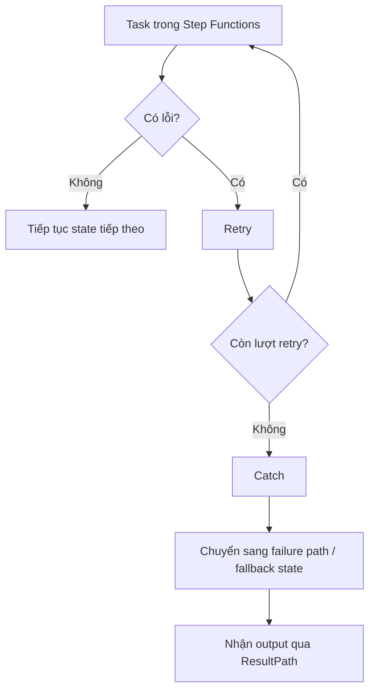

# 395. Step Functions - Error Handling

## 🎯 Giới thiệu
- **Step Functions** được dùng để điều phối nhiều task nhỏ, mỗi task chỉ làm một phần việc rất nhỏ như gọi API.
- **Error handling** nên được xử lý ở **Step Functions state machine**, không nên nhét vào trong application code hay trong **Lambda**.
- Cách này giúp:
  - Application đơn giản hơn
  - Retry/Catch được quản lý rõ ràng
  - Có **execution history** cho toàn bộ quá trình xử lý lỗi

## 1. Các loại lỗi có thể gặp
- **Definition issue** của state machine:
  - Ví dụ: **Choice state** không có rule khớp
- **Task failure**:
  - Ví dụ: **Lambda function throws an exception**
- **Transient failure**:
  - Ví dụ: network partition
- Các error code được nhắc đến:
  - `States.All`
  - `State.Timeout`
  - `TaskFailed`
  - `States.Permissions`

## 2. Retry trong Step Functions
- **Retry** dùng để thử lại task hoặc **parallel states** khi gặp lỗi.
- Cơ chế này được đánh giá **từ trên xuống dưới**.
- Các thuộc tính chính:
  - **ErrorEquals**: khớp loại lỗi cụ thể
  - **IntervalSeconds**: thời gian chờ trước khi retry
  - **BackoffRate**: hệ số nhân độ trễ sau mỗi lần retry
  - **MaxAttempts**: số lần retry tối đa
- Một vài điểm cần nhớ:
  - `MaxAttempts` mặc định là **3**
  - `MaxAttempts = 0` nghĩa là **không retry**
  - Có thể dùng để mô phỏng **exponential backoff**
- Ví dụ lỗi có thể match:
  - `CustomError`
  - `TaskFailed`
  - `All` để bắt mọi lỗi

## 3. Catch và ResultPath
- Khi retry hết số lần cho phép, **Catch** sẽ được kích hoạt.
- **Catch** cũng được đánh giá **từ trên xuống dưới**.
- Trong Catch:
  - Có `ErrorEquals`
  - Có `Next` để chuyển sang state tiếp theo
- Ý nghĩa:
  - Khi gặp lỗi sau quá nhiều lần retry, Step Functions sẽ chuyển sang **fallback path** hoặc một state xử lý lỗi khác.
- **ResultPath**:
  - Dùng để xác định dữ liệu lỗi sẽ được gắn vào output như thế nào
  - Ví dụ `$.error` sẽ đưa error vào output dưới key `error`
  - Output cuối cùng vẫn giữ input cũ, đồng thời có thêm block lỗi để state sau phân tích hoặc gửi email/debug

## 4. Ý nghĩa cho thiết kế hệ thống
- Không nên để Lambda tự xử lý toàn bộ retry logic.
- Nếu làm trong Lambda:
  - Code sẽ phức tạp hơn
  - Lambda có thể chạy lâu và dễ timeout
  - Muốn đổi logic error handling phải redeploy Lambda
- Nếu làm trong Step Functions:
  - Dễ thay đổi trực tiếp trong JSON definition
  - Linh hoạt hơn
  - Task trong Lambda chạy ngắn và gọn hơn

## 📊 Bảng tóm tắt
| Tiêu chí | Mô tả |
|----------|------|
| Vị trí xử lý lỗi | Trong **Step Functions**, không phải trong Lambda |
| Cơ chế chính | **Retry** và **Catch** |
| Loại lỗi | `States.All`, `State.Timeout`, `TaskFailed`, `States.Permissions`, custom error |
| Retry order | Đánh giá **top to bottom** |
| Retry params | `ErrorEquals`, `IntervalSeconds`, `BackoffRate`, `MaxAttempts` |
| Catch action | Chuyển sang state tiếp theo qua `Next` |
| ResultPath | Gắn lỗi vào output, ví dụ `$.error` |
| Lợi ích | Code đơn giản, linh hoạt, có execution history rõ ràng |

## 💡 Mẹo ghi nhớ cho kỳ thi AWS
- Nhớ 2 từ khóa chính: **Retry** = thử lại, **Catch** = chuyển hướng lỗi.
- **Retry** dùng trước, **Catch** dùng sau khi retry hết.
- **ErrorEquals** luôn được xét **từ trên xuống dưới**.
- `MaxAttempts = 0` nghĩa là **không retry**.
- **ResultPath** là điểm rất dễ ra thi: nó quyết định lỗi được đưa vào output như thế nào.
- Nếu thấy câu hỏi về việc giữ input cũ nhưng thêm thông tin lỗi, nghĩ ngay đến **ResultPath**.

## ✅ Kết luận
- Step Functions cho phép xử lý lỗi tập trung ở state machine thay vì trong từng task.
- Cơ chế chính là **Retry** để thử lại và **Catch** để đi sang failure path hoặc fallback state.
- **ResultPath** giúp truyền thông tin lỗi sang state tiếp theo để xử lý tiếp hoặc debug.
- Đây là phần rất quan trọng khi ôn thi AWS vì thường kiểm tra khả năng phân biệt **Retry**, **Catch**, và **ResultPath**.
