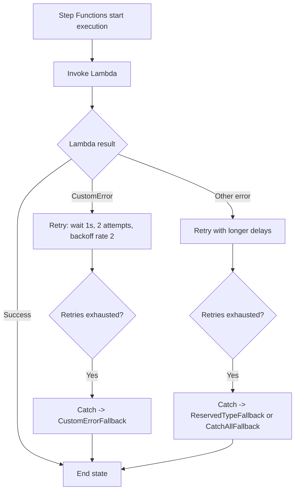

# 396. Step Functions - Error Handling Hands On

## 🎯 Giới thiệu
Bài học này demo cách **Step Functions** xử lý lỗi khi gọi **Lambda**. Một Lambda được tạo để luôn ném lỗi `CustomError`, sau đó state machine sẽ dùng **Retry** và **Catch** để rẽ nhánh theo từng loại lỗi khác nhau.

## 1. Tạo Lambda ném lỗi
- Tạo một Lambda từ blueprint `step-functions-error`.
- Đặt tên là `MyLambdaFunctionThatFails`.
- Code của Lambda tạo ra một `CustomError` và luôn thất bại.
- Khi test với input như `Foobar`, function trả về:
  - `CustomError`
  - error message
  - stack trace

## 2. Cấu hình Step Functions xử lý lỗi
- Tạo state machine mới và author từ scratch.
- Dùng definition từ file `1-error-handling/state-machine.json`.
- State machine gọi Lambda và xử lý theo loại lỗi:
  - `CustomError` -> retry ngắn, sau đó sang `CustomErrorFallback`
  - lỗi kiểu khác không khớp -> đi sang `ReservedTypeFallback`
  - mọi lỗi còn lại -> đi sang `CatchAllFallback`
- Logic retry được mô tả là:
  - chờ `1 second`
  - `2 attempts`
  - `BackoffRate = 2`
- Sau khi hết retry thì mới vào phần `Catch`.

## 3. Quan sát luồng thực thi
- Với `CustomError`:
  - Lambda bị gọi lại nhiều lần theo retry
  - sau khi hết retry thì lỗi được bắt
  - execution đi vào `CustomErrorFallback`
  - cuối cùng execution thành công
- Khi đổi Lambda sang một lỗi khác không khớp `CustomError`:
  - execution đi theo nhánh khác
  - vào `ReservedTypeFallback`
  - lịch retry dài hơn, ví dụ:
    - lần đầu fail
    - đợi `30 seconds`
    - lần tiếp theo đợi `60 seconds`
  - sau khi hết retry, workflow kết thúc theo nhánh fallback tương ứng

## 📊 Bảng tóm tắt
| Tiêu chí | Mô tả |
|----------|------|
| Mục tiêu | Demo error handling trong Step Functions |
| Nguồn lỗi | Lambda cố tình ném `CustomError` |
| Cơ chế xử lý | `Retry` và `Catch` |
| Phân nhánh | `CustomErrorFallback`, `ReservedTypeFallback`, `CatchAllFallback` |
| Retry logic | Có thể khác nhau theo loại lỗi |
| Kết quả | Hết retry thì chuyển sang fallback phù hợp |

## 💡 Mẹo ghi nhớ cho kỳ thi AWS
- `Retry` dùng để thử lại khi task fail, `Catch` dùng khi retry đã hết.
- Loại lỗi quyết định branch nào được chọn trong Step Functions.
- `States.ALL` là nhánh bắt tất cả lỗi không khớp loại cụ thể.
- Cùng một workflow có thể có nhiều retry policy khác nhau cho từng error type.
- Khi đọc đề thi, hãy chú ý từ khóa: `CustomError`, `States.ALL`, `Retry`, `Catch`, `BackoffRate`.

## ✅ Kết luận
Step Functions có thể xử lý lỗi rất linh hoạt bằng cách kết hợp `Retry` và `Catch`. Trong demo này, cùng một Lambda fail nhưng workflow vẫn rẽ nhánh đúng theo loại lỗi và cuối cùng đi tới fallback phù hợp.
