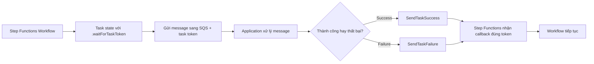

# 397. Step Functions - Wait For Task Token

## 🎯 Giới thiệu
`Wait for task token` là một feature của **Step Functions** dùng khi workflow cần **chờ một tác vụ bên ngoài hoàn thành** trước khi tiếp tục.

- Dùng cho các tình huống như:
  - Chờ **AWS service** khác xử lý xong
  - Chờ **human approval**
  - Tích hợp với **third-party integration**
  - Gọi **legacy systems**
- Trong `Task state`, thêm `.waitForTaskToken` vào `resource`.
- Step Functions sẽ **pause execution** cho đến khi nhận lại đúng `task token`.

## 1. Khái niệm cốt lõi
- `waitForTaskToken` cho phép Step Functions gửi công việc ra ngoài nhưng vẫn giữ trạng thái workflow đang chờ.
- Khi gửi request, phải kèm theo:
  - **input**
  - **task token**
- Bên nhận message sẽ dùng token này để gọi ngược về Step Functions.

## 2. Luồng hoạt động

- Ví dụ trong transcript:
  - Workflow bắt đầu bằng việc **check client credits**
  - Việc này phụ thuộc vào **external service**
  - Step Functions gửi message vào **SQS** kèm `task token`
- Application nào pull message cũng có thể xử lý:
  - `Lambda`
  - `ECS`
  - `EC2`
  - **third-party server**
- Sau khi xử lý xong, application gọi:
  - `SendTaskSuccess` nếu thành công
  - `SendTaskFailure` nếu thất bại
- Callback phải mang theo:
  - **task token ban đầu**
  - **output của xử lý**

## 3. Ý nghĩa trong workflow
- Giúp Step Functions tích hợp với **bất kỳ cơ chế external nào**
- Workflow không bị chạy tiếp quá sớm
- Chỉ tiếp tục khi nhận đúng callback với đúng `task token`

## 📊 Bảng tóm tắt
| Tiêu chí | Mô tả |
|----------|------|
| Mục đích | Chờ tác vụ bên ngoài hoàn tất trước khi workflow tiếp tục |
| Cách dùng | Thêm `.waitForTaskToken` vào `resource` của `Task state` |
| Dữ liệu gửi đi | `input` + `task token` |
| Cách phản hồi | `SendTaskSuccess` hoặc `SendTaskFailure` |
| Nơi xử lý message | `Lambda`, `ECS`, `EC2`, hoặc `third-party server` |
| Điểm quan trọng | Workflow chỉ đi tiếp khi nhận callback đúng `task token` |

## 💡 Mẹo ghi nhớ cho kỳ thi AWS
- Nhớ công thức: **Step Functions waits + task token + callback**
- `waitForTaskToken` = **pause workflow** để chờ external processing
- Luôn nhớ callback dùng:
  - `SendTaskSuccess`
  - `SendTaskFailure`
- Nếu đề bài nói đến:
  - chờ approval
  - chờ hệ thống ngoài xử lý
  - tích hợp SQS / external application
  - gọi lại sau khi xử lý xong  
  thì hãy nghĩ ngay đến **Step Functions - Wait For Task Token**.

## ✅ Kết luận
`Wait for task token` là cơ chế trong **Step Functions** giúp workflow chờ kết quả từ bên ngoài trước khi tiếp tục. Nó hoạt động bằng cách gửi `task token` cùng message ra ngoài, sau đó nhận callback qua `SendTaskSuccess` hoặc `SendTaskFailure` để resume workflow.
