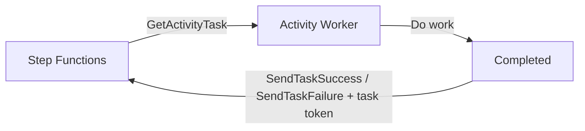

# 398. Step Functions - Activity Tasks

## 🎯 Giới thiệu
- **Activity Tasks** trong AWS Step Functions là một cơ chế để **activity workers** chủ động **pull** công việc từ workflow của Step Functions.
- Ý tưởng có nét giống với pattern **wait for task token**, nhưng cách thực hiện **khác nhau**:
  - **Activity Tasks**: worker **pull** work từ Step Functions.
  - **Wait for task token callback pattern**: Step Functions **push** event ra ngoài, rồi hệ thống bên ngoài xử lý và gọi trả về.

## 1. Cách Activity Tasks hoạt động
- Các **activity workers** có thể chạy trên:
  - **EC2 instances**
  - **Lambda functions**
  - **mobile devices**
  - hoặc bất kỳ nơi nào phù hợp
- Worker sẽ thường xuyên gọi API **GetActivityTask** để tìm task từ Step Functions.
- Nếu có task được trả về:
  - Step Functions gửi lại **input** và **task token**
  - Worker thực hiện công việc
  - Sau đó gửi kết quả về bằng **SendTaskSuccess** hoặc **SendTaskFailure**

## 2. Pull-based vs Push-based
- **Activity Task mechanism**:
  - Là mô hình **pull-based**
  - Worker tự đi lấy task từ Step Functions
  - Kết nối mạng khá đơn giản: EC2 instance chỉ cần kết nối được tới Step Functions
- **Wait for task token callback pattern**:
  - Là mô hình **push-based**
  - Step Functions đẩy event ra ngoài, ví dụ tới **SQS queue**
  - Một thành phần bên ngoài sẽ lấy work rồi đưa kết quả ngược về Step Functions

## 3. Timeout và Heartbeat
- **TimeoutSeconds**
  - Là thời gian tối đa một task đang xử lý có thể chờ trước khi bị xem là failure
- **HeartbeatSeconds**
  - Là thời gian tối đa chờ heartbeat trước khi task bị coi là không còn sống
  - Worker phải gọi **SendHeartBeat** để báo task vẫn đang hoạt động
- Nếu đặt **HeartBeatSeconds = 10 seconds**, thì nên gửi heartbeat khoảng mỗi **5 seconds** để task luôn được xem là alive
- Nếu cấu hình **TimeoutSeconds** rất dài và vẫn gửi heartbeat đều đặn, Activity Task có thể chờ tới **1 năm**

## 📊 Bảng tóm tắt
| Tiêu chí | Mô tả |
|----------|------|
| Cơ chế chính | **Pull-based**: worker chủ động lấy task từ Step Functions |
| API quan trọng | **GetActivityTask**, **SendTaskSuccess**, **SendTaskFailure**, **SendHeartBeat** |
| Worker có thể chạy ở đâu | **EC2**, **Lambda**, mobile devices, hoặc hệ thống khác |
| Timeout | **TimeoutSeconds** quyết định task in progress được chờ bao lâu |
| Heartbeat | **HeartbeatSeconds** quyết định thời gian tối đa chờ heartbeat |
| So sánh với callback pattern | Callback pattern là **push-based**, còn Activity Tasks là **pull-based** |

## 💡 Mẹo ghi nhớ cho kỳ thi AWS
- Nhớ từ khóa: **Activity Tasks = worker pull work từ Step Functions**
- Nếu thấy **GetActivityTask** thì nghĩ ngay đến **pull mechanism**
- Nếu thấy **SendTaskSuccess / SendTaskFailure** thì đây là bước hoàn tất task sau khi worker xử lý xong
- **Heartbeat** dùng để chứng minh task vẫn còn sống
- **TimeoutSeconds** là giới hạn tổng thời gian task được phép chạy
- Cần phân biệt:
  - **Activity Task**: worker kéo task về
  - **wait for task token**: Step Functions đẩy event ra ngoài

## ✅ Kết luận
- **Activity Tasks** là cách Step Functions giao việc theo mô hình **pull**.
- Worker dùng **GetActivityTask** để lấy input và **task token**, sau đó trả kết quả bằng **SendTaskSuccess** hoặc **SendTaskFailure**.
- Hai tham số quan trọng khi ôn thi là **TimeoutSeconds** và **HeartbeatSeconds**.
