# 399. Step Functions - Standard vs Express

## 🎯 Giới thiệu
AWS Step Functions có 2 nhóm cách chạy workflow chính:
- **Standard workflow**: mặc định
- **Express workflow**: gồm **asynchronous** và **synchronous**

Điểm cần nhớ cho kỳ thi là sự khác nhau về:
- **thời lượng chạy**
- **execution model**
- **khả năng theo dõi**
- **pricing**
- **use case**

## 1. Standard workflow
- Là **default** của Step Functions
- Thời lượng tối đa của một workflow: **up to 1 year**
- Execution model: **exactly-once execution**
- Tốc độ: khoảng **2,000 workflows/second**
- Lịch sử execution:
  - tối đa **90 days** trong console history
  - có thể dùng **CloudWatch** để xem logs lâu hơn
  - có thể giữ logs **forever** bằng log retention settings
- Pricing:
  - tính theo **number of state transitions**
- Use case phù hợp:
  - các tác vụ **non-idempotent**
  - ví dụ: **payments processing**

## 2. Express workflow
- Dùng cho workflow ngắn, tối đa **5 minutes**
- Có khả năng xử lý rất cao:
  - hơn **100,000 executions/second**
- Không có cách theo dõi trực tiếp trong console
- Muốn xem kết quả và phân tích thì phải dùng **CloudWatch logs**
- Pricing:
  - tính theo **number of executions**
  - **duration**
  - **memory consumption**
- Use case phù hợp:
  - **IoT data ingestion**
  - **streaming data**
  - **mobile app backends**

### 2.1 Asynchronous Express
- Execution model: **at least once**
- Workflow bắt đầu chạy, nhưng **không chờ kết quả**
- Phù hợp khi **không cần immediate response**
- Ví dụ trong transcript:
  - messaging services, chỉ cần gửi đi và không cần chờ phản hồi
- Vì là **at least once**, một action có thể bị thực hiện **2 lần**
- Do đó cần quản lý **idempotence**

### 2.2 Synchronous Express
- Execution model: **at most once**
- Khi invoke workflow, ta **chờ workflow hoàn tất** và lấy kết quả
- Phù hợp khi cần **immediate response**
- Ví dụ trong transcript:
  - orchestrate microservices và cần chắc chắn mọi thứ hoạt động đúng
- Có thể invoke từ:
  - **API Gateway**
  - **Lambda**
- Nếu có failure thì **Step Functions không tự restart workflow**
- Việc retry là do **bạn tự implement**

## 3. Điểm khác nhau cần nhớ cho exam

```mermaid
flowchart TD
    A[Step Functions] --> B[Standard workflow]
    A --> C[Express workflow]

    B --> B1[Default]
    B --> B2[Up to 1 year]
    B --> B3[Exactly-once]
    B --> B4[~2,000 executions/second]
    B --> B5[Console history 90 days]
    B --> B6[Billing by state transitions]
    B --> B7[Non-idempotent actions<br/>vd: payments]

    C --> C1[Up to 5 minutes]
    C --> C2[>100,000 executions/second]
    C --> C3[CloudWatch logs only]
    C --> C4[Billing by executions,<br/>duration, memory]
    C --> C5[IoT, streaming, mobile backends]

    C --> D[Asynchronous Express]
    C --> E[Synchronous Express]

    D --> D1[At least once]
    D --> D2[Do not wait for result]
    D --> D3[Can run twice]
    D --> D4[Need idempotence]

    E --> E1[At most once]
    E --> E2[Wait for completion]
    E --> E3[Immediate response]
    E --> E4[Invoke from API Gateway or Lambda]
    E --> E5[No auto-restart on failure]
```

## 📊 Bảng tóm tắt
| Tiêu chí | Mô tả |
|----------|------|
| Standard workflow | Default, chạy tối đa 1 năm |
| Standard execution model | **Exactly-once** |
| Standard scale | Khoảng **2,000 executions/second** |
| Standard tracking | Console history tối đa 90 ngày, thêm logs qua **CloudWatch** |
| Standard pricing | Tính theo **state transitions** |
| Standard use case | Tác vụ **non-idempotent** như payments processing |
| Express workflow | Workflow ngắn, tối đa 5 phút |
| Express scale | Hơn **100,000 executions/second** |
| Express tracking | Chỉ qua **CloudWatch logs** |
| Express pricing | Tính theo **executions**, **duration**, **memory consumption** |
| Async Express | **At least once**, không chờ kết quả |
| Sync Express | **At most once**, chờ kết quả trả về |
| Sync Express invoke | Có thể gọi từ **API Gateway** hoặc **Lambda** |

## 💡 Mẹo ghi nhớ cho kỳ thi AWS
- **Standard = lâu hơn, chắc chắn hơn**: nhớ **1 year + exactly-once + state transitions**
- **Express = nhanh hơn, ngắn hơn**: nhớ **5 minutes + very high throughput + CloudWatch logs**
- **Async Express = at least once**:
  - dễ bị chạy lại
  - phải nghĩ đến **idempotence**
- **Sync Express = at most once**:
  - chờ kết quả
  - phù hợp khi cần phản hồi ngay
- Nếu đề bài nhắc đến:
  - **payments / non-idempotent** → nghĩ tới **Standard**
  - **IoT / streaming / mobile backend** → nghĩ tới **Express**
  - **không cần chờ kết quả** → nghĩ tới **Async Express**
  - **cần response ngay** → nghĩ tới **Sync Express**

## ✅ Kết luận
Step Functions có 2 lựa chọn chính:
- **Standard** cho workflow dài, cần exactly-once và phù hợp với tác vụ quan trọng như payments
- **Express** cho workflow ngắn, tốc độ cao, theo dõi qua CloudWatch logs

Trong Express:
- **Asynchronous** = **at least once**
- **Synchronous** = **at most once**

Đây là phần rất dễ ra đề, đặc biệt là các từ khóa: **duration**, **execution model**, **CloudWatch**, **idempotence**, **API Gateway**, **Lambda**.
