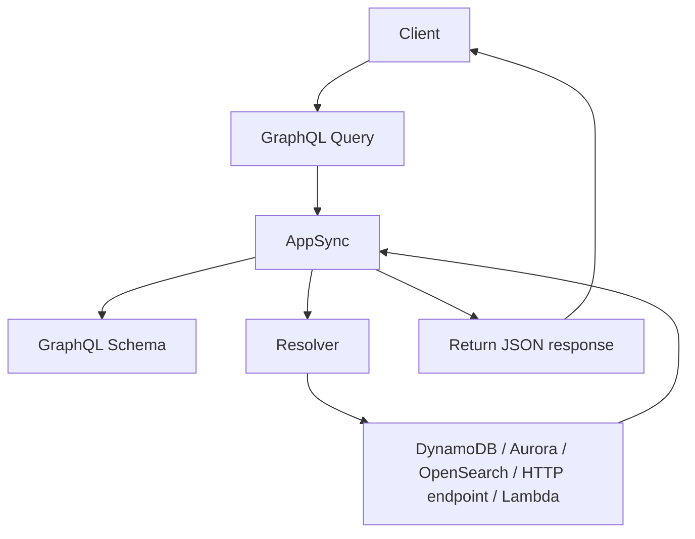

# 400. AppSync Overview

## 🎯 Giới thiệu
AWS AppSync là một **managed service** dùng **GraphQL**. Từ góc nhìn exam, AppSync có 2 ý chính:

- Dùng để xây dựng **GraphQL API** trên AWS.
- Dùng cho **real-time** thông qua **WebSockets** hoặc **MQTT on WebSockets**.

GraphQL giúp application lấy đúng dữ liệu cần thiết bằng cách request các field mong muốn, thay vì lấy toàn bộ dữ liệu.

## 1. AppSync dùng để làm gì?
### ✅ GraphQL API
- AppSync là lựa chọn khi muốn build **GraphQL API** trên AWS.
- GraphQL cho phép application:
  - hỏi đúng field cần lấy
  - nhận lại đúng dữ liệu tương ứng
- Dữ liệu phía sau GraphQL có thể đến từ nhiều nguồn:
  - **NoSQL data stores**
  - **Relational databases**
  - **HTTP APIs**

### ✅ Real-time application
- AppSync hỗ trợ **real-time WebSockets integration**.
- Có thể dùng cho:
  - real-time dashboard
  - application cần dữ liệu realtime
- Đây là một trong nhiều cách để làm real-time, bên cạnh **Application Load Balancer** hoặc **API Gateway**.

### ✅ Mobile app và sync dữ liệu
- AppSync còn phù hợp cho **mobile application** cần:
  - local data access
  - data synchronization
- Transcript nhấn mạnh đây là lựa chọn thay thế cho một thứ “outdated” gọi là **cookie to sync**.

## 2. Cách AppSync hoạt động

### 🔍 Flow chính
- Bạn upload một **GraphQL schema** lên AppSync.
- Client gửi **query** đến AppSync.
- AppSync dùng **resolver** để biết cách lấy dữ liệu.
- Resolver có thể lấy dữ liệu từ:
  - **DynamoDB**
  - **Aurora**
  - **OpenSearch**
  - **Lambda**
  - **public HTTP endpoints**
- AppSync tự trả về dữ liệu dưới dạng **JSON** đúng theo query đã request.

### 🧩 Ý nghĩa quan trọng
- “Magic” của GraphQL nằm ở **resolvers**.
- Bạn không cần lấy toàn bộ dữ liệu rồi lọc thủ công.
- AppSync tự gom và trả đúng field mà client yêu cầu.

## 3. Bảo mật, tích hợp và logging
### 🔐 Authorization cho GraphQL API
AppSync có 4 cách authorize application:

- **API_KEY**
  - tạo key và phân phối cho users
- **AWS_IAM**
  - cho phép **IAM users**, **roles**, hoặc **cross-account access**
- **OPENID_CONNECT**
  - tích hợp với **OpenID Connect provider** và **JSON Web Token**
- **AMAZON_COGNITO_USER_POOL**
  - tích hợp với **Cognito User Pools**
  - có thể federation qua các **social login providers**

### 📈 Monitoring
- AppSync tích hợp với:
  - **CloudWatch Metrics**
  - **CloudWatch Logs**

### 🌐 HTTPS custom domain
- Nếu muốn dùng **custom domain** với **HTTPS security** trên AppSync:
  - giải pháp được khuyến nghị là dùng **CloudFront** phía trước AppSync

## 📊 Bảng tóm tắt
| Tiêu chí | Mô tả |
|----------|------|
| Dịch vụ | **Managed service** cho **GraphQL** |
| Mục đích chính | Xây dựng **GraphQL API** và hỗ trợ **real-time** |
| Nguồn dữ liệu | **DynamoDB**, **Aurora**, **OpenSearch**, **Lambda**, **HTTP endpoints** |
| Cơ chế xử lý | Dùng **GraphQL schema** và **resolvers** |
| Kết quả trả về | Dữ liệu được trả về dạng **JSON** đúng theo query |
| Use case nổi bật | Web app, mobile app, real-time app, data synchronization |
| Authorization | **API_KEY**, **AWS_IAM**, **OPENID_CONNECT**, **AMAZON_COGNITO_USER_POOL** |
| Monitoring | **CloudWatch Metrics**, **CloudWatch Logs** |
| Custom domain HTTPS | Khuyến nghị dùng **CloudFront** trước AppSync |

## 💡 Mẹo ghi nhớ cho kỳ thi AWS
- Nhớ AppSync = **GraphQL + real-time**.
- Nhớ 2 thành phần cốt lõi: **schema** và **resolver**.
- Nhớ các integration chính: **DynamoDB**, **Aurora**, **OpenSearch**, **Lambda**, **HTTP**.
- Nhớ 4 kiểu auth:
  - **API_KEY**
  - **AWS_IAM**
  - **OPENID_CONNECT**
  - **AMAZON_COGNITO_USER_POOL**
- Nếu đề bài nhắc **custom domain + HTTPS** cho AppSync, transcript gợi ý dùng **CloudFront**.

## ✅ Kết luận
AppSync là dịch vụ AWS dành cho **GraphQL API** và **real-time communication**. Điểm quan trọng khi ôn thi là nắm được **schema**, **resolver**, các **data source integration**, 4 cơ chế **authorization**, và cách dùng **CloudFront** cho **HTTPS custom domain**.
