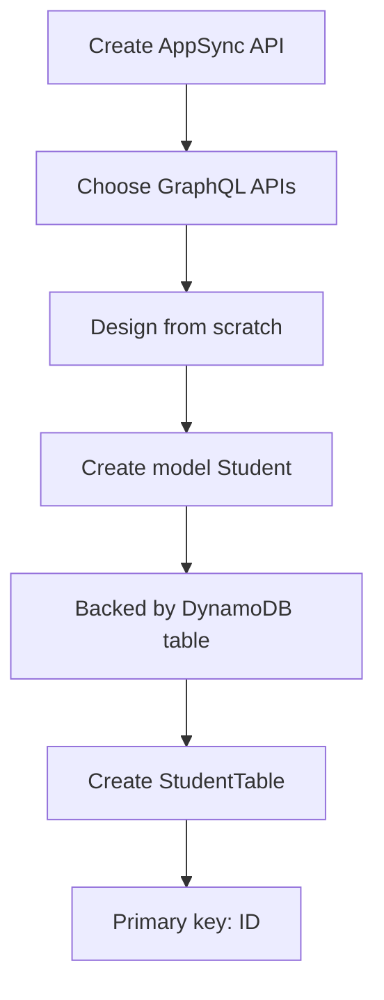
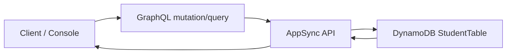

# 401. AppSync Hands On

## 🎯 Giới thiệu
- Bài thực hành này dùng AWS AppSync để tạo một API kiểu **GraphQL**.
- Có 2 lựa chọn khi tạo API:
  - **GraphQL APIs**
  - **Merged API**  
- Trong bài, chọn **GraphQL APIs** vì đơn giản nhất và là phần cần nắm cho kỳ thi.
- API được thiết kế **from scratch**, có thể:
  - import từ **DynamoDB**
  - hoặc tạo **real-time API**
- AppSync có thể được **backed by DynamoDB table**, nghĩa là schema và dữ liệu được gắn trực tiếp với bảng DynamoDB.

## 1. 🛠️ Tạo AppSync API và model
- Đặt tên API là **My AppSync API**.
- Tạo một type/model mới backed by **DynamoDB table**.
- Model name là **Student**.
- Các field được khai báo:
  - `id`: kiểu **ID**, **required**
  - `name`: kiểu **String**, có thể **required**
  - `age`: kiểu **Int**, không bắt buộc
  - `certified`: kiểu **Boolean**, không bắt buộc
- Cấu hình bảng DynamoDB:
  - Table name: **StudentTable**
  - Primary key: **ID**
  - Không dùng sort key
- Sau khi tạo xong, schema được sinh tự động từ cấu trúc đã khai báo.

## 2. 📦 Data source, query và mutation
- Trong AppSync:
  - **Data sources**: liên kết DynamoDB table với GraphQL API
  - **Functions**: không cần học sâu trong bài này
  - **Queries**: nơi bắt đầu sử dụng API
- Có sẵn các thao tác GraphQL:
  - **createStudent mutation**
  - **listStudents mutation**
- Luồng thao tác:
  - Chạy `listStudents` trước thì chưa có dữ liệu
  - Chạy `createStudent` để thêm dữ liệu
  - Ví dụ tạo 2 student:
    - Mike, 25, `certified: true`
    - Alice, 30, `certified: true`
  - Sau đó chạy `listStudents` sẽ trả về cả 2 bản ghi
- Dữ liệu cũng xuất hiện trong **DynamoDB** ở table items.

## 3. ⚙️ Cấu hình, bảo mật và dọn dẹp
- AppSync cung cấp các thông tin và cấu hình:
  - **GraphQL endpoint**
  - **API ID**
  - **real-time endpoints**
- Có thể cấu hình **caching**:
  - **full request caching**
  - **per-resolver caching**
  - **no caching**
- Có nhiều **authorization modes**:
  - **API key**
  - **IAM**
  - **OpenID Connect**
  - **Lambda**
  - **Amazon Cognito User Pool**
- Có thể chọn **multiple authorization providers**.
- Có phần **monitoring**:
  - số lượng errors
  - số lượng requests
- Có thể gắn **custom domain names** để host API dưới domain riêng.
- Kết thúc bài thực hành:
  - xóa API trong AppSync
  - xóa bảng trong **DynamoDB**
  - không cần backup

## 📊 Bảng tóm tắt
| Tiêu chí | Mô tả |
|----------|------|
| Dịch vụ chính | **AWS AppSync** |
| Loại API | **GraphQL APIs** |
| Mô hình dữ liệu | **Student** |
| Data source | **DynamoDB table** |
| Table name | **StudentTable** |
| Primary key | **ID** |
| Field ví dụ | `id`, `name`, `age`, `certified` |
| Thao tác chính | `createStudent`, `listStudents` |
| Cấu hình nổi bật | caching, authorization modes, monitoring, custom domain |
| Mục tiêu sử dụng | Tạo API cho **web** và **mobile** |

## 💡 Mẹo ghi nhớ cho kỳ thi AWS
- Nhớ mối liên hệ: **AppSync = GraphQL API layer**, có thể nối với **DynamoDB**.
- Khi thấy bài nói về **mobile/web clients** và API kiểu GraphQL, nghĩ ngay tới **AppSync**.
- Phân biệt nhanh:
  - **createStudent** = mutation để ghi dữ liệu
  - **listStudents** = query để đọc dữ liệu
- AppSync hỗ trợ nhiều **authorization modes**, trong transcript nhấn mạnh:
  - **API key**
  - **IAM**
  - **Cognito**
  - **Lambda**
- Nếu câu hỏi nói về API có **real-time endpoints**, **caching**, hoặc **custom domain**, đó cũng là dấu hiệu của **AppSync**.

## ✅ Kết luận
- Bài hands-on này minh họa quy trình tạo **AppSync GraphQL API** từ đầu.
- AppSync được cấu hình với **Student model** và liên kết với **DynamoDB StudentTable**.
- Sau khi tạo dữ liệu bằng mutation, có thể truy vấn lại bằng GraphQL query và kiểm tra trực tiếp trong DynamoDB.
- Ngoài chức năng API, AppSync còn có các phần quan trọng như **authorization**, **caching**, **monitoring** và **custom domain**.
