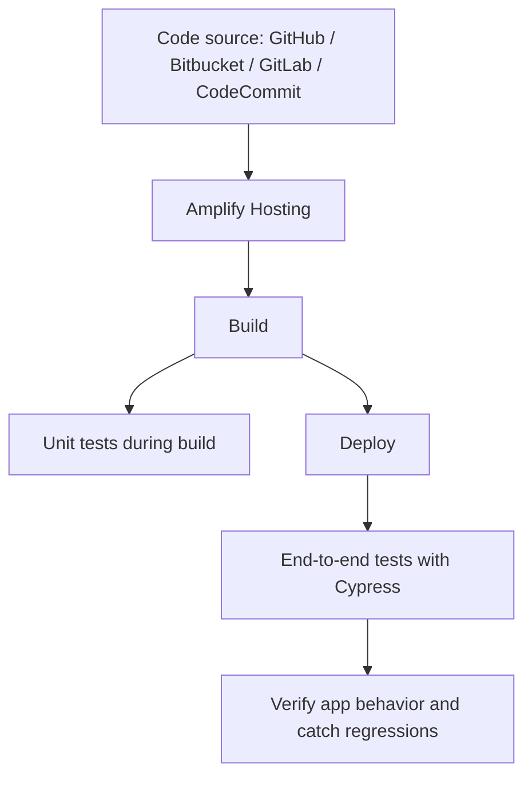

# 402. AWS Amplify

## 🎯 Giới thiệu
AWS Amplify là bộ công cụ giúp tạo **mobile** và **web applications** nhanh hơn, theo kiểu “one-stop shop” để tích hợp cả **front-end** lẫn **backend**. Trong transcript, Amplify được ví như **Elastic Beanstalk cho mobile và web applications**.

Amplify gồm nhiều thành phần:
- **Amplify Studio**: xây dựng app full stack bằng giao diện trực quan.
- **Amplify CLI**: làm tương tự nhưng qua command line.
- **Amplify Libraries**: kết nối app với các AWS services như **Cognito**, **S3**,...
- **Amplify Hosting**: host ứng dụng trên AWS và deliver nhanh.

## 1. Thành phần chính của AWS Amplify 🧩
Amplify tập trung vào việc khởi tạo và phát triển ứng dụng với các khả năng “must-have”:
- **Authentication**
- **Data storage**
- **Storage of files**
- **Machine learning**

Ở backend, Amplify dựa trên các AWS services như:
- **DynamoDB**
- **AWS AppSync** cho **GraphQL APIs**
- **Cognito**
- **Amazon S3**

Amplify cũng cung cấp **front-end libraries** cho nhiều framework/nền tảng:
- **React**
- **Vue**
- **JavaScript**
- **iOS**
- **Android**
- **Flutter**

Điểm nhấn:
- Tích hợp theo hướng **best practices**
- Hỗ trợ **reliability**, **security**, **scalability**

## 2. Authentication và DataStore 🔐🗄️
### Authentication
Khi dùng `amplify add auth`, Amplify sẽ tận dụng **Amazon Cognito** để cung cấp:
- user registration
- authentication
- account recovery
- MFA
- social signing
- fine-grained authorization

Ngoài backend, Amplify còn có **pre-built components** giúp tích hợp nhanh với Cognito ở front-end.

### DataStore
Khi dùng `amplify add api`, Amplify sẽ leverage:
- **Amazon AppSync** cho API
- **Amazon DynamoDB** cho data storage

Ý chính của **DataStore**:
- làm việc với **local data**
- tự động **synchronization to the cloud**
- không cần code phức tạp nhờ Amplify framework
- dựa trên **GraphQL** và **AppSync**
- hỗ trợ **offline** và **realtime**
- có thể model data bằng **Amplify Studio**

## 3. Amplify Hosting và Testing 🚀
### Amplify Hosting
Khi dùng `amplify add hosting`, Amplify cho phép build và host modern web apps với:
- **CICD**
- **build / test / deploy**
- **pull request previews**
- **custom domains**
- **monitoring**
- **redirects**
- **custom headers**
- **password protection**

Nguồn code có thể đến từ:
- **GitHub**
- **Bitbucket**
- **GitLab**
- **CodeCommit**

Luồng cơ bản:
- CICD build front-end
- deploy lên môi trường như **CloudFront**
- có thể build backend và deploy backend vào Amplify

### Testing
Amplify hỗ trợ 2 loại testing:
- **unit testing** trong giai đoạn build
- **end-to-end testing** khi app đã deploy

Mục tiêu của **end-to-end test**:
- phát hiện **regressions** trước khi push code lên production
- kiểm tra application hoạt động đúng từ góc nhìn **usability**

Chi tiết:
- test steps được định nghĩa trong file **`amplify.yml`**
- có thể dùng **Cypress testing framework**
- Cypress có thể:
  - tạo **UI report**
  - mô phỏng web browser
  - thực hiện các thao tác như click, nhập liệu, kiểm tra kết quả

## 📊 Bảng tóm tắt
| Tiêu chí | Mô tả |
|----------|------|
| Mục đích | Tạo mobile và web applications nhanh hơn bằng bộ công cụ Amplify |
| Thành phần | Amplify Studio, Amplify CLI, Amplify Libraries, Amplify Hosting |
| Backend services | DynamoDB, AppSync, Cognito, S3 |
| Authentication | `amplify add auth` dùng Cognito, hỗ trợ registration, authentication, account recovery, MFA |
| DataStore | `amplify add api`, dùng AppSync + DynamoDB, sync local lên cloud, hỗ trợ offline/realtime |
| Hosting | `amplify add hosting`, hỗ trợ CICD, PR previews, custom domains, monitoring, redirects |
| Testing | Unit testing khi build, end-to-end testing sau deploy, có thể dùng Cypress |
| Điểm thi cần nhớ | Amplify là “one-stop shop” cho app mobile/web, tích hợp best practices về reliability, security, scalability |

## 💡 Mẹo ghi nhớ cho kỳ thi AWS
- **Amplify = nhanh chóng xây app mobile/web + tích hợp backend AWS**
- **Studio = visual**, **CLI = command line**
- **Auth = Cognito**
- **DataStore = AppSync + DynamoDB**
- **Hosting = build/test/deploy + CI/CD**
- **Cypress = end-to-end testing**
- Nhớ cụm: **“one-stop shop”** và **“Elastic Beanstalk for mobile and web applications”**

## ✅ Kết luận
AWS Amplify là bộ công cụ giúp xây dựng, kết nối, kiểm thử và triển khai **mobile/web applications** theo cách gọn hơn và có sẵn nhiều thành phần tích hợp. Các ý quan trọng nhất trong transcript là **Amplify Studio/CLI**, **authentication với Cognito**, **DataStore với AppSync + DynamoDB**, và **Amplify Hosting** với **CICD** cùng **testing** qua **Cypress**.
