# 403. AWS Amplify - Hands On

## 🎯 Giới thiệu
AWS Amplify là một **all-in-one shop** để **build** và **deploy** ứng dụng trên AWS. Trong bài hands-on này, quy trình chính là:
- Clone template repository lên GitHub
- Kết nối repo đó với **AWS Amplify Console**
- Cho phép Amplify đọc repository
- Build và deploy ứng dụng tự động
- Quản lý dữ liệu, user, storage, functions và UI ngay trong Amplify console

## 1. Quy trình tạo và deploy ứng dụng 🚀
Các bước triển khai được thực hiện khá nhanh:
- Vào **create a new app**
- Mở docs để lấy hướng dẫn khởi động
- Clone repository mẫu về GitHub cá nhân
- Chọn **GitHub** làm provider trong Amplify
- Authorize Amplify Console đọc repository
- Chọn đúng template đã clone
- Giữ nguyên build settings
- Tạo và dùng **new service role** tự động
- Chọn **save and deploy**

Amplify sẽ tự bootstrap account để cài các phần cần thiết, ví dụ **CDK**, rồi build app.

```mermaid
flowchart LR
    A[GitHub repository] --> B[AWS Amplify Console]
    B --> C[Authorize access]
    C --> D[Select Amplify VT React template]
    D --> E[Keep build settings]
    E --> F[Create service role]
    F --> G[Save and deploy]
    G --> H[Bootstrap account]
    H --> I[Install CDK / required resources]
    I --> J[CloudFormation stacks]
    J --> K[Deployed Amplify app]
    K --> L[Access app via domain]
```

Sau khi deploy xong:
- Có thể mở domain để truy cập app
- App to-do hoạt động bình thường
- Có thể thêm dữ liệu trực tiếp trên giao diện

## 2. CloudFormation, stacks và Data Manager 📦
Khi app được build:
- Có thể xem các resource trong **CloudFormation**
- Amplify tạo ra nhiều **stacks**
- Có cả **nested stacks**
- App được managed bởi **CDK**

Ở phần giao diện Amplify:
- Chọn **production branch**
- Xem thêm thông tin ở panel bên trái
- Có các khu vực như:
  - **deployments**
  - **data**
  - **user management**

Với **Data Manager**:
- Dữ liệu của Amplify app được hiển thị tại đây
- Các record đã insert từ to-do list xuất hiện ngay
- Phía sau, dữ liệu nằm trong **DynamoDB**
- Có thể:
  - tạo item trực tiếp
  - chỉnh sửa item
  - download dữ liệu dạng **CSV**

## 3. User management, storage, functions và vận hành 🔧
Amplify console còn hỗ trợ nhiều phần khác:
- **User management**
  - Tạo users
  - Thiết lập security cho ứng dụng
  - Cần có authentication branch và push code cần thiết
  - Tích hợp sâu với **Amazon Cognito**
- **Storage**
  - Quản lý cấu hình storage
  - Có thể backend bởi **Amazon S3** hoặc các thứ khác
- **Functions**
  - Amplify functions được backed bởi **AWS Lambda**
- **UI library**
  - Lấy UI components
  - Làm **Figma-to-React**
- Các cấu hình khác:
  - **custom domains**
  - **build notification**
  - **build settings**
  - **environment variables**

Khi có thay đổi:
- Amplify sẽ **redeploy** application version
- Nhờ **CICD**, build và deploy diễn ra tự động

Khi muốn dọn dẹp:
- Vào **app settings**
- Chọn **general settings**
- Delete app bằng cách nhập `delete`
- Có thể xóa luôn repository trên GitHub bằng cách delete repo

## 📊 Bảng tóm tắt
| Tiêu chí | Mô tả |
|----------|------|
| Mục đích | Build và deploy ứng dụng trên AWS bằng một console tích hợp |
| Provider | Dùng **GitHub** repo làm nguồn code |
| Triển khai | Amplify bootstrap account, cài **CDK**, tạo **CloudFormation stacks** |
| Quản lý dữ liệu | **Data Manager** hiển thị và chỉnh sửa dữ liệu, backend là **DynamoDB** |
| User management | Quản lý users, tích hợp **Amazon Cognito** |
| Storage | Có thể dùng backend như **Amazon S3** |
| Functions | Amplify functions được backed bởi **AWS Lambda** |
| UI | Hỗ trợ UI library, **Figma-to-React** |
| Vận hành | Có **custom domains**, build notification, build settings, environment variables |
| Cleanup | Xóa app trong Amplify và xóa repo trên GitHub |

## 💡 Mẹo ghi nhớ cho kỳ thi AWS
- **Amplify = front-end/app deployment + quản lý backend ở mức console**
- Nhớ chuỗi triển khai: **GitHub -> Amplify -> CDK/CloudFormation -> app chạy**
- **Data Manager** thường liên quan đến **DynamoDB**
- **User management** gắn với **Cognito**
- **Functions** gắn với **Lambda**
- **Storage** có thể là **S3**
- Khi thấy Amplify trong đề thi, hãy nghĩ đến:
  - deploy nhanh
  - CI/CD tự động
  - quản lý app theo kiểu tích hợp sẵn
  - mọi thứ nằm trong AWS account nên mang tính private

## ✅ Kết luận
AWS Amplify cung cấp một quy trình rất nhanh để **build, deploy và quản lý** ứng dụng. Điểm nổi bật trong bài hands-on là tích hợp với **GitHub**, tự động tạo hạ tầng qua **CloudFormation/CDK**, và cung cấp các công cụ quản trị như **Data Manager**, **user management**, **storage**, **functions** và **UI library** ngay trong cùng một console.
