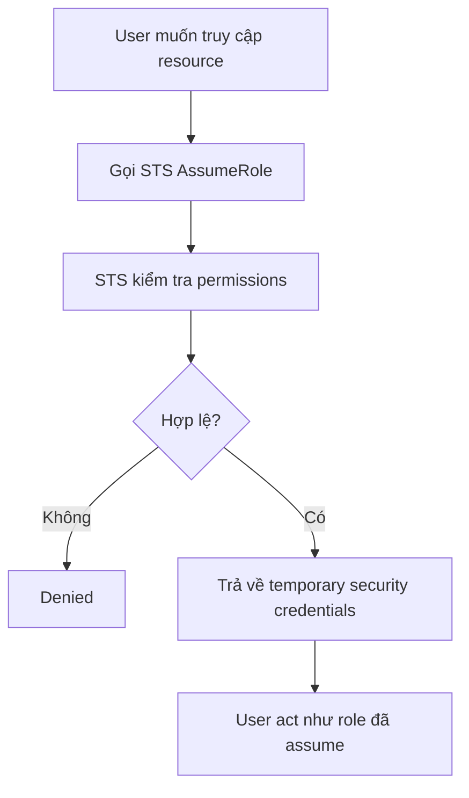
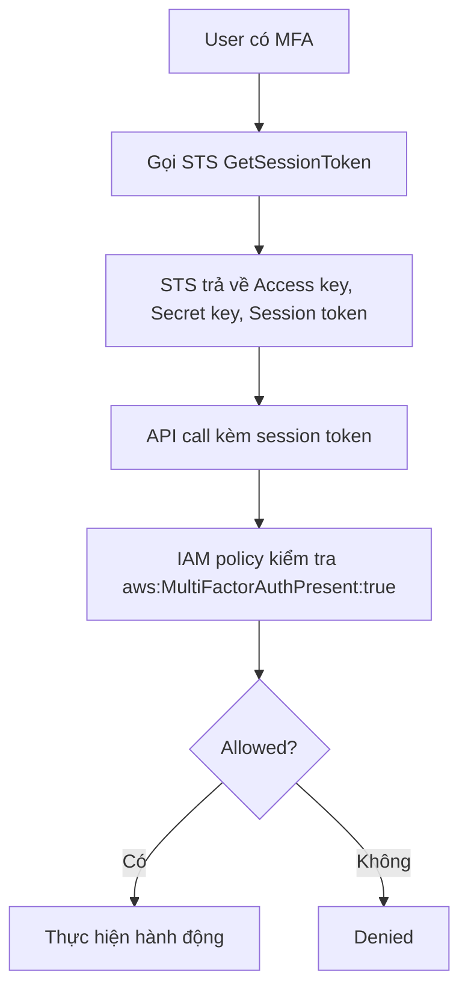

# 404. STS Overview

## 🎯 Giới thiệu
- `STS` là `Security Token Service`.
- Mục đích chính của `STS` là cấp **temporary security credentials** để truy cập tài nguyên trực tiếp.
- Thời hạn credentials có thể lên đến **1 hour**.
- Đây là chủ đề quan trọng cho kỳ thi AWS, đặc biệt các API sau:
  - `AssumeRole`
  - `GetSessionToken`
  - `GetCallerIdentity`
  - `DecodeAuthorizationMessage`

## 1. Các API quan trọng của STS
- `AssumeRole`
  - Dùng để assume role trong cùng account hoặc **cross-account**.
  - Đây là API nền tảng và quan trọng nhất.
- `AssumeRoleWithSAML`
  - Dùng khi user đăng nhập bằng `SAML`.
  - Trả về temporary credentials.
- `AssumeRoleWithWebIdentity`
  - Dùng với identity provider như `Facebook Login`, `Google Login`, hoặc `OIDC`.
  - Transcript nhấn mạnh rằng hiện nay thường dùng `Cognito Identity Pools` thay vì cách này.
- `GetSessionToken`
  - Dùng khi user có `MFA` hoặc với `AWS root account`.
  - Trả về `Access key`, `Secret key`, và `Session token`.
- `GetFederationToken`
  - Dùng để lấy temporary credentials cho federated user.
- `GetCallerIdentity`
  - Trả về thông tin về `IAM user` hoặc `role` đang dùng để gọi API.
  - Hữu ích khi không chắc “mình là ai” trong AWS.
- `DecodeAuthorizationMessage`
  - Dùng để giải mã error message khi một AWS API bị denied.

## 2. Flow của `AssumeRole`
- Quy trình cơ bản:
  - Tạo `IAM role` trong cùng account hoặc account khác.
  - Xác định ai có quyền truy cập role đó.
  - Dùng `IAM policies` để authorizes truy cập.
  - Gọi `STS AssumeRole` để impersonate role.
- Kết quả:
  - `STS` kiểm tra permission.
  - Nếu hợp lệ, `STS` trả về `temporary security credentials`.
  - Credentials này cho phép user hành động như thể họ đang dùng role đó.
- `AssumeRole` cross-account:
  - Tạo role ở target account.
  - Thiết lập permission đúng ở cả account của bạn và target account.
  - Gọi `AssumeRole` để truy cập tài nguyên ở account đích.
- Ví dụ:
  - Nếu role cho phép truy cập một `S3 bucket`, thì sau khi assume role, bạn có thể truy cập bucket đó.

## 3. `STS` với `MFA`
- Đây là phần rất quan trọng cho `AWS Certified Developer`.
- Dùng `GetSessionToken` để lấy session token khi user đăng nhập có `MFA`.
- Cần `IAM policy` với điều kiện phù hợp.
- Điều kiện cần nhớ:
  - `aws:MultiFactorAuthPresent:true`
- Ý nghĩa:
  - Chỉ cho phép hành động nếu `MFA` đang bật.
- Ví dụ trong transcript:
  - Role chỉ cho phép `stop instances` hoặc `terminate instances` khi `MFA` = true.
- Điểm cần nhớ:
  - `GetSessionToken` trả về 3 thành phần cần để gọi API:
    - `Access key`
    - `Secret key`
    - `Session token`
  - Nó cũng trả về `expiry date` của credentials để biết khi nào cần renew.

## 📊 Bảng tóm tắt
| Tiêu chí | Mô tả |
|----------|------|
| Mục đích của STS | Cấp temporary security credentials để truy cập tài nguyên |
| Thời gian hiệu lực | Up to 1 hour, riêng `AssumeRole` trong transcript là 15 minutes đến 1 hour |
| API quan trọng | `AssumeRole`, `GetSessionToken`, `GetCallerIdentity`, `DecodeAuthorizationMessage` |
| Dùng cho MFA | `GetSessionToken` + condition `aws:MultiFactorAuthPresent:true` |
| Dùng để xác định danh tính | `GetCallerIdentity` |
| Dùng để giải mã denied message | `DecodeAuthorizationMessage` |
| Web identity | Có `AssumeRoleWithWebIdentity`, nhưng transcript nói hiện nay thường dùng `Cognito Identity Pools` thay thế |

## 💡 Mẹo ghi nhớ cho kỳ thi AWS
- `AssumeRole` = dùng để **đóng vai role** trong cùng account hoặc cross-account.
- `GetSessionToken` = nhớ ngay tới **MFA** và `Session token`.
- `GetCallerIdentity` = khi không biết mình là ai trên AWS, hãy gọi API này.
- `DecodeAuthorizationMessage` = dùng khi gặp lỗi `AccessDenied` cần giải mã.
- `aws:MultiFactorAuthPresent:true` = điều kiện IAM quan trọng để bắt buộc `MFA`.
- `AssumeRoleWithWebIdentity` có xuất hiện, nhưng transcript nhấn mạnh rằng hiện nay thường thay bằng `Cognito Identity Pools`.

## ✅ Kết luận
- `STS` là dịch vụ cấp **temporary credentials** cho các tình huống xác thực và ủy quyền linh hoạt.
- Hai luồng cần nắm chắc là:
  - `AssumeRole` cho role access và cross-account access
  - `GetSessionToken` cho `MFA`
- Nếu ôn thi, hãy ưu tiên nhớ 4 API chính: `AssumeRole`, `GetSessionToken`, `GetCallerIdentity`, `DecodeAuthorizationMessage`.
