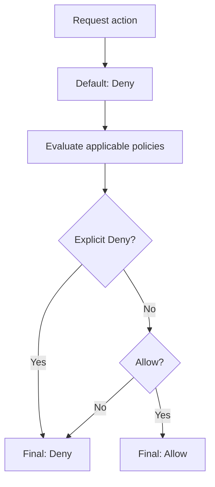
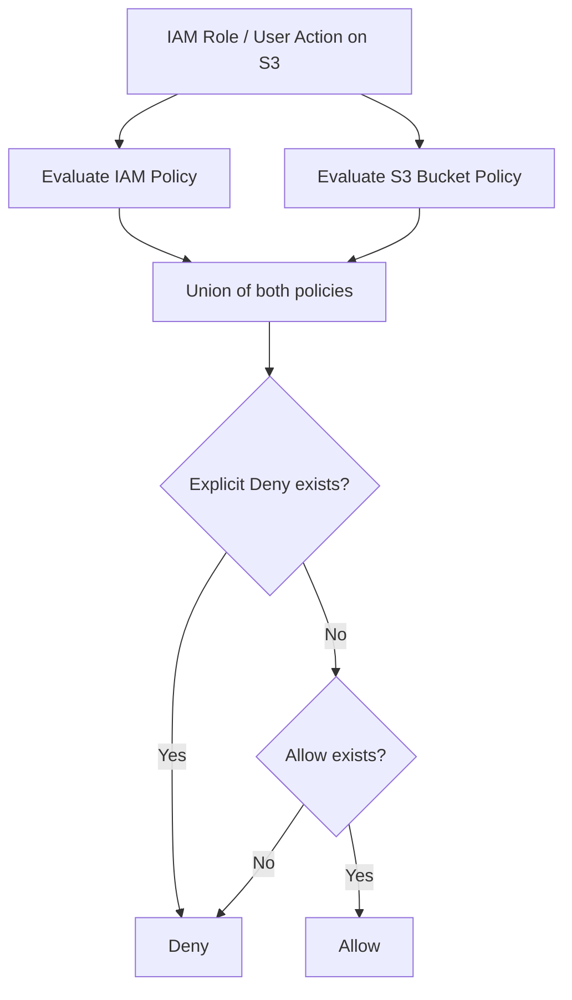

# 405. Advanced IAM

## 🎯 Giới thiệu
- Bài này tập trung vào các khái niệm **Advanced IAM** quan trọng cho kỳ thi AWS.
- Nội dung chính gồm:
  - Cách **IAM policy evaluation** hoạt động
  - Cách **IAM policy** kết hợp với **S3 bucket policy**
  - **Dynamic policy** với biến `${aws:username}`
  - Phân biệt **AWS managed policy**, **Customer managed policy**, và **Inline policy**

## 1. Cách đánh giá policy trong IAM
- Khi một action được yêu cầu, hệ thống bắt đầu với trạng thái mặc định là **deny**.
- IAM sẽ đánh giá các policy liên quan:
  - Nếu có **explicit deny** thì kết quả cuối cùng là **deny**
  - Nếu không có deny nhưng có **allow** thì kết quả là **allow**
  - Nếu không có cả hai thì vẫn là **deny**
- Điểm cần nhớ:
  - **Explicit deny luôn thắng explicit allow**
  - Đây là nền tảng rất quan trọng khi làm bài thi

## 2. IAM policy và S3 bucket policy
- **IAM policy** được gắn vào:
  - users
  - roles
  - groups
- **S3 bucket policy** được gắn vào **bucket**
- Khi một IAM principal thực hiện action trên S3:
  - Hệ thống đánh giá **union** của **IAM policy + S3 bucket policy**
  - Nghĩa là các rule từ hai policy được cộng lại để quyết định quyền truy cập
- Nếu trong union có **explicit deny**:
  - deny sẽ thắng, dù policy còn lại có allow
- 4 tình huống được nêu:
  - IAM role cho phép đọc/ghi, không có bucket policy -> **được phép**
  - IAM role cho phép, bucket policy có explicit deny -> **bị từ chối**
  - IAM role không có quyền S3, bucket policy cho phép role đó -> **được phép**
  - IAM role có explicit deny, bucket policy cho phép -> **bị từ chối**

## 3. Dynamic policy và các loại policy
### Dynamic policy
- Mục tiêu: tránh phải tạo **một policy cho mỗi user**
- Dùng biến đặc biệt **`${aws:username}`**
- Khi chạy, biến này được thay bằng tên user AWS thực tế
- Ví dụ ý tưởng:
  - cho user truy cập thư mục riêng như `/home/${aws:username}`
- Lợi ích:
  - chỉ cần **một policy**
  - vẫn tùy biến theo từng user

### Ba loại policy trong AWS
| Loại policy | Đặc điểm | Ghi nhớ |
|---|---|---|
| **AWS managed policy** | Do AWS duy trì, cập nhật khi có service/API mới | Hợp cho power users, administrators, job functions |
| **Customer managed policy** | Do bạn tạo, dùng lại được, có version control, có thể rollback, dễ audit | **Best practice** theo AWS documentation |
| **Inline policy** | Gắn trực tiếp vào một principal, quan hệ 1-1, không version control, khó chỉnh sửa, xóa principal thì policy cũng bị xóa | Ít linh hoạt, có giới hạn kích thước |

## 📊 Bảng tóm tắt
| Tiêu chí | Mô tả |
|----------|------|
| Policy evaluation | Bắt đầu từ **deny**, có **explicit deny** thì luôn deny |
| Allow vs Deny | **Explicit deny** ưu tiên hơn **allow** |
| IAM + S3 | Khi truy cập S3, xét **union** của **IAM policy** và **S3 bucket policy** |
| Dynamic policy | Dùng `${aws:username}` để cá nhân hóa quyền theo từng user |
| AWS managed policy | AWS quản lý, phù hợp cho quyền chuẩn như admin/power user |
| Customer managed policy | Do bạn quản lý, reusable, versioned, best practice |
| Inline policy | Gắn trực tiếp vào principal, 1-1, không version control, ít linh hoạt |

## 💡 Mẹo ghi nhớ cho kỳ thi AWS
- Nhớ câu: **Deny wins**
- Với S3, nhớ rằng **IAM policy + S3 bucket policy = union**
- Nếu đề bài có user/folder riêng theo tên user, nghĩ ngay tới **`${aws:username}`**
- Phân biệt nhanh:
  - **AWS managed** = AWS lo
  - **Customer managed** = bạn lo, dễ quản trị hơn
  - **Inline** = gắn thẳng vào principal, khó mở rộng
- Nếu câu hỏi nhắc đến thay đổi quyền trung tâm, versioning, rollback, audit thì thường là **Customer managed policy**

## ✅ Kết luận
- Bài này nhấn mạnh các điểm quan trọng của **Advanced IAM**:
  - thứ tự đánh giá policy
  - quy tắc **explicit deny**
  - cách IAM kết hợp với **S3 bucket policy**
  - cách dùng **dynamic policy** với `${aws:username}`
  - sự khác nhau giữa **AWS managed policy**, **Customer managed policy**, và **Inline policy**
- Đây là các ý rất dễ xuất hiện trong câu hỏi thi AWS, đặc biệt khi đề bài có tình huống truy cập S3 hoặc quản lý policy ở mức chi tiết.
